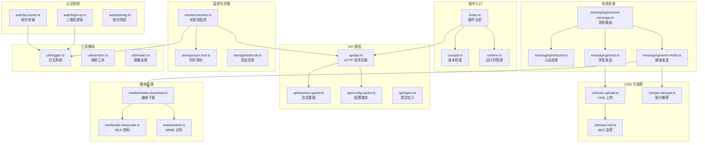
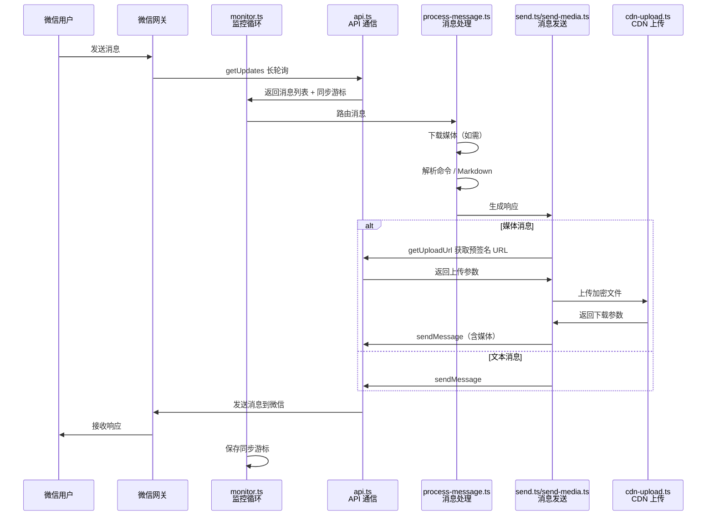

本页面提供 OpenClaw 微信插件的整体架构概览，帮助开发者快速理解项目结构、核心功能模块及各组件之间的关系。OpenClaw 微信插件是一个基于 HTTP JSON API 的微信渠道插件，支持通过扫码完成登录授权，实现与微信生态的无缝对接。

## 项目定位

OpenClaw 微信插件是 OpenClaw 生态系统的官方微信渠道组件，旨在为开发者提供稳定、高效的微信集成方案。插件采用长轮询（long-polling）机制获取消息，通过 `sendMessage` API 发送消息，并完整支持文本、图片、视频、文件等多种媒体类型的上传与下载。插件内置了 **多账号管理**、**会话状态保持**、**SILK 语音转码**、**AES-128-ECB 加密** 等企业级特性，适用于生产环境部署。

当前版本为 **2.1.7**，要求 Node.js >=22，并与 OpenClaw 2026.3.22+ 版本完全兼容。插件在启动时会执行版本兼容性检查，如果运行的 OpenClaw 版本超出支持范围，插件将拒绝加载。

Sources: [package.json](package.json#L1-L60)

## 技术架构总览

项目采用模块化架构设计，核心职责清晰分离。下图展示了插件的主要模块及其交互关系：



该架构体现了关注点分离的设计原则：认证授权专注于登录流程，API 模块处理网络通信，消息处理模块负责业务逻辑，CDN 和媒体模块处理底层媒体操作，监控与存储模块保障系统稳定运行。

Sources: [index.ts](index.ts#L1-L25), [src/channel.ts](src/channel.ts#L1-L200), [src/monitor/monitor.ts](src/monitor/monitor.ts#L1-L200)

## 核心功能特性

插件提供以下核心功能，这些特性构成了微信渠道的完整功能矩阵：

| 功能类别 | 特性名称 | 说明 | 支持状态 |
|---------|---------|------|---------|
| **认证授权** | 二维码登录 | 通过手机微信扫码完成授权，登录凭证自动保存到本地 | ✅ 完整支持 |
| | 多账号管理 | 支持多个微信号同时登录，每个账号独立存储 | ✅ 完整支持 |
| | 会话过期处理 | 检测会话过期（errcode -14），自动暂停并重试 | ✅ 完整支持 |
| **消息通信** | 长轮询获取 | 基于 getUpdates API 的长轮询机制，超时默认 35 秒 | ✅ 完整支持 |
| | 消息发送 | 支持 sendMessage API，可发送文本及多种媒体类型 | ✅ 完整支持 |
| | Markdown 过滤 | 发送消息时自动过滤 Markdown 语法，避免格式错误 | ✅ 完整支持 |
| | 斜杠命令 | 支持斜杠命令快速交互 | ✅ 完整支持 |
| **媒体处理** | CDN 上传 | 先获取预签名 URL，再上传加密后的文件 | ✅ 完整支持 |
| | AES-128-ECB 加密 | 媒体文件上传前自动加密，符合微信安全规范 | ✅ 完整支持 |
| | 媒体下载与解密 | 下载远程媒体并解密到本地临时文件 | ✅ 完整支持 |
| | SILK 语音转码 | 将 SILK 格式语音转换为 WAV/PCM | ✅ 完整支持 |
| | MIME 类型识别 | 根据文件扩展名自动识别媒体类型 | ✅ 完整支持 |
| **系统特性** | 同步游标持久化 | 记录每次长轮询的同步游标，服务端重启后自动恢复 | ✅ 完整支持 |
| | 上下文令牌缓存 | 缓存每个会话的 contextToken，发送消息时自动匹配 | ✅ 完整支持 |
| | 结构化日志 | 完整的日志系统，支持账号级别的日志追踪 | ✅ 完整支持 |
| | 版本兼容性检查 | 启动时检查 OpenClaw 版本，拒绝不兼容版本 | ✅ 完整支持 |

Sources: [README.zh_CN.md](README.zh_CN.md#L1-L100), [src/monitor/monitor.ts](src/monitor/monitor.ts#L1-L200), [src/cdn/cdn-upload.ts](src/cdn/cdn-upload.ts#L1-L88)

## 目录结构详解

项目的目录结构体现了模块化设计理念，每个目录负责特定的功能域：

```
openclaw-weixin/
├── index.ts                          # 插件入口，注册通道插件
├── openclaw.plugin.json              # 插件元数据配置
├── package.json                      # npm 包配置与依赖声明
└── src/
    ├── api/                          # API 通信层
    │   ├── api.ts                    # HTTP 请求封装（GET/POST）
    │   ├── config-cache.ts           # 配置缓存管理器
    │   ├── session-guard.ts          # 会话状态管理与过期处理
    │   └── types.ts                  # API 请求/响应类型定义
    ├── auth/                         # 认证授权模块
    │   ├── accounts.ts               # 账号存储与多账号管理
    │   ├── login-qr.ts               # 二维码登录流程实现
    │   └── pairing.ts                # 配对授权与白名单机制
    ├── cdn/                          # CDN 与加密模块
    │   ├── aes-ecb.ts                # AES-128-ECB 加密算法
    │   ├── cdn-upload.ts             # CDN 上传逻辑（带重试）
    │   ├── cdn-url.ts                # CDN URL 构建工具
    │   ├── pic-decrypt.ts            # 图片解密实现
    │   └── upload.ts                 # 统一上传入口
    ├── media/                        # 媒体处理模块
    │   ├── media-download.ts         # 媒体下载与解密
    │   ├── mime.ts                   # MIME 类型识别
    │   └── silk-transcode.ts         # SILK 语音格式转码
    ├── messaging/                    # 消息处理模块
    │   ├── debug-mode.ts             # 调试模式与链路追踪
    │   ├── error-notice.ts           # 错误通知机制
    │   ├── inbound.ts                # 入站消息处理
    │   ├── markdown-filter.ts        # Markdown 文本过滤
    │   ├── process-message.ts        # 消息路由与分发
    │   ├── send-media.ts             # 媒体消息发送
    │   ├── send.ts                   # 文本消息发送
    │   └── slash-commands.ts         # 斜杠命令处理
    ├── monitor/                      # 监控模块
    │   └── monitor.ts                # 长轮询监控循环实现
    ├── storage/                      # 存储模块
    │   ├── state-dir.ts              # 状态目录解析
    │   └── sync-buf.ts               # 同步游标持久化
    ├── config/                       # 配置管理
    │   └── config-schema.ts          # 配置 Schema 定义（Zod）
    ├── util/                         # 工具函数
    │   ├── logger.ts                 # 结构化日志系统
    │   ├── random.ts                 # 随机数生成工具
    │   └── redact.ts                 # 敏感信息脱敏
    ├── channel.ts                    # 通道插件核心实现
    ├── compat.ts                     # OpenClaw 版本兼容性检查
    ├── runtime.ts                    # 插件运行时管理
    └── vendor.d.ts                   # 第三方库类型声明
```

Sources: [src/channel.ts](src/channel.ts#L1-L460), [src/auth/accounts.ts](src/auth/accounts.ts#L1-L200), [src/runtime.ts](src/runtime.ts#L1-L71)

## 数据流与生命周期

插件的核心数据流遵循 **接收 → 处理 → 响应** 的模式，下图展示了完整的消息生命周期：



该流程体现了插件的高效性：通过长轮询减少轮询开销，通过同步游标保证消息不丢失，通过 CDN 预签名 URL 实现安全的媒体上传，通过上下文令牌缓存优化消息发送性能。

Sources: [src/monitor/monitor.ts](src/monitor/monitor.ts#L1-L223), [src/messaging/process-message.ts](src/messaging/process-message.ts#L1-L100), [src/cdn/cdn-upload.ts](src/cdn/cdn-upload.ts#L1-L88)

## 依赖与运行环境

插件依赖以下核心库和技术栈：

| 依赖项 | 版本 | 用途 |
|-------|------|------|
| **openclaw** | 2026.3.23 | 插件 SDK，提供运行时、配置管理、通道接口 |
| **zod** | 4.3.6 | 配置 Schema 验证 |
| **qrcode-terminal** | 0.12.0 | 终端二维码显示 |
| **silk-wasm** | ^3.7.1 | SILK 语音格式转码（dev 依赖） |

插件要求 **Node.js >=22** 运行环境，并作为 ESM module 加载。构建工具使用 TypeScript 5.8+，测试框架采用 Vitest 3.1+。

Sources: [package.json](package.json#L1-L60)

## 下一步学习路径

理解项目概览后，建议按照以下顺序深入学习各个模块：

1. **[快速开始：安装与配置](2-kuai-su-kai-shi-an-zhuang-yu-pei-zhi)** - 完成插件的安装、配置与首次登录
2. **[扫码登录流程](3-sao-ma-deng-lu-liu-cheng)** - 了解二维码登录的完整机制与实现细节
3. **[多账号管理与隔离配置](4-duo-zhang-hao-guan-li-yu-ge-chi-pei-zhi)** - 掌握多账号场景下的配置技巧

如果希望深入理解架构设计，可以继续阅读：

- **[插件架构总览](5-cha-jian-jia-gou-zong-lan)** - 了解插件的架构设计原则与扩展机制
- **[核心模块职责划分](6-he-xin-mo-kuai-zhi-ze-hua-fen)** - 深入各核心模块的职责边界与交互方式