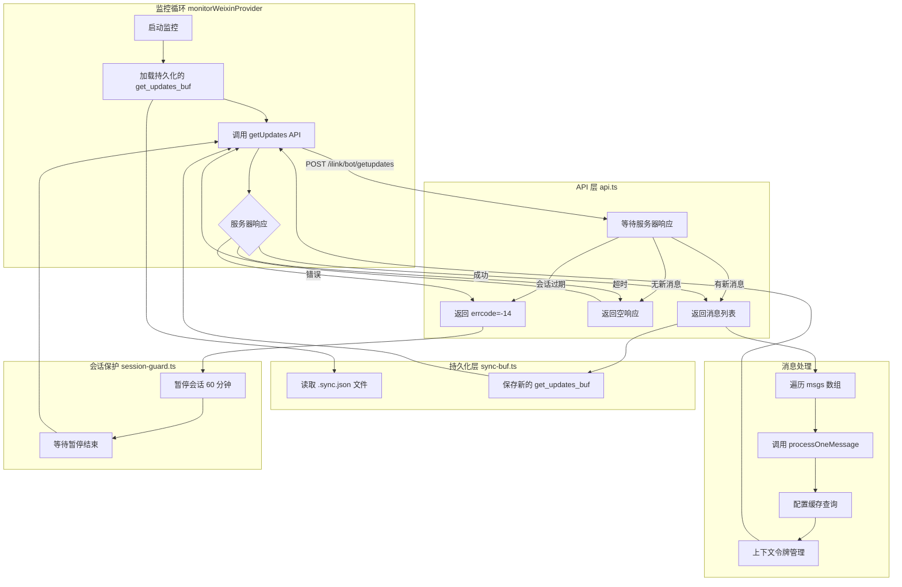

微信插件采用长轮询机制实时获取入站消息，通过持续的服务器连接实现低延迟的消息推送。本文档深入分析长轮询 getUpdates 的完整实现细节，包括 API 协议、监控循环、状态持久化、错误处理和会话保护机制。

Sources: [api.ts](src/api/api.ts#L1-L319) [monitor.ts](src/monitor/monitor.ts#L1-L223) [types.ts](src/api/types.ts#L1-L227)

## 架构概览

长轮询 getUpdates 的核心架构由三个层次组成：API 通信层、监控循环层和持久化存储层。监控循环作为主驱动引擎，周期性地调用 getUpdates API，服务器在无新消息时保持连接直至超时，有新消息时立即返回。每次响应都包含一个同步游标 `get_updates_buf`，客户端必须将其持久化并在下次请求时回传，以实现增量拉取并防止消息丢失。



这种架构设计的核心优势在于：**消息可靠性**通过持久化同步游标保证，**低延迟**通过长轮询连接实现，**容错能力**通过会话保护和退避策略增强。

Sources: [monitor.ts](src/monitor/monitor.ts#L23-L145) [api.ts](src/api/api.ts#L206-L239)

## API 协议实现

### 请求构建

getUpdates API 使用 POST 方法调用 `/ilink/bot/getupdates` 端点，请求体包含两个字段：`get_updates_buf` 为上次保存的同步游标，`base_info` 包含渠道版本等元数据。请求头必须携带认证信息、渠道标识、客户端版本等必要字段。

Sources: [api.ts](src/api/api.ts#L206-L219) [types.ts](src/api/types.ts#L173-L180)

### 长轮询超时机制

客户端侧的超时通过 AbortController 实现，默认超时时间为 35 秒（`DEFAULT_LONG_POLL_TIMEOUT_MS`）。当客户端超时发生时，`getUpdates` 函数捕获 AbortError 并返回一个空响应，这样监控循环可以立即重试而无需抛出异常。这种设计确保了长轮询的正常流程不会被客户端超时中断。

Sources: [api.ts](src/api/api.ts#L23-L30) [api.ts](src/api/api.ts#L220-L239)

### 响应处理

服务器响应包含以下关键字段：`ret` 为返回码，0 表示成功；`msgs` 为消息数组；`get_updates_buf` 为新的同步游标；`longpolling_timeout_ms` 为服务器建议的下一次轮询超时时间。监控循环会动态更新超时时间以适应网络条件，使用服务器建议的值优先于配置值。

Sources: [types.ts](src/api/types.ts#L182-L194) [monitor.ts](src/monitor/monitor.ts#L68-L75)

| 字段 | 类型 | 说明 |
|------|------|------|
| ret | number | 返回码，0 表示成功 |
| errcode | number | 错误码，-14 表示会话过期 |
| errmsg | string | 错误消息 |
| msgs | WeixinMessage[] | 消息列表 |
| get_updates_buf | string | 新的同步游标 |
| longpolling_timeout_ms | number | 下次轮询建议超时时间（毫秒） |

Sources: [types.ts](src/api/types.ts#L182-L194)

## 监控循环实现

### 循环启动与初始化

`monitorWeixinProvider` 函数是监控循环的入口点，它在账号启动时被调用。初始化过程包括：等待微信运行时准备就绪、加载持久化的同步游标、创建配置缓存管理器。如果存在历史同步游标，循环将从该游标恢复，确保不会漏掉任何消息。

Sources: [monitor.ts](src/monitor/monitor.ts#L23-L52) [channel.ts](src/channel.ts#L366-L394)

### 主循环逻辑

监控循环的核心是一个 while 循环，持续运行直到收到中止信号。每次循环迭代调用 `getUpdates` API，传入当前的同步游标和超时时间。如果请求成功且返回新消息，循环会保存新的同步游标到持久化存储，然后遍历消息列表，对每条消息调用 `processOneMessage` 进行处理。

Sources: [monitor.ts](src/monitor.ts#L54-L118)

### 错误处理与会话保护

监控循环实现了多层次的错误处理机制。当检测到会话过期错误（`errcode = -14` 或 `ret = -14`）时，循环会调用 `pauseSession` 暂停该账号一小时，在此期间所有请求都会被拒绝。这种机制防止了在会话无效时继续请求导致服务器压力。

对于其他 API 错误，循环会计算连续失败次数。如果连续失败超过 3 次（`MAX_CONSECUTIVE_FAILURES`），循环会退避 30 秒（`BACKOFF_DELAY_MS`）后再重试；否则仅等待 2 秒（`RETRY_DELAY_MS`）后重试。这种渐进式退避策略平衡了快速恢复和避免服务器过载的需求。

Sources: [monitor.ts](src/monitor.ts#L76-L108) [session-guard.ts](src/api/session-guard.ts#L10-L23)

```mermaid
sequenceDiagram
    participant Loop as 监控循环
    participant API as getUpdates API
    participant Server as 微信服务器
    participant Guard as 会话保护
    
    Loop->>API: 发送请求(get_updates_buf)
    API->>Server: POST /ilink/bot/getupdates
    Server-->>API: 返回响应
    API-->>Loop: 返回结果
    
    alt 会话过期(errcode=-14)
        Loop->>Guard: pauseSession(accountId)
        Guard->>Guard: 设置暂停 60 分钟
        Loop->>Guard: 等待暂停结束
        Guard-->>Loop: 暂停结束
        Loop->>Loop: 重新开始循环
    else 其他错误
        Loop->>Loop: 计算连续失败次数
        alt 失败次数 >= 3
            Loop->>Loop: 退避 30 秒
        else 失败次数 < 3
            Loop->>Loop: 等待 2 秒
        end
        Loop->>Loop: 重试
    else 成功
        Loop->>Loop: 保存新 get_updates_buf
        Loop->>Loop: 处理消息列表
        Loop->>Loop: 更新状态回调
    end
```

Sources: [monitor.ts](src/monitor/monitor.ts#L54-L145)

## 状态持久化机制

### 同步游标存储

`get_updates_buf` 同步游标持久化到文件系统，确保在程序重启后能够恢复到正确的位置。文件路径为 `~/.openclaw/openclaw-weixin/accounts/{accountId}.sync.json`，其中 accountId 是账号的唯一标识。文件内容为 JSON 格式，包含一个字段 `get_updates_buf`，其值为 base64 编码的二进制数据。

Sources: [sync-buf.ts](src/storage/sync-buf.ts#L11-L20)

### 向后兼容策略

持久化模块实现了完整的向后兼容策略，支持从旧版本迁移。`loadGetUpdatesBuf` 函数按以下优先级尝试加载：首先尝试主路径（使用规范化的 accountId），然后尝试兼容路径（使用原始 ID 格式），最后尝试遗留单账号路径（非常旧的版本）。这种设计确保了用户升级插件后不会丢失同步状态。

Sources: [sync-buf.ts](src/storage/sync-buf.ts#L38-L62)

### 保存逻辑

`saveGetUpdatesBuf` 函数负责保存新的同步游标。它会创建必要的父目录（如果不存在），然后将同步游标写入 JSON 文件。文件不包含缩进或换行符，以最小化文件大小和写入时间。

Sources: [sync-buf.ts](src/storage/sync-buf.ts#L64-L72)

## 消息处理流程

### 消息遍历与分发

当监控循环收到新的消息数组时，它会遍历每条消息并调用 `processOneMessage`。在处理前，循环会更新账号状态快照的 `lastEventAt` 和 `lastInboundAt` 时间戳，这些状态可以通过 `setStatus` 回调传递给网关，用于监控和诊断。

Sources: [monitor.ts](src/monitor.ts#L113-L138)

### 配置缓存查询

对于每条消息，监控循环会使用发送者 ID（`from_user_id`）和上下文令牌（`context_token`）从配置缓存管理器中查询用户特定的配置。缓存管理器（`WeixinConfigManager`）负责避免重复调用 getConfig API，提高性能并减少服务器压力。

Sources: [monitor.ts](src/monitor.ts#L128-L130) [config-cache.ts](src/api/config-cache.ts#L1-L200)

### 上下文令牌传递

上下文令牌（`context_token`）是微信协议中的重要字段，用于标识会话上下文。监控循环将该令牌传递给消息处理函数，后者会将其保存到内存缓存中，并在后续的出站消息中回传给服务器。这种机制确保了回复消息能够正确关联到原始会话。

Sources: [monitor.ts](src/monitor.ts#L132-L138) [inbound.ts](src/messaging/inbound.ts#L1-L200)

## 性能优化与资源管理

### 动态超时调整

监控循环支持动态调整长轮询超时时间。服务器可以在响应中返回 `longpolling_timeout_ms` 字段，建议客户端在下一次请求中使用该超时值。这种设计允许服务器根据网络状况和服务器负载优化长轮询行为，而不需要客户端硬编码固定值。

Sources: [monitor.ts](src/monitor.ts#L68-L75) [types.ts](src/api/types.ts#L192-L194)

### 中止信号支持

监控循环完全支持中止机制，通过 `AbortSignal` 实现优雅关闭。当收到中止信号时，循环会立即停止，不会启动新的 API 请求。已进行的请求也会通过 AbortController 被中止，释放网络资源。这种设计确保了插件能够快速响应停止命令，不会因为等待长轮询超时而延迟关闭。

Sources: [monitor.ts](src/monitor.ts#L140-L145) [api.ts](src/api/api.ts#L107-L122)

### 日志记录与调试

监控循环使用结构化日志系统记录详细的事件信息。每条日志都包含 accountId 上下文，便于多账号环境下的问题排查。关键事件包括：API 请求和响应、同步游标更新、会话暂停、连续失败计数等。调试模式下，日志还会包含请求体和响应体的脱敏内容。

Sources: [monitor.ts](src/monitor/monitor.ts#L1-L223) [logger.ts](src/util/logger.ts#L1-L100)

## 配置参数

### 关键配置项

监控循环支持以下配置参数，可通过 `MonitorWeixinOpts` 传入：

| 参数 | 类型 | 默认值 | 说明 |
|------|------|--------|------|
| baseUrl | string | 必填 | API 基础 URL |
| cdnBaseUrl | string | 必填 | CDN 基础 URL |
| token | string | 可选 | 认证令牌 |
| accountId | string | 必填 | 账号 ID |
| allowFrom | string[] | 可选 | 允许的发送者白名单 |
| longPollTimeoutMs | number | 35000 | 长轮询超时时间（毫秒） |
| abortSignal | AbortSignal | 可选 | 中止信号 |
| setStatus | function | 可选 | 状态更新回调 |

Sources: [monitor.ts](src/monitor/monitor.ts#L11-L22)

### 常量定义

监控循环内部定义了几个关键常量，控制错误处理和重试行为：

- `DEFAULT_LONG_POLL_TIMEOUT_MS = 35_000`：默认长轮询超时时间
- `MAX_CONSECUTIVE_FAILURES = 3`：最大连续失败次数阈值
- `BACKOFF_DELAY_MS = 30_000`：退避延迟时间
- `RETRY_DELAY_MS = 2_000`：常规重试延迟时间

Sources: [monitor.ts](src/monitor/monitor.ts#L4-L7)

## 下一步阅读

理解长轮询 getUpdates 的实现后，建议继续学习以下相关主题：

- [消息发送 sendMessage API](11-xiao-xi-fa-song-sendmessage-api) - 了解出站消息的实现机制
- [长轮询监控循环实现](26-chang-lun-xun-jian-kong-xun-huan-shi-xian) - 深入理解监控循环的架构设计
- [会话状态管理与过期处理](13-hui-hua-zhuang-tai-guan-li-yu-guo-qi-chu-li) - 掌握会话保护机制的完整实现
- [同步游标持久化](24-tong-bu-you-biao-chi-jiu-hua) - 理解状态持久化的详细机制