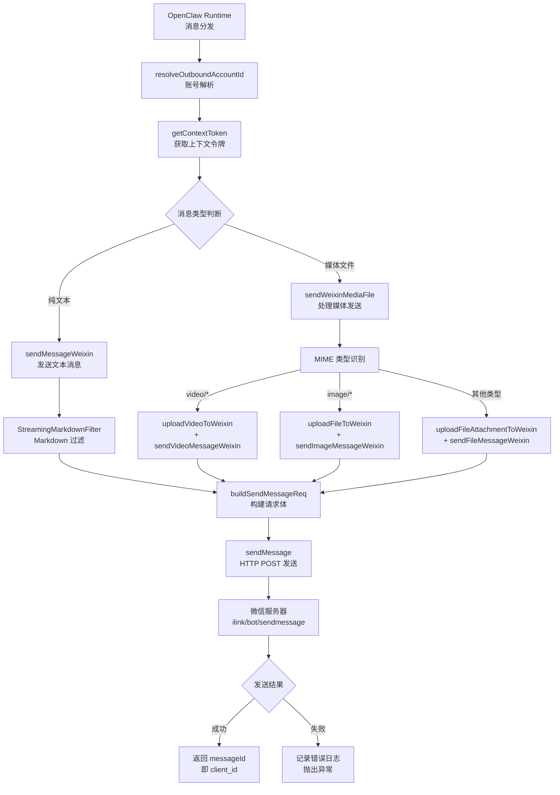
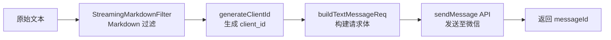

sendMessage API 是 OpenClaw Weixin 插件中负责向微信用户发送消息的核心组件，它通过 `ilink/bot/sendmessage` 端点与微信服务器通信，支持文本、图片、视频、文件等多种消息类型的发送。该 API 构建在统一的 `SendMessageReq` 请求结构之上，并与上下文令牌管理、CDN 媒体上传、Markdown 文本过滤等模块深度集成，形成完整的消息发送管道。

## 架构概览

sendMessage API 采用分层架构设计，从上层插件运行时到底层 HTTP 通信形成了清晰的数据流。消息发送流程始于 OpenClaw 框架的消息分发，经过插件层的账号解析、上下文令牌检索、消息预处理、媒体上传（如需）、最终通过 HTTP POST 请求发送至微信服务器。



该架构的核心设计原则包括：**关注点分离**（文本发送与媒体发送独立实现）、**类型安全**（基于 TypeScript 的强类型定义）、**可观测性**（结构化日志记录）、**容错性**（上下文令牌缺失时的降级处理）。Sources: [src/messaging/send.ts](src/messaging/send.ts#L1-L242), [src/api/api.ts](src/api/api.ts#L1-L319)

## 支持的消息类型

sendMessage API 通过 `MessageItem` 类型的 `item_list` 字段支持多种消息类型的发送。每种类型都有特定的数据结构和字段要求，其中媒体类型（图片、视频、文件）需要预先通过 CDN 上传并获取加密参数。

| 消息类型 | MessageItemType 常量 | 核心字段 | 是否需要预先上传 |
|---------|---------------------|---------|-----------------|
| 文本 | `MessageItemType.TEXT` | `text_item.text` | 否 |
| 图片 | `MessageItemType.IMAGE` | `image_item.media`, `image_item.mid_size` | 是 |
| 视频 | `MessageItemType.VIDEO` | `video_item.media`, `video_item.video_size` | 是 |
| 文件 | `MessageItemType.FILE` | `file_item.media`, `file_item.file_name`, `file_item.len` | 是 |
| 语音 | `MessageItemType.VOICE` | `voice_item.media`, `voice_item.encode_type` | 是 |

### 文本消息发送

文本消息是最简单的发送类型，通过 `sendMessageWeixin` 函数实现。该函数会自动生成唯一的 `client_id` 作为消息标识符，并将其包装在 `buildSendMessageReq` 构建的请求体中。发送前会经过 `StreamingMarkdownFilter` 过滤，将 Markdown 语法转换为微信支持的富文本格式。如果缺少 `contextToken`，会记录警告日志但仍继续发送（降级处理）。Sources: [src/messaging/send.ts](src/messaging/send.ts#L18-L75), [src/channel.ts](src/channel.ts#L94-L119)



### 媒体消息发送

媒体消息（图片、视频、文件）的发送流程更为复杂，需要先通过 CDN 上传文件获取 `UploadedFileInfo`，该对象包含 `filekey`、`aesKey`、`fileSize` 等关键信息。所有媒体消息发送函数（`sendImageMessageWeixin`、`sendVideoMessageWeixin`、`sendFileMessageWeixin`）都通过统一的 `sendMediaItems` 函数实现，该函数支持在媒体消息前发送文本说明（作为独立的 TEXT 消息项）。Sources: [src/messaging/send.ts](src/messaging/send.ts#L151-L242), [src/messaging/send-media.ts](src/messaging/send-media.ts#L1-L73)

## 请求与响应结构

### SendMessageReq 请求结构

`SendMessageReq` 是发送消息的顶层请求结构，包含一个 `WeixinMessage` 对象。核心字段包括：

- **`msg`**: `WeixinMessage` 类型的消息容器
  - `from_user_id`: 留空字符串（发送时不需要）
  - `to_user_id`: 接收者用户 ID（格式如 `xxx@im.wechat`）
  - `client_id`: 客户端生成的消息 ID，用于标识和追踪
  - `message_type`: 消息类型，固定为 `MessageType.BOT`（值为 2）
  - `message_state`: 消息状态，固定为 `MessageState.FINISH`（值为 2）
  - `item_list`: 消息项数组，每个元素代表一个消息内容（文本或媒体）
  - `context_token`: 上下文令牌，由入站消息的 `getUpdates` API 提供

```typescript
interface SendMessageReq {
  msg?: WeixinMessage;
}

interface WeixinMessage {
  from_user_id?: string;
  to_user_id?: string;
  client_id?: string;
  message_type?: number;  // 2 = BOT
  message_state?: number; // 2 = FINISH
  item_list?: MessageItem[];
  context_token?: string;
}
```

Sources: [src/api/types.ts](src/api/types.ts#L160-L190), [src/messaging/send.ts](src/messaging/send.ts#L18-L75)

### SendMessageResp 响应结构

微信服务器对 `sendMessage` 请求的响应是空的（`SendMessageResp` 接口不包含任何字段），成功仅通过 HTTP 200 状态码表示。消息 ID（`client_id`）由客户端生成并返回给调用者，用于后续的日志追踪和调试。Sources: [src/api/types.ts](src/api/types.ts#L188-L192)

## API 调用实现

### HTTP 请求构造

`sendMessage` 函数在 `src/api/api.ts` 中实现，负责构造 HTTP POST 请求并发送至 `ilink/bot/sendmessage` 端点。请求头包含关键认证和版本信息：

- `iLink-App-Id`: 从 `package.json` 读取的插件 ID
- `iLink-App-ClientVersion`: 编码后的插件版本号（`0x00MMNNPP` 格式）
- `SKRouteTag`: 从配置读取的路由标签（如存在）
- `Authorization`: Bearer token 认证
- `X-WECHAT-UIN`: 随机生成的 UIN 标识
- `Content-Type`: `application/json`

请求体包含 `SendMessageReq` 对象和 `base_info` 元数据（包含 `channel_version`）。默认请求超时为 15 秒。Sources: [src/api/api.ts](src/api/api.ts#L219-L234)

### 错误处理与日志

发送过程中的错误会被捕获并记录详细日志，包括目标用户 ID、`client_id` 和错误信息。日志使用 `logger.error` 级别，便于故障排查。所有敏感信息（如 token、URL 参数）通过 `redact` 工具进行脱敏处理，确保日志安全。Sources: [src/api/api.ts](src/api/api.ts#L1-L319), [src/messaging/send.ts](src/messaging/send.ts#L69-L75)

## 上下文令牌管理

上下文令牌（`context_token`）是消息发送的关键参数，由微信服务器的 `getUpdates` API 在入站消息中提供，必须在出站消息中回传以维持会话上下文。该插件实现了两级缓存机制：

1. **内存缓存**：`contextTokenStore`（`Map<string, string>`）存储运行时令牌
2. **磁盘持久化**：每个账户的令牌保存到 `{stateDir}/openclaw-weixin/accounts/{accountId}.context-tokens.json`

令牌的存储键为 `{accountId}:{userId}`，在发送消息时通过 `getContextToken(accountId, to)` 检索。如果令牌缺失，插件会记录警告日志但仍继续发送（降级模式），确保基本功能可用。Sources: [src/messaging/inbound.ts](src/messaging/inbound.ts#L1-L263), [src/channel.ts](src/channel.ts#L94-L119)

## 消息项构建细节

### buildTextMessageReq 函数

该函数负责构建包含单个文本消息的 `SendMessageReq`，参数包括接收者 ID、文本内容、上下文令牌和客户端 ID。生成的 `item_list` 仅包含一个 `MessageItemType.TEXT` 类型的元素，其 `text_item.text` 字段存储纯文本内容。如果文本为空字符串，`item_list` 将为 `undefined`。Sources: [src/messaging/send.ts](src/messaging/send.ts#L18-L38)

### buildSendMessageReq 函数

该函数是对 `buildTextMessageReq` 的包装，专门用于从 `ReplyPayload`（来自 OpenClaw 框架的回复载荷）构建请求。它提取 `payload.text` 字段，并将其他参数转发给 `buildTextMessageReq`。这种设计使得框架层的回复可以无缝转换为微信消息格式。Sources: [src/messaging/send.ts](src/messaging/send.ts#L42-L57)

### sendMediaItems 函数

这是所有媒体消息发送的核心实现，支持发送一个或多个 `MessageItem`（通常用于发送文本说明 + 媒体文件）。函数会遍历 `items` 数组，为每个项生成独立的 `client_id` 并构建请求，确保每次请求的 `item_list` 仅包含一个元素。这种设计简化了服务器端的消息处理逻辑。Sources: [src/messaging/send.ts](src/messaging/send.ts#L81-L149)

## 账号解析与会话验证

在发送消息前，插件会验证目标账号的会话状态并通过 `assertSessionActive` 函数确保会话有效。如果未指定 `accountId`，插件会通过 `resolveOutboundAccountId` 自动解析：

1. **单账号场景**：直接使用唯一的注册账号
2. **多账号场景**：通过 `contextToken` 匹配与接收者有活跃会话的账号
3. **模糊场景**：抛出错误，提示用户在配置中明确指定 `accountId`

解析出的账号包含 `baseUrl`、`token`、`cdnBaseUrl` 等配置信息，用于构造 API 请求。Sources: [src/channel.ts](src/channel.ts#L57-L92), [src/api/session-guard.ts](src/api/session-guard.ts#L1-L50)

## 媒体文件路由发送

`sendWeixinMediaFile` 函数实现了基于 MIME 类型的智能媒体文件发送路由。该函数根据文件扩展名或 MIME 类型自动选择合适的上传和发送策略：

- **视频文件**（`video/*`）：`uploadVideoToWeixin` → `sendVideoMessageWeixin`
- **图片文件**（`image/*`）：`uploadFileToWeixin` → `sendImageMessageWeixin`
- **文件附件**（其他）：`uploadFileAttachmentToWeixin` → `sendFileMessageWeixin`

这种路由设计确保了不同类型媒体文件的处理逻辑集中管理，同时支持发送前添加文本说明。该函数被监控循环（入站回复）和渠道发送（出站）两个路径共享，保证行为一致性。Sources: [src/messaging/send-media.ts](src/messaging/send-media.ts#L1-L73), [src/messaging/send.ts](src/messaging/send.ts#L151-L242)

## 集成与扩展点

sendMessage API 通过 `ChannelPlugin` 接口与 OpenClaw 运行时集成，提供 `sendText` 和 `sendMedia` 两个出站处理函数：

- **sendText**: 处理纯文本消息发送，调用 `sendWeixinOutbound`
- **sendMedia**: 处理媒体文件发送，根据 `mediaUrl` 类型（本地路径或远程 URL）调用 `sendWeixinMediaFile` 或降级为文本发送

渠道插件定义了 `textChunkLimit`（4000 字符）限制超长文本，并通过 `blockStreaming` 声明不支持流式发送（需要等待完整内容）。Sources: [src/channel.ts](src/channel.ts#L139-L199), [src/channel.ts](src/messaging/send.ts#L1-L242)

## 最佳实践

1. **始终使用 contextToken**：确保会话连续性，避免降级警告
2. **处理超时和错误**：默认超时 15 秒，建议捕获并记录所有异常
3. **媒体文件预上传**：媒体消息必须先通过 CDN 上传获取加密参数
4. **Markdown 文本过滤**：发送前通过 `StreamingMarkdownFilter` 处理富文本
5. **消息 ID 追踪**：使用返回的 `messageId`（即 `client_id`）进行日志关联
6. **媒体类型自动路由**：利用 `sendWeixinMediaFile` 的自动类型识别功能

## 相关主题

- [CDN 预签名 URL 获取与上传](12-cdn-yu-qian-ming-url-huo-qu-yu-shang-chuan)：了解媒体文件上传机制
- [上下文令牌缓存与恢复](25-shang-xia-wen-ling-pai-huan-cun-yu-hui-fu)：深入理解上下文令牌的持久化机制
- [Markdown 文本过滤](19-markdown-wen-ben-guo-lu)：探索富文本到微信格式的转换细节
- [入站消息路由与处理](18-ru-zhan-xiao-xi-lu-you-yu-chu-li)：理解消息接收到回复的完整流程