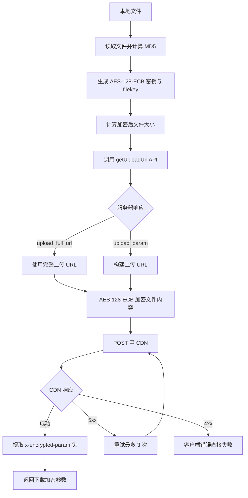

本页面详细阐述微信插件系统中 CDN 媒体文件上传的完整流程，包括预签名 URL 获取机制、文件加密处理以及上传重试策略。该系统负责将本地文件（图片、视频、附件等）安全地传输至微信 CDN，并获取后续下载所需的加密参数。

Sources: [src/cdn/upload.ts](src/cdn/upload.ts#L1-L158), [src/api/api.ts](src/api/api.ts#L221-L250)

## 核心架构概览

CDN 上传系统采用三层架构设计：API 通信层负责与服务器交互获取上传凭证，加密处理层提供 AES-128-ECB 加密能力，上传执行层负责将加密数据通过预签名 URL 提交至 CDN。整个流程确保媒体数据在传输过程中的安全性，并通过重试机制提升可靠性。



Sources: [src/cdn/upload.ts](src/cdn/upload.ts#L50-L158), [src/cdn/cdn-upload.ts](src/cdn/cdn-upload.ts#L1-L88)

## 预签名 URL 获取机制

预签名 URL 通过 `getUploadUrl` API 从服务器获取，该接口需要提供完整的文件元数据和加密密钥信息。服务器根据这些参数生成具有时效性的上传凭证，返回两种形式的上传地址：

| 返回字段 | 类型 | 说明 | 优先级 |
|---------|------|------|--------|
| `upload_full_url` | `string?` | 服务端完整构造的上传 URL | 高 |
| `upload_param` | `string?` | 加密查询参数，需与 `cdnBaseUrl` 和 `filekey` 拼接 | 低 |
| `thumb_upload_param` | `string?` | 缩略图上传参数（可选） | - |

当 `upload_full_url` 存在时直接使用，否则使用 `upload_param` 构建上传 URL。URL 构建逻辑由 `buildCdnUploadUrl` 函数实现：

```typescript
// src/cdn/cdn-url.ts:13-21
export function buildCdnUploadUrl(params: {
  cdnBaseUrl: string;
  uploadParam: string;
  filekey: string;
}): string {
  return `${params.cdnBaseUrl}/upload?encrypted_query_param=${encodeURIComponent(params.uploadParam)}&filekey=${encodeURIComponent(params.filekey)}`;
}
```

Sources: [src/api/types.ts](src/api/types.ts#L17-L41), [src/api/api.ts](src/api/api.ts#L221-L250), [src/cdn/cdn-url.ts](src/cdn/cdn-url.ts#L13-L21)

### getUploadUrl 请求参数

`getUploadUrl` API 的核心请求参数包括文件标识信息、大小校验数据以及加密密钥：

| 参数名 | 类型 | 说明 |
|--------|------|------|
| `filekey` | `string` | 16 字节随机十六进制字符串，唯一标识文件 |
| `media_type` | `number` | 媒体类型：1=图片，2=视频，3=文件，4=语音 |
| `to_user_id` | `string` | 目标用户 ID |
| `rawsize` | `number` | 原始文件明文大小 |
| `rawfilemd5` | `string` | 原始文件 MD5 哈希（十六进制） |
| `filesize` | `number` | 加密后文件大小（AES-128-ECB 填充后） |
| `aeskey` | `string` | AES-128 密钥（32 字符十六进制字符串） |
| `no_need_thumb` | `boolean` | 是否需要缩略图上传 URL |

API 请求默认超时时间为 15 秒，可通过 `timeoutMs` 参数自定义。请求头包含应用标识、版本信息以及认证令牌。

Sources: [src/api/types.ts](src/api/types.ts#L17-L41), [src/api/api.ts](src/api/api.ts#L108-L121)

## 文件加密与上传流程

### 文件预处理与密钥生成

上传前需完成文件预处理，包括生成唯一文件标识、加密密钥以及计算文件哈希：

```typescript
// src/cdn/upload.ts:52-59
const plaintext = await fs.readFile(filePath);
const rawsize = plaintext.length;
const rawfilemd5 = crypto.createHash("md5").update(plaintext).digest("hex");
const filesize = aesEcbPaddedSize(rawsize);
const filekey = crypto.randomBytes(16).toString("hex");
const aeskey = crypto.randomBytes(16);
```

AES-128-ECB 加密采用 PKCS7 填充方案，加密后的文件大小需满足 16 字节对齐：

```typescript
// src/cdn/aes-ecb.ts:19-22
export function aesEcbPaddedSize(plaintextSize: number): number {
  return Math.ceil((plaintextSize + 1) / 16) * 16;
}
```

文件加密通过 `encryptAesEcb` 函数执行，使用 Node.js 内置的 `createCipheriv` 接口：

```typescript
// src/cdn/aes-ecb.ts:8-12
export function encryptAesEcb(plaintext: Buffer, key: Buffer): Buffer {
  const cipher = createCipheriv("aes-128-ecb", key, null);
  return Buffer.concat([cipher.update(plaintext), cipher.final()]);
}
```

Sources: [src/cdn/upload.ts](src/cdn/upload.ts#L52-L59), [src/cdn/aes-ecb.ts](src/cdn/aes-ecb.ts#L8-L22)

### CDN 上传执行

`uploadBufferToCdn` 函数负责执行实际的 CDN 上传操作，内置重试机制处理服务器临时错误。上传流程包含以下关键步骤：

1. **AES-128-ECB 加密文件内容**
2. **确定上传目标 URL**（优先使用 `upload_full_url`，否则构建 URL）
3. **POST 加密数据至 CDN**（Content-Type: application/octet-stream）
4. **解析响应头提取 `x-encrypted-param`**

上传重试策略采用指数退避逻辑，最多重试 3 次。客户端错误（4xx）立即中止，服务器错误（5xx）触发重试：

```typescript
// src/cdn/cdn-upload.ts:42-75
for (let attempt = 1; attempt <= UPLOAD_MAX_RETRIES; attempt++) {
  try {
    const res = await fetch(cdnUrl, {
      method: "POST",
      headers: { "Content-Type": "application/octet-stream" },
      body: new Uint8Array(ciphertext),
    });
    if (res.status >= 400 && res.status < 500) {
      // 客户端错误直接抛出，不重试
      throw new Error(`CDN upload client error ${res.status}`);
    }
    if (res.status !== 200) {
      // 服务器错误记录日志，继续重试
      throw new Error(`CDN upload server error`);
    }
    downloadParam = res.headers.get("x-encrypted-param");
    break;
  } catch (err) {
    if (err instanceof Error && err.message.includes("client error")) throw err;
    // 服务器错误继续重试
  }
}
```

Sources: [src/cdn/cdn-upload.ts](src/cdn/cdn-upload.ts#L1-L88)

### 上传结果返回

上传成功后返回 `UploadedFileInfo` 对象，包含后续消息发送所需的完整信息：

| 字段名 | 类型 | 说明 |
|--------|------|------|
| `filekey` | `string` | 文件唯一标识 |
| `downloadEncryptedQueryParam` | `string` | CDN 下载加密参数 |
| `aeskey` | `string` | AES 密钥（十六进制，需转为 base64 用于消息） |
| `fileSize` | `number` | 原始文件明文大小 |
| `fileSizeCiphertext` | `number` | 加密后文件大小 |

下载参数通过 CDN 响应头 `x-encrypted-param` 传递，用于后续构建下载 URL：

```typescript
// src/cdn/cdn-url.ts:11-13
export function buildCdnDownloadUrl(encryptedQueryParam: string, cdnBaseUrl: string): string {
  return `${cdnBaseUrl}/download?encrypted_query_param=${encodeURIComponent(encryptedQueryParam)}`;
}
```

Sources: [src/cdn/upload.ts](src/cdn/upload.ts#L12-L19), [src/cdn/cdn-url.ts](src/cdn/cdn-url.ts#L11-L13)

## 媒体类型路由与集成

系统根据文件 MIME 类型自动选择上传通道，所有类型复用统一的 `uploadMediaToCdn` 核心逻辑，仅媒体类型参数不同：

| 文件类型 | MIME 模式 | 上传函数 | media_type |
|---------|-----------|----------|------------|
| 图片 | `image/*` | `uploadFileToWeixin` | 1 |
| 视频 | `video/*` | `uploadVideoToWeixin` | 2 |
| 附件 | 其他类型 | `uploadFileAttachmentToWeixin` | 3 |

上传完成后，返回的信息直接用于消息发送，例如图片消息的构建：

```typescript
// src/messaging/send.ts:112-125
const imageItem: MessageItem = {
  type: MessageItemType.IMAGE,
  image_item: {
    media: {
      encrypt_query_param: uploaded.downloadEncryptedQueryParam,
      aes_key: Buffer.from(uploaded.aeskey).toString("base64"),
      encrypt_type: 1,
    },
    mid_size: uploaded.fileSizeCiphertext,
  },
};
```

Sources: [src/messaging/send-media.ts](src/messaging/send-media.ts#L1-L73), [src/messaging/send.ts](src/messaging/send.ts#L112-L125)

## 错误处理与日志记录

系统在关键路径上提供详细的日志记录，包括文件元数据、上传 URL（脱敏）、重试次数以及最终结果。所有错误都会记录详细的错误信息，便于问题诊断：

- **API 错误**：记录 HTTP 状态码和响应体
- **CDN 上传错误**：记录客户端/服务器错误分类，提取 `x-error-message` 头
- **重试日志**：记录每次尝试的失败原因和重试进度
- **敏感信息脱敏**：URL 和请求体通过 `redactUrl` 和 `redactBody` 函数处理

Sources: [src/cdn/cdn-upload.ts](src/cdn/cdn-upload.ts#L42-L75), [src/util/redact.ts](src/util/redact.ts#L1-L21)

## 下一步阅读

- [CDN 上传与 AES-128-ECB 加密](14-cdn-shang-chuan-yu-aes-128-ecb-jia-mi) - 深入了解加密实现细节
- [媒体下载与解密](15-mei-ti-xia-zai-yu-jie-mi) - 了解完整的 CDN 下载与解密流程
- [MIME 类型识别](17-mime-lei-xing-shi-bie) - 了解文件类型检测机制
- [消息发送 sendMessage API](11-xiao-xi-fa-song-sendmessage-api) - 了解如何使用上传结果发送消息