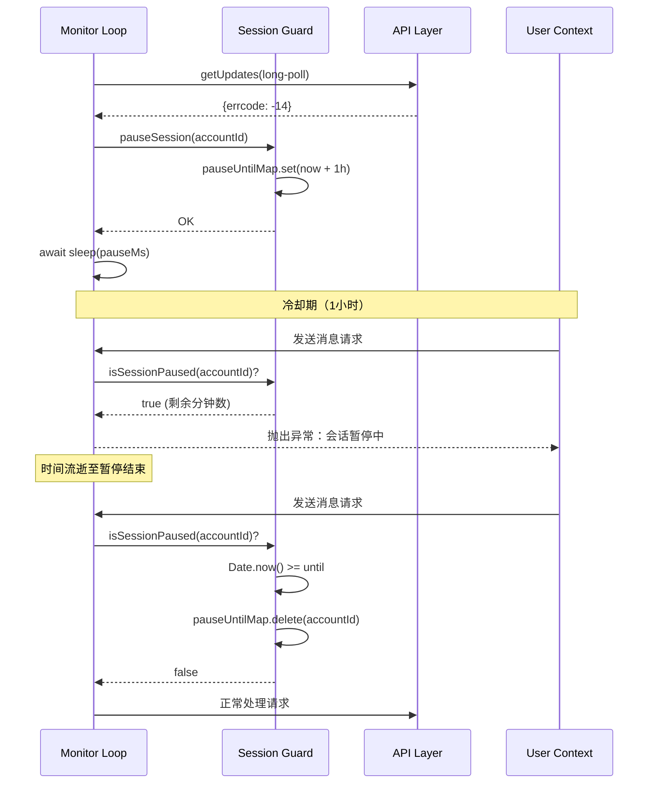

会话状态管理是微信机器人插件保障服务稳定性的核心机制。通过会话暂停、上下文令牌追踪、配置缓存过期检测等多重策略，系统实现了对服务器会话状态的精准控制和优雅降级处理。本文档将深入解析会话过期检测、冷却机制、令牌持久化以及跨模块协作的设计原理。

## 会话过期检测与冷却机制

会话过期由微信服务器在会话失效时返回的特定错误码标识。插件通过 `session-guard.ts` 模块实现统一的会话生命周期管理，确保在会话过期后优雅地暂停所有 API 调用，避免无效请求导致的资源浪费和错误泛滥。

### 错误码定义

系统定义了专门的会话过期错误码常量：`SESSION_EXPIRED_ERRCODE = -14`。此错误码由微信服务器在 bot 会话超时时返回，是触发会话冷却机制的唯一标识。在实现中，此值同时检查 `GetUpdatesResp` 的 `errcode` 和 `ret` 字段，确保兼容不同的响应格式[monitor/monitor.ts#L111-L113](src/monitor/monitor.ts#L111-L113)。

### 会话暂停状态机

会话暂停通过一个基于内存 Map 的状态机实现，以 `accountId` 为键，暂停截止时间戳为值。核心函数包括：

- `pauseSession(accountId)`：将账号暂停状态写入内存 Map，截止时间为当前时间加 1 小时（`SESSION_PAUSE_DURATION_MS = 60 * 60 * 1000`），并记录日志[session-guard.ts#L11-L17](src/api/session-guard.ts#L11-L17)。
- `isSessionPaused(accountId)`：检查账号是否在暂停期内。如果暂停时间已过，自动从 Map 中删除并返回 `false`，实现懒清理[session-guard.ts#L20-L28](src/api/session-guard.ts#L20-L28)。
- `getRemainingPauseMs(accountId)`：返回剩余暂停时间（毫秒），用于向用户展示冷却进度。同样在过期时自动清理[session-guard.ts#L31-L40](src/api/session-guard.ts#L31-L40)。
- `assertSessionActive(accountId)`：在每次 API 请求前调用，若会话暂停则抛出包含剩余分钟的异常[session-guard.ts#L43-L50](src/api/session-guard.ts#L43-L50)。

以下时序图展示了从会话过期检测到冷却期结束的完整流程：

### 冷却期处理策略

在长轮询监控循环中，当检测到会话过期错误码时，系统执行以下流程[monitor/monitor.ts#L114-L126](src/monitor/monitor.ts#L114-L126)：

1. 调用 `pauseSession(accountId)` 进入冷却状态。
2. 获取剩余暂停时间并记录错误日志。
3. 通过 `sleep(pauseMs, abortSignal)` 阻塞监控循环，期间不发起任何 getUpdates 请求。
4. 冷却期结束后自动恢复长轮询。

这种设计确保了系统不会在会话失效期间进行无效请求，同时避免了快速重试风暴。冷却期设置为 1 小时是经过权衡的选择：足够长以避免服务器压力，又不会造成过长的服务中断。

## 上下文令牌管理与持久化

上下文令牌（`context_token`）是微信 API 会话状态的关键载体，由服务器在每条消息中返回，必须在后续的所有出站消息中回传。通过内存缓存加磁盘持久化的双层存储，插件能够在网关重启后恢复会话上下文，保证消息连贯性。

### 令牌存储架构

`contextTokenStore` 是一个内存 Map，键由 `accountId` 和 `userId` 组合而成（格式：`{accountId}:{userId}`），值为 `context_token` 字符串[inbound.ts#L19-L23](src/messaging/inbound.ts#L19-L23)。这种设计支持多账号场景，每个账号与每个用户的会话令牌独立管理。

磁盘持久化路径为 `~/.openclaw/openclaw-weixin/accounts/{accountId}.context-tokens.json`，每个账号一个文件，存储格式为 JSON 对象，键为 userId，值为 context_token[inbound.ts#L29-L36](src/messaging/inbound.ts#L29-L36)。

### 令牌生命周期管理

令牌管理包含完整的 CRUD 操作，确保在系统启动、运行和关闭时都能正确维护会话状态：

- **恢复（Restore）**：`restoreContextTokens(accountId)` 在网关启动账号时调用，从磁盘文件加载所有令牌到内存，并记录恢复数量[inbound.ts#L61-L78](src/messaging/inbound.ts#L61-L78)。
- **存储（Store）**：`setContextToken(accountId, userId, token)` 在每条入站消息处理后调用，更新内存并立即持久化到磁盘[inbound.ts#L98-L103](src/messaging/inbound.ts#L98-L103)。
- **查询（Query）**：`getContextToken(accountId, userId)` 在发送消息时调用，返回缓存的令牌用于构建请求[inbound.ts#L106-L113](src/messaging/inbound.ts#L106-L113)。
- **清理（Clear）**：`clearContextTokensForAccount(accountId)` 在账号注销或切换时调用，清除内存和磁盘中的所有令牌[inbound.ts#L81-L95](src/messaging/inbound.ts#L81-L95)。

### 多账号路由匹配

当系统配置了多个微信账号时，发送消息需要确定使用哪个账号。`findAccountIdsByContextToken` 函数通过查找具有目标用户 contextToken 的账号来实现智能路由[inbound.ts#L123-L128](src/messaging/inbound.ts#L123-L128)。

在 `channel.ts` 的 `resolveOutboundAccountId` 函数中，路由优先级如下[channel.ts#L63-L104](src/channel.ts#L63-L104)：

1. **精确匹配**：通过 `findAccountIdsByContextToken` 查找与接收方有活跃会话的账号。
2. **单账号兜底**：如果只有一个注册账号，直接使用。
3. **多账号歧义**：如果多个账号都匹配，抛出错误并要求用户明确指定 `accountId`。
4. **无匹配错误**：如果没有账号与接收方有会话，提示用户确保接收方最近发送过消息或明确指定账号。

下表总结了不同账号数量场景下的路由逻辑：

| 账号总数 | 匹配数量 | 行为 | 错误条件 |
|---------|---------|------|---------|
| 0 | N/A | 抛出错误 | 提示需要先登录 |
| 1 | N/A | 使用唯一账号 | 无 |
| >1 | 0 | 抛出错误 | 无活跃会话 |
| >1 | 1 | 使用匹配账号 | 无 |
| >1 | >1 | 抛出错误 | 歧义，需明确指定 |

## 配置缓存与过期处理

微信 API 的配置信息（如 `typing_ticket`）通过 `WeixinConfigManager` 进行缓存管理，采用周期性随机刷新和失败指数退避策略，平衡了数据新鲜度和服务器负载。

### 缓存结构

`WeixinConfigManager` 为每个用户维护一个 `ConfigCacheEntry`，包含[config-cache.ts#L12-L17](src/api/config-cache.ts#L12-L17)：

- `config`：缓存的配置对象（当前仅包含 `typingTicket`）。
- `everSucceeded`：布尔值，标记是否曾经成功获取过配置。
- `nextFetchAt`：下次刷新时间戳，基于 `CONFIG_CACHE_TTL_MS = 24 * 60 * 60 * 1000` 随机计算。
- `retryDelayMs`：失败时的重试延迟，指数增长上限为 `CONFIG_CACHE_MAX_RETRY_MS = 60 * 60 * 1000`。

### 刷新策略

`getForUser(userId, contextToken)` 方法实现了智能刷新逻辑[config-cache.ts#L31-L78](src/api/config-cache.ts#L31-L78)：

1. **首次请求**：缓存未命中，立即调用 `getConfig` API，失败时设置 `everSucceeded: false` 和初始重试延迟 2 秒。
2. **周期刷新**：如果当前时间超过 `nextFetchAt`，触发刷新。新的刷新时间在 0-24 小时范围内随机，避免大量用户同时刷新造成服务器压力。
3. **失败处理**：如果 API 调用失败，将重试延迟加倍（指数退避），最大不超过 1 小时。返回已缓存的旧配置（如有），确保服务不中断。
4. **成功刷新**：更新缓存，记录日志区分首次缓存（"cached"）和更新（"refreshed"）。

这种设计保证了即使服务器暂时不可用，客户端仍可使用过期的配置继续服务，同时在服务器恢复后自动更新。

## 会话状态在 API 调用中的保护

所有出站 API 调用（发送文本、图片、视频等）在执行前都经过会话状态检查，确保在会话暂停期间不会发起无效请求。

### 出站消息保护

在 `channel.ts` 的 `sendWeixinOutbound` 函数中，发送消息前首先调用 `assertSessionActive(accountId)`[channel.ts#L116](src/channel.ts#L116)。如果会话暂停，函数会抛出包含剩余分钟的异常，错误码为 `SESSION_EXPIRED_ERRCODE`，明确告知用户需要等待的时间[session-guard.ts#L43-L50](src/api/session-guard.ts#L43-L50)。

同样的保护机制也应用于媒体消息发送，确保无论是文本还是媒体，在会话暂停时都不会尝试上传或发送。

### 入站消息保护

入站消息处理通过长轮询监控循环实现。当 `getUpdates` 返回会话过期错误时，监控循环进入冷却期，期间停止轮询[monitor/monitor.ts#L114-L125](src/monitor/monitor.ts#L114-L125)。这避免了在会话无效期间持续发起长轮询请求。

对于其他 API 错误（非会话过期），系统采用连续失败计数和退避策略[monitor/monitor.ts#L128-L147](src/monitor/monitor.ts#L128-L147)：

- 连续失败计数器累计失败次数。
- 失败次数达到 `MAX_CONSECUTIVE_FAILURES = 3` 后，退避 30 秒。
- 未达到阈值时，退避 2 秒后重试。
- 成功后重置计数器。

这种分级处理确保了临时网络抖动不会触发会话冷却，而真正的会话过期能够被正确识别和处理。

## 状态目录与数据持久化

所有会话相关的持久化数据都存储在统一的目录结构中，便于管理和迁移。

### 目录结构

状态目录位于 `~/.openclaw/openclaw-weixin/`，包含以下关键文件和目录[accounts.ts#L40-L46](src/auth/accounts.ts#L40-L46)：

- `accounts.json`：注册的账号 ID 列表。
- `accounts/`：各账号的数据目录。
  - `{accountId}.json`：账号凭证（token、baseUrl、userId）。
  - `{accountId}.sync.json`：getUpdates 同步缓冲区。
  - `{accountId}.context-tokens.json`：上下文令牌缓存。

### 同步缓冲区管理

同步缓冲区（`get_updates_buf`）用于恢复长轮询的断点位置，避免重启后重复获取历史消息[sync-buf.ts#L12-L18](src/storage/sync-buf.ts#L12-L18)。加载时支持多级回退[sync-buf.ts#L56-L72](src/storage/sync-buf.ts#L56-L72)：

1. **主路径**：使用标准化 accountId 的文件名。
2. **兼容路径**：尝试使用旧格式的原始 ID（如 `@im.bot` 替代 `-im-bot`）。
3. **遗留路径**：回退到单账号时代的默认路径。

保存时确保父目录存在，写入原子化的 JSON 文件[sync-buf.ts#L77-L81](src/storage/sync-buf.ts#L77-L81)。

## 故障恢复与手动干预

尽管自动机制能够处理大多数会话过期场景，但在某些情况下可能需要手动干预。

### 自动恢复机制

系统提供了完整的自动恢复路径：

1. **冷却期自动结束**：1 小时冷却期结束后，`isSessionPaused` 自动检测并清除暂停状态[session-guard.ts#L23-L26](src/api/session-guard.ts#L23-L26)。
2. **令牌自动恢复**：网关重启时从磁盘加载所有上下文令牌[inbound.ts#L61-L78](src/messaging/inbound.ts#L61-L78)。
3. **同步缓冲恢复**：长轮询重启时加载上次保存的同步缓冲位置[monitor/monitor.ts#L72-L81](src/monitor/monitor.ts#L72-L81)。

### 清理陈旧数据

当用户通过二维码重新登录时，系统会自动清理旧账号数据，防止多个账号产生歧义[accounts.ts#L90-L107](src/auth/accounts.ts#L90-L107)：

- 识别与当前 `userId` 相同的其他账号。
- 删除旧账号的数据文件。
- 从注册列表中移除旧账号 ID。
- 调用 `clearContextTokensForAccount` 清理上下文令牌。

这确保了每次登录后，系统只保留最新的账号记录，避免 `findAccountIdsByContextToken` 返回多个匹配项导致的路由歧义。

## 总结

会话状态管理与过期处理通过多层防护机制保障了微信机器人插件的稳定性：会话暂停冷却避免无效请求、上下文令牌持久化确保会话连续性、配置缓存优化服务器负载、状态目录统一管理持久化数据。这些机制协同工作，即使在网络波动、服务器故障或会话过期等异常场景下，系统也能优雅降级、自动恢复，为用户提供可靠的服务体验。

### 下一步阅读

要深入理解相关机制，建议按照以下路径继续学习：

- [上下文令牌缓存与恢复](25-shang-xia-wen-ling-pai-huan-cun-yu-hui-fu) - 详解令牌持久化实现细节
- [同步游标持久化](24-tong-bu-you-biao-chi-jiu-hua) - 深入了解长轮询断点恢复机制
- [长轮询 getUpdates 实现](10-chang-lun-xun-getupdates-shi-xian) - 完整的长轮询监控循环架构
- [消息发送 sendMessage API](11-xiao-xi-fa-song-sendmessage-api) - 出站消息的完整调用链路