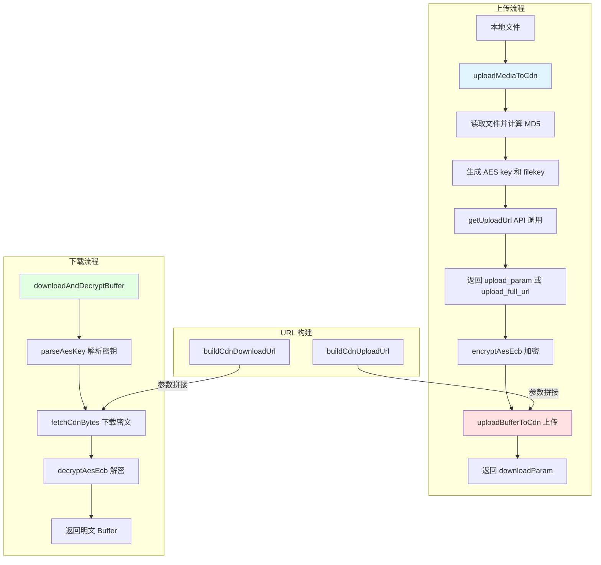

本文档详细阐述了微信插件中的 CDN 媒体上传机制及其配套的 AES-128-ECB 加密方案。媒体文件在上传至 CDN 前需经过 AES-128-ECB 加密，下载时再进行解密，整个过程由多个协作模块共同完成，构成了一个安全可靠的媒体传输链路。该机制适用于图片、视频、语音和文件附件等多种媒体类型，确保数据在传输过程中的机密性和完整性。

Sources: [src/cdn/upload.ts](src/cdn/upload.ts#L1-L158), [src/cdn/cdn-upload.ts](src/cdn/cdn-upload.ts#L1-L88)

## 整体架构设计

CDN 上传与加密系统由五个核心模块组成：加密工具模块 (`aes-ecb.ts`)、上传执行模块 (`cdn-upload.ts`)、上传流程编排模块 (`upload.ts`)、URL 构建模块 (`cdn-url.ts`) 和下载解密模块 (`pic-decrypt.ts`)。这些模块遵循单一职责原则，各自处理特定功能，通过清晰定义的接口协同工作。架构设计考虑了重试容错、多种 URL 获取方式、密钥编码兼容性等工程细节，形成了一个健壮的媒体传输方案。

Sources: [src/cdn/aes-ecb.ts](src/cdn/aes-ecb.ts#L1-L22), [src/cdn/cdn-upload.ts](src/cdn/cdn-upload.ts#L1-L88), [src/cdn/upload.ts](src/cdn/upload.ts#L1-L158)

## AES-128-ECB 加密机制

加密模块提供了 AES-128-ECB 模式的加密和解密功能，使用 PKCS7 填充方案。加密函数 `encryptAesEcb` 接收明文 Buffer 和 16 字节密钥，返回加密后的密文；解密函数 `decryptAesEcb` 执行逆向操作。由于 ECB 模式按 16 字节块独立加密，密文大小需填充到 16 字节边界，`aesEcbPaddedSize` 函数专门计算填充后的密文大小，公式为 `Math.ceil((plaintextSize + 1) / 16) * 16`。系统在生成随机 AES 密钥时使用 16 字节长度，并通过 Hex 编码或 Base64 编码进行传输和存储。

Sources: [src/cdn/aes-ecb.ts](src/cdn/aes-ecb.ts#L4-L22), [src/cdn/upload.ts](src/cdn/upload.ts#L44-L49)

### 密钥编码与解析

微信协议中的 AES 密钥存在两种编码格式，分别用于不同的媒体类型。图片类型的密钥直接对 16 字节原始密钥进行 Base64 编码；而文件、语音、视频类型的密钥则先对 16 字节原始密钥进行 Hex 编码生成 32 字符的十六进制字符串，再进行 Base64 编码。`parseAesKey` 函数能够智能识别这两种格式，先尝试 Base64 解码，若结果长度为 32 且符合十六进制格式，则再次进行 Hex 解码恢复原始 16 字节密钥；若解码长度为 16，则直接使用。这种兼容性设计确保了系统能够正确处理历史遗留的不同编码格式。

Sources: [src/cdn/pic-decrypt.ts](src/cdn/pic-decrypt.ts#L38-L58)

## CDN 上传流程详解

上传流程由 `uploadMediaToCdn` 函数统一编排，该函数是所有媒体类型（图片、视频、文件）上传的核心实现。流程始于读取本地文件，计算明文大小和 MD5 哈希值，随后生成随机的 16 字节 AES 密钥和 32 字符十六进制的 filekey。系统调用 `aesEcbPaddedSize` 计算加密后的文件大小，为后续 API 调用做准备。接着调用 `getUploadUrl` API，传递文件元数据（包括密钥的 Hex 编码字符串），服务器返回预签名上传参数（`upload_param`）或完整上传 URL（`upload_full_url`）。

Sources: [src/cdn/upload.ts](src/cdn/upload.ts#L60-L158)

### 预签名 URL 获取

`getUploadUrl` API 调用是上传流程的关键环节，它向服务器请求 CDN 上传权限。请求参数包含媒体类型（`media_type`）、目标用户 ID（`to_user_id`）、文件原始大小（`rawsize`）、原始文件 MD5（`rawfilemd5`）、加密后文件大小（`filesize`）、是否需要缩略图标志（`no_need_thumb`）以及 AES 密钥的十六进制编码（`aeskey`）。服务器响应包含两种形式的上传凭证：`upload_param` 是加密查询参数，需要客户端结合 `cdnBaseUrl` 和 `filekey` 拼接成完整上传 URL；`upload_full_url` 则是服务器直接返回的完整上传 URL，优先级更高，无需客户端拼接。这种双模式设计兼顾了灵活性和性能优化。

Sources: [src/api/types.ts](src/api/types.ts#L38-L62), [src/api/api.ts](src/api/api.ts#L244-L279)

### 加密与上传执行

获取上传凭证后，`uploadBufferToCdn` 函数执行实际的加密和上传操作。首先调用 `encryptAesEcb` 对原始 Buffer 进行加密，然后确定目标 URL：优先使用 `uploadFullUrl`，若不存在则使用 `uploadParam` 通过 `buildCdnUploadUrl` 构建完整 URL。上传采用 POST 方法，Content-Type 设置为 `application/octet-stream`，请求体为加密后的二进制数据。系统实现了最多 3 次的重试机制：对于 4xx 客户端错误（如 400、404），立即终止重试并抛出异常；对于 5xx 服务器错误或网络异常，继续重试直到成功或达到最大尝试次数。成功上传后，从响应头的 `x-encrypted-param` 字段获取下载加密参数，该参数将在消息发送时填充到 `ImageItem.media.encrypt_query_param` 字段。

Sources: [src/cdn/cdn-upload.ts](src/cdn/cdn-upload.ts#L1-L88), [src/cdn/cdn-url.ts](src/cdn/cdn-url.ts#L14-L21)

## URL 构建策略

CDN URL 模块提供了统一的 URL 构建接口，封装了上传和下载 URL 的拼接逻辑。上传 URL 构建函数 `buildCdnUploadUrl` 将 `cdnBaseUrl`、`uploadParam` 和 `filekey` 组合成标准格式：`${cdnBaseUrl}/upload?encrypted_query_param=${uploadParam}&filekey=${filekey}`。下载 URL 构建函数 `buildCdnDownloadUrl` 则使用 `encryptedQueryParam` 生成下载链接：`${cdnBaseUrl}/download?encrypted_query_param=${encryptedQueryParam}`。模块定义了 `ENABLE_CDN_URL_FALLBACK` 常量，当设为 `true` 时，若服务器未返回 `full_url` 字段，客户端会回退到本地拼接 URL；设为 `false` 时则直接报错，强制要求服务器提供完整 URL。这种设计为协议演进和调试提供了灵活性。

Sources: [src/cdn/cdn-url.ts](src/cdn/cdn-url.ts#L1-L21)

## 上传重试与错误处理机制

`uploadBufferToCdn` 实现了细致的错误分类和重试策略。4xx 客户端错误（如 400 Bad Request、404 Not Found）表示请求本身存在问题，系统立即终止重试并记录错误日志，包括从 `x-error-message` 响应头或响应体中提取的错误信息。5xx 服务器错误（如 500 Internal Server Error）或网络异常则触发重试机制，每次重试前都会记录详细日志，包括尝试次数和错误原因。系统定义了 `UPLOAD_MAX_RETRIES = 3` 的常量控制最大重试次数，确保在保证可靠性的同时避免无限重试导致的资源浪费。成功上传后，系统从 `x-encrypted-param` 响应头提取下载参数，若该字段缺失则视为上传失败并抛出异常。

Sources: [src/cdn/cdn-upload.ts](src/cdn/cdn-upload.ts#L4-L5), [src/cdn/cdn-upload.ts](src/cdn/cdn-upload.ts#L29-L69)

## 媒体类型封装与调用接口

系统为不同媒体类型提供了三个封装函数，简化了调用方的使用复杂度。`uploadFileToWeixin` 用于上传图片，内部调用 `uploadMediaToCdn` 时设置 `mediaType` 为 `UploadMediaType.IMAGE`；`uploadVideoToWeixin` 用于上传视频，设置 `mediaType` 为 `UploadMediaType.VIDEO`；`uploadFileAttachmentToWeixin` 用于上传非图片非视频的文件附件，设置 `mediaType` 为 `UploadMediaType.FILE`。所有函数返回 `UploadedFileInfo` 对象，包含 `filekey`（文件唯一标识）、`downloadEncryptedQueryParam`（下载加密参数）、`aeskey`（Hex 编码的 AES 密钥）、`fileSize`（明文文件大小）和 `fileSizeCiphertext`（密文文件大小，需填充到 `ImageItem.hd_size` 或 `mid_size` 字段）。

Sources: [src/cdn/upload.ts](src/cdn/upload.ts#L134-L158), [src/api/types.ts](src/api/types.ts#L33-L37)

## 模块交互与数据流

上传流程中，多个模块通过明确的接口进行协作。`uploadMediaToCdn` 作为流程编排者，协调文件读取、元数据计算、API 调用、加密和上传等步骤。加密模块独立于上传逻辑，专注于提供基础的加密解密功能。URL 构建模块为上传和下载提供统一的 URL 格式，隐藏了协议细节。API 类型定义模块通过 TypeScript 接口规范了所有数据结构，确保类型安全。下载流程则由 `downloadAndDecryptBuffer` 函数主导，先解析 AES 密钥，再构建下载 URL，然后获取密文数据，最后解密返回明文 Buffer。整个设计体现了高内聚低耦合的原则，模块间依赖清晰，便于测试和维护。

Sources: [src/cdn/pic-decrypt.ts](src/cdn/pic-decrypt.ts#L65-L102), [src/api/types.ts](src/api/types.ts#L88-L200)

## 表格：上传流程参数映射

| 参数名称 | 生成位置 | 计算方式 | API 字段 | 用途 |
|---------|---------|---------|---------|------|
| `rawsize` | `uploadMediaToCdn` | `plaintext.length` | `rawsize` | 原始文件明文大小 |
| `rawfilemd5` | `uploadMediaToCdn` | MD5 哈希 | `rawfilemd5` | 原始文件 MD5 校验 |
| `filesize` | `uploadMediaToCdn` | `aesEcbPaddedSize(rawsize)` | `filesize` | AES 加密后文件大小 |
| `filekey` | `uploadMediaToCdn` | `crypto.randomBytes(16).toString('hex')` | `filekey` | CDN 文件唯一标识 |
| `aeskey` | `uploadMediaToCdn` | `crypto.randomBytes(16)` | `aeskey` | AES-128-ECB 加密密钥 |
| `uploadParam` | `getUploadUrl` API | 服务器返回 | `upload_param` | 上传凭证（需拼接 URL） |
| `uploadFullUrl` | `getUploadUrl` API | 服务器返回 | `upload_full_url` | 完整上传 URL |
| `downloadParam` | CDN 响应头 | `x-encrypted-param` | - | 下载加密参数 |

Sources: [src/cdn/upload.ts](src/cdn/upload.ts#L41-L69), [src/api/types.ts](src/api/types.ts#L38-L62)

## 表格：AES 密钥编码格式对比

| 媒体类型 | 编码步骤 | 解析步骤 | 解码后长度 | 应用场景 |
|---------|---------|---------|-----------|---------|
| 图片 | Base64(原始16字节) | Base64 解码 | 16 字节 | `ImageItem.aeskey` 字段 |
| 文件/语音/视频 | Base64(Hex(原始16字节)) | Base64 解码 → Hex 解码 | 32 字节 ASCII → 16 字节 | `CDNMedia.aes_key` 字段 |
| 统一特征 | 最终都存储为 Base64 字符串 | 自动识别并解码 | - | 兼容不同协议版本 |

Sources: [src/cdn/pic-decrypt.ts](src/cdn/pic-decrypt.ts#L38-L58), [src/api/types.ts](src/api/types.ts#L88-L105)

## 扩展阅读

理解 CDN 上传与加密机制后，建议继续学习媒体下载与解密流程，该流程是上传的逆向过程，涉及从 CDN 获取加密数据并使用相同的 AES-128-ECB 密钥进行解密。此外，SILK 语音格式转码和 MIME 类型识别也构成了完整的媒体处理链条，值得深入研究。在 API 通信协议层面，[CDN 预签名 URL 获取与上传](12-cdn-yu-qian-ming-url-huo-qu-yu-shang-chuan) 提供了更底层的协议细节说明。