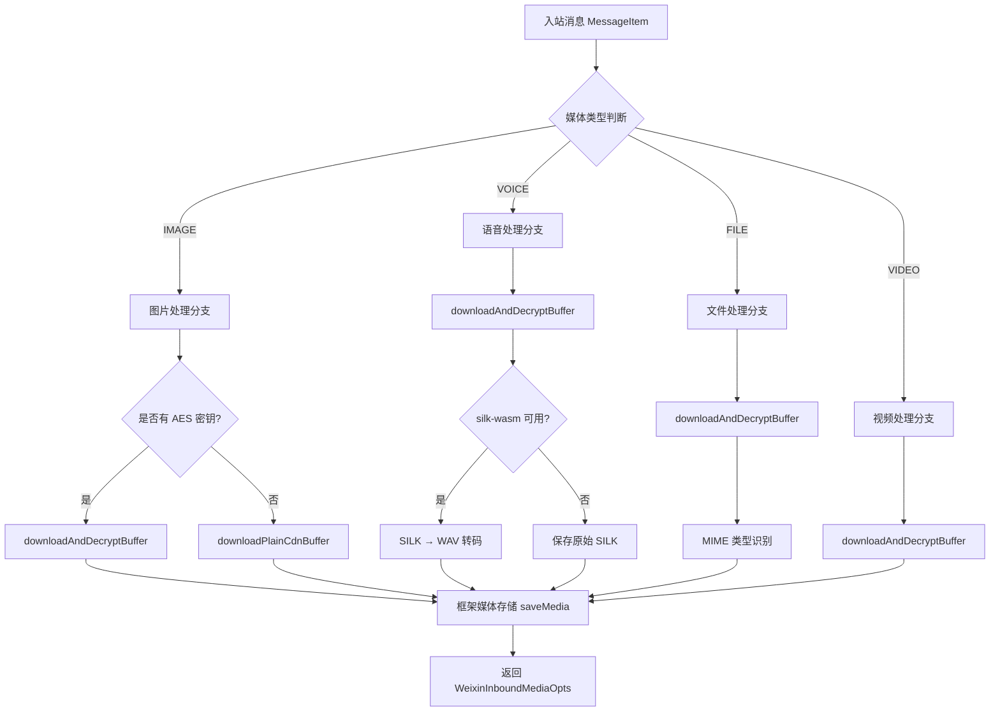
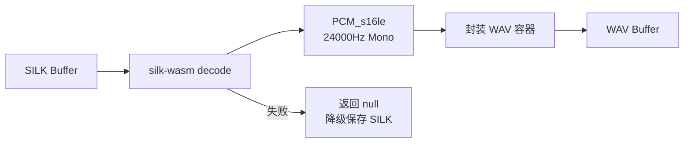

本文档详细阐述插件从微信 CDN 下载并解密媒体文件的完整机制，包括图片、语音、文件和视频四种媒体类型的处理流程，涵盖 AES-128-ECB 解密算法、密钥格式兼容性处理以及语音转码等关键技术实现。

## 功能架构概览

媒体下载与解密模块是插件入站消息处理的核心组件之一，负责将加密存储在微信 CDN 的媒体文件下载到本地并解密，为后续消息处理提供明文文件路径。该模块采用分层架构设计，将下载、解密和转码逻辑解耦，确保各职责清晰且易于维护。整个流程从消息的 MessageItem 入手，根据媒体类型分发到相应的处理分支，最终通过框架统一的媒体存储接口保存文件。

## 媒体类型处理策略

插件支持四种媒体类型的下载与解密，每种类型根据协议规范采用差异化的处理策略。图片类型具有特殊的非加密模式兼容性，而语音、文件和视频均采用强制解密模式。所有媒体下载通过 `downloadMediaFromItem` 函数统一入口，该函数根据 `MessageItemType` 枚举值路由到相应的处理逻辑，并将结果封装为 `WeixinInboundMediaOpts` 类型返回。Sources: [media-download.ts](src/media/media-download.ts#L30-L150)

### 图片媒体处理

图片处理逻辑首先检查必要的 CDN 参数字段，包括 `encrypt_query_param` 或 `full_url`。AES 密钥来源具有双重支持机制：优先使用 `image_item.aeskey` 字段的十六进制字符串密钥，回退到 `media.aes_key` 字段的 Base64 编码密钥。这种设计兼容不同版本协议的字段差异，确保最大兼容性。如果存在 AES 密钥，调用 `downloadAndDecryptBuffer` 进行下载解密；否则直接调用 `downloadPlainCdnBuffer` 下载非加密图片。下载完成后，文件通过 `saveMedia` 接口保存到 `inbound` 子目录，文件大小限制为 100MB。Sources: [media-download.ts](src/media/media-download.ts#L40-L65)

### 语音媒体处理

语音消息必须提供加密参数和 AES 密钥，否则直接返回空结果。下载解密后的 SILK 格式音频数据会尝试通过 `silkToWav` 函数转码为标准 WAV 格式。转码过程依赖 `silk-wasm` 模块，该模块将 SILK 解码为 16-bit PCM 数据，采样率固定为 24000Hz，然后封装为单声道 WAV 容器。如果转码失败（如依赖模块未安装或解码错误），系统会降级保存原始 SILK 文件，并在 `voiceMediaType` 字段标记实际的 MIME 类型（`audio/wav` 或 `audio/silk`），确保下游调用方知晓文件格式。Sources: [media-download.ts](src/media/media-download.ts#L66-L91) | [silk-transcode.ts](src/media/silk-transcode.ts#L40-L75)

### 文件媒体处理

文件处理流程包括下载解密、MIME 类型推断和文件保存三个阶段。MIME 类型通过 `getMimeFromFilename` 函数从文件扩展名识别，插件内置了 22 种常见文件类型的映射表，包括 Office 文档、压缩包、音视频和图片等。对于未知扩展名，默认返回 `application/octet-stream`。保存文件时，原始文件名会作为 `originalFilename` 参数传递给媒体存储接口，确保文件扩展名得以保留。Sources: [media-download.ts](src/media/media-download.ts#L92-L110) | [mime.ts](src/media/mime.ts#L10-L35)

### 视频媒体处理

视频消息处理流程相对简单，强制要求加密参数和 AES 密钥，下载解密后直接保存为 `video/mp4` 格式。视频文件同样受 100MB 大小限制，保存路径和 MIME 类型通过 `decryptedVideoPath` 和固定值 `video/mp4` 返回。Sources: [media-download.ts](src/media/media-download.ts#L111-L125)

## AES 密钥解析机制

微信协议中 AES 密钥的编码格式存在两种变体，`parseAesKey` 函数实现了格式自动识别与转换。第一种格式是 Base64 编码的原始 16 字节密钥，主要用于图片媒体；第二种格式是 Base64 编码的十六进制字符串（32 个 ASCII 字符），用于文件、语音和视频媒体。解析时首先进行 Base64 解码，若结果长度为 16 字节则直接使用；若为 32 字节且全为十六进制字符，则将其作为 ASCII 字符串解析为十六进制字节；否则抛出异常。这种双重格式兼容性确保了插件能够处理不同版本的协议字段。Sources: [pic-decrypt.ts](src/cdn/pic-decrypt.ts#L29-L45)

## CDN 下载与解密流程

`downloadAndDecryptBuffer` 函数封装了完整的下载解密流程。首先解析 AES 密钥，然后确定 CDN URL：优先使用服务端返回的 `full_url` 字段，若该字段不存在且 `ENABLE_CDN_URL_FALLBACK` 配置为 true，则回退到客户端拼接 URL（格式为 `{cdnBaseUrl}/download?encrypted_query_param={encodeURIComponent(encryptedQueryParam)}`）。下载过程通过 `fetch` API 完成，网络错误和 HTTP 错误状态都会被捕获并转换为异常。下载完成后，使用 `decryptAesEcb` 函数进行 AES-128-ECB 解密，该函数基于 Node.js 内置的 `crypto` 模块实现，自动处理 PKCS7 填充。Sources: [pic-decrypt.ts](src/cdn/pic-decrypt.ts#L59-L91) | [aes-ecb.ts](src/cdn/aes-ecb.ts#L13-L17)

| 配置项 | 类型 | 默认值 | 说明 |
|--------|------|--------|------|
| `ENABLE_CDN_URL_FALLBACK` | boolean | true | 是否在服务端未返回 full_url 时回退到客户端拼接 URL |
| `WEIXIN_MEDIA_MAX_BYTES` | number | 104,857,600 | 单个媒体文件最大大小限制（100MB） |

## SILK 语音转码实现

SILK 是微信使用的专有音频编码格式，插件提供可选的 WAV 转码功能。转码过程分为两个步骤：首先使用 `silk-wasm` 模块的 `decode` 函数将 SILK 解码为 PCM 数据，然后将 PCM 数据封装为 WAV 容器。WAV 文件头严格按照 RIFF 格式构建，包括格式标识、音频格式（PCM=1）、声道数（单声道=1）、采样率（24000Hz）、字节率和位深度（16-bit）等字段。转码失败时（如 silk-wasm 模块未安装或文件损坏），函数返回 null，调用方应降级保存原始 SILK 文件。Sources: [silk-transcode.ts](src/media/silk-transcode.ts#L8-L33)

## 错误处理与日志记录

模块采用细粒度的错误处理策略，每个媒体类型的处理分支都包含独立的 try-catch 块，确保一种媒体下载失败不会影响其他类型的处理。错误信息同时通过 `logger.error` 记录到日志系统，并通过 `errLog` 回调函数传递给调用方，便于上层进行错误通知。日志记录包括关键步骤的调试信息，如下载字节数、解密后字节数、保存路径和 MIME 类型等，便于问题排查。Sources: [media-download.ts](src/media/media-download.ts#L58-L62) | [pic-decrypt.ts](src/cdn/pic-decrypt.ts#L11-L27)

## 后续学习路径

完成媒体下载与解密的理解后，建议按以下顺序深入学习相关模块：

- [SILK 语音格式转码](16-silk-yu-yin-ge-shi-zhuan-ma) - 了解 SILK 编解码的完整实现细节
- [CDN 上传与 AES-128-ECB 加密](14-cdn-shang-chuan-yu-aes-128-ecb-jia-mi) - 掌握媒体上传的加密流程，与下载解密形成对称理解
- [MIME 类型识别](17-mime-lei-xing-shi-bie) - 查看完整的文件类型映射表和类型推断逻辑
- [入站消息路由与处理](18-ru-zhan-xiao-xi-lu-you-yu-chu-li) - 了解媒体下载结果如何传递到消息处理管道