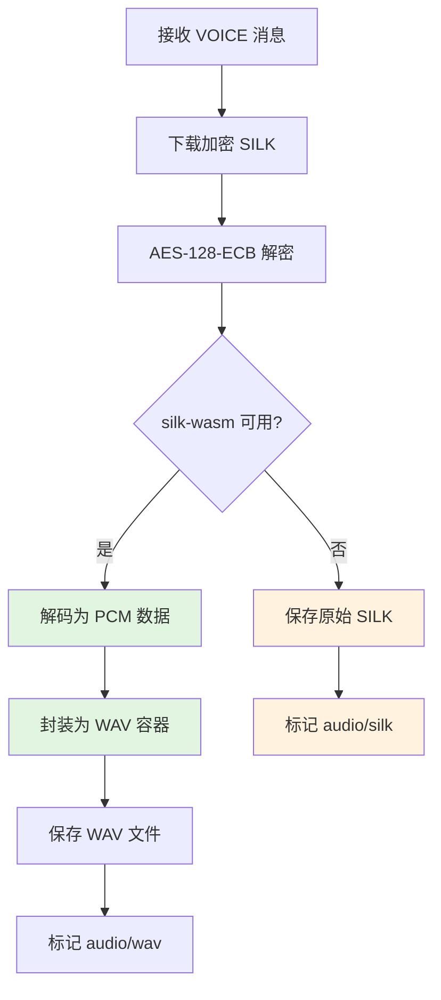
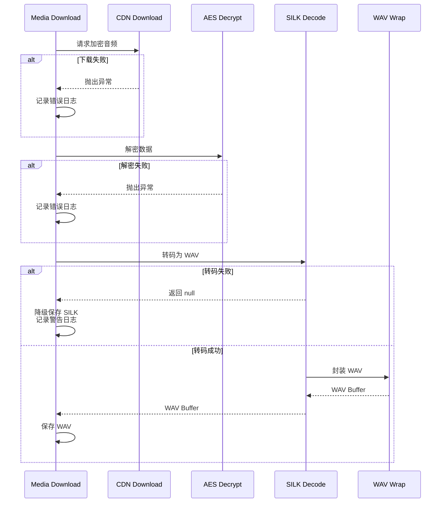

本页面详细阐述微信语音消息的 SILK 格式转码机制，涵盖从 CDN 下载加密音频、WASM 解码到 WAV 容器封装的完整流程，以及降级处理策略和错误恢复机制。

SILK (Skype Internet Low Bitrate Codec) 是微信用于语音消息的编码格式，采样率为 24,000 Hz。由于该格式不是主流音频格式，插件提供将其转换为标准 WAV 格式的功能，同时保留原始 SILK 数据作为降级方案。

## 转码流程架构

SILK 转码过程集成在入站消息处理的媒体下载阶段。当接收到类型为 `VOICE` 的消息时，系统会按顺序执行下载、解密、转码、封装和保存操作。



该流程的核心特性是**优雅降级**：当 `silk-wasm` 模块不可用或解码失败时，系统会自动保存原始 SILK 格式，确保音频数据不丢失。这种设计保证了在依赖缺失或转码异常情况下的系统健壮性。

Sources: [src/media/media-download.ts](src/media/media-download.ts#L46-L76)

## WAV 容器封装实现

WAV 封装过程将解码后的 PCM（Pulse Code Modulation）数据包装为标准 WAV 文件格式。WAV 是 RIFF（Resource Interchange File Format）的子格式，由一系列 chunk 组成。

### WAV 文件结构

WAV 文件包含两个主要 chunk：`fmt ` chunk 描述音频格式参数，`data` chunk 包含实际的 PCM 音频数据。

```mermaid
graph LR
    subgraph RIFF_Header
        A[RIFF 标识<br/>4 字节]
        B[文件大小<br/>4 字节]
        C[WAVE 标识<br/>4 字节]
    end
    
    subgraph fmt_Chunk
        D[fmt 标识<br/>4 字节]
        E[Chunk 大小<br/>4 字节]
        F[音频格式 PCM=1<br/>2 字节]
        G[声道数 Mono=1<br/>2 字节]
        H[采样率 24000 Hz<br/>4 字节]
        I[字节率<br/>4 字节]
        J[块对齐<br/>2 字节]
        K[位深度 16-bit<br/>2 字节]
    end
    
    subgraph data_Chunk
        L[data 标识<br/>4 字节]
        M[数据大小<br/>4 字节]
        N[PCM 数据<br/>N 字节]
    end
    
    A --> B --> C --> D --> E --> F --> G --> H --> I --> J --> K --> L --> M --> N
```



### 封装参数配置

微信语音转码的 WAV 封装采用固定参数配置，确保与解码后的 PCM 数据格式完全匹配。

| 参数 | 值 | 说明 |
|------|-----|------|
| 采样率 | 24,000 Hz | 微信 SILK 编码的默认采样率 |
| 声道数 | 1（单声道） | 语音消息仅包含单声道 |
| 位深度 | 16 位 | PCM 数据采用 16 位有符号小端序 |
| 音频格式 | 1（PCM） | 无压缩的线性 PCM 编码 |
| 字节率 | 48,000 bytes/s | 采样率 × 声道数 × 位深度/8 = 24000 × 1 × 2 |
| 块对齐 | 2 字节 | 声道数 × 位深度/8 = 1 × 16/8 |

Sources: [src/media/silk-transcode.ts](src/media/silk-transcode.ts#L3-L44)

## silk-wasm 解码集成

`silk-wasm` 是一个 WebAssembly 编译的 SILK 解码器，提供跨平台的解码能力。插件通过动态导入方式加载该模块，避免在不需要时占用资源。

### 解码接口

解码函数返回包含 PCM 数据和音频持续时间的对象：

```typescript
interface SilkDecodeResult {
  data: Uint8Array;        // PCM_s16le 格式的音频数据
  duration: number;        // 音频持续时间（毫秒）
}
```

解码过程需要提供 SILK 原始数据和目标采样率。解码器会验证输入数据的有效性，并在解析失败时抛出异常，由上层进行降级处理。

Sources: [src/media/silk-transcode.ts](src/media/silk-transcode.ts#L55-L75)

## 降级处理机制

降级机制确保即使在转码失败的情况下，音频数据也能被保存和传递。该机制处理三种主要场景：依赖缺失、解码失败、格式异常。

### 降级场景分析

| 场景 | 触发条件 | 处理方式 | MIME 类型 |
|------|----------|----------|-----------|
| 依赖缺失 | `silk-wasm` 模块未安装 | 保存原始 SILK | `audio/silk` |
| 解码失败 | `decode()` 抛出异常 | 保存原始 SILK | `audio/silk` |
| 转码成功 | 正常返回 WAV Buffer | 保存 WAV 文件 | `audio/wav` |

降级处理的日志记录包含详细的错误信息，便于开发者追踪问题根源。所有转码失败都会记录为 `warn` 级别日志，包含错误原因和原始数据大小。

Sources: [src/media/silk-transcode.ts](src/media/silk-transcode.ts#L63-L75)

## 媒体存储与类型标记

转码后的音频文件通过框架统一的媒体存储接口进行持久化。存储时需要指定 MIME 类型，以便下游系统正确识别和播放。

### 存储参数

```typescript
SaveMediaFn = (
  buffer: Buffer,           // 音频数据
  contentType?: string,     // MIME 类型
  subdir?: string,          // 子目录 "inbound"
  maxBytes?: number,        // 最大大小 100 MB
  originalFilename?: string // 原始文件名
) => Promise<{ path: string }>;
```

存储路径返回后，会被填充到 `WeixinInboundMediaOpts` 对象中，包含 `decryptedVoicePath` 和 `voiceMediaType` 字段，供后续消息处理使用。

Sources: [src/media/media-download.ts](src/media/media-download.ts#L15-L20)

## 错误处理与日志记录

完整的错误处理链路覆盖网络请求、解密、转码和文件保存四个环节。每个环节都有独立的日志记录，便于问题诊断和性能监控。

### 错误传播路径



### 日志级别说明

- `debug`：记录数据大小、文件路径、采样率等调试信息
- `warn`：记录转码失败、降级处理等可恢复异常
- `error`：记录网络错误、解密失败、文件保存失败等严重问题

Sources: [src/media/silk-transcode.ts](src/media/silk-transcode.ts#L6-L9)

## 相关文档

SILK 转码是媒体处理流程的关键环节，建议结合以下文档全面理解系统的媒体处理机制：

- **[CDN 上传与 AES-128-ECB 加密](14-cdn-shang-chuan-yu-aes-128-ecb-jia-mi)**：了解 CDN 媒体文件的加密传输机制
- **[媒体下载与解密](15-mei-ti-xia-zai-yu-jie-mi)**：深入了解加密媒体的下载和解密流程
- **[MIME 类型识别](17-mime-lei-xing-shi-bie)**：掌握文件类型识别和扩展名映射逻辑
- **[入站消息路由与处理](18-ru-zhan-xiao-xi-lu-you-yu-chu-li)**：理解消息处理的完整生命周期