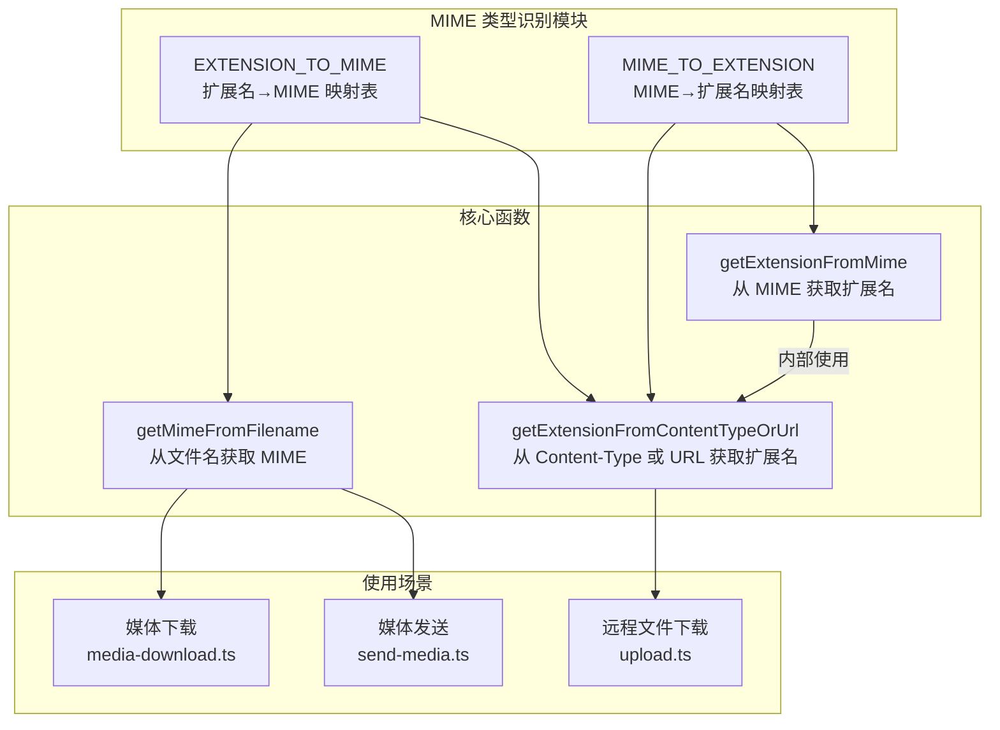
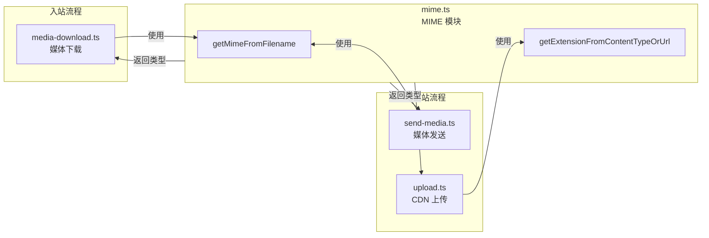

MIME 类型识别模块为插件提供了文件类型映射功能，支持在媒体下载、上传和消息发送过程中正确处理不同格式的文件。该模块基于文件扩展名进行 MIME 类型推断，同时提供反向查找功能，确保文件在微信生态系统中的正确传输和展示。

## 核心架构

MIME 类型识别模块位于 `src/media/mime.ts`，采用双向映射表设计，支持扩展名与 MIME 类型之间的相互转换。模块提供三个核心函数，分别适用于不同的使用场景：



## 双向映射表

模块维护两个映射表：`EXTENSION_TO_MIME` 包含扩展名到 MIME 类型的完整映射，而 `MIME_TO_EXTENSION` 提供反向映射但仅覆盖常用类型。这种不对称设计基于实际使用场景：文件上传/下载时需要从扩展名推断 MIME 类型，而反向查找主要用于特定 MIME 类型的文件扩展名推断。

**支持的文件类型**包括：

| 类别 | 扩展名 | MIME 类型 |
|------|--------|-----------|
| **图像** | .png, .jpg, .jpeg, .gif, .webp, .bmp | image/png, image/jpeg, image/gif, image/webp, image/bmp |
| **视频** | .mp4, .mov, .webm, .mkv, .avi | video/mp4, video/quicktime, video/webm, video/x-matroska, video/x-msvideo |
| **音频** | .mp3, .ogg, .wav | audio/mpeg, audio/ogg, audio/wav |
| **文档** | .pdf, .doc, .docx, .xls, .xlsx, .ppt, .pptx, .txt, .csv | application/pdf, application/msword, application/vnd.openxmlformats-*, text/plain, text/csv |
| **压缩包** | .zip, .tar, .gz | application/zip, application/x-tar, application/gzip |

Sources: [src/media/mime.ts](src/media/mime.ts#L1-L51)

## 核心函数

### getMimeFromFilename

该函数从文件名中提取扩展名并返回对应的 MIME 类型。对于未知扩展名，返回通用的 `application/octet-stream` 类型，确保系统不会因无法识别类型而崩溃。

```typescript
export function getMimeFromFilename(filename: string): string {
  const ext = path.extname(filename).toLowerCase();
  return EXTENSION_TO_MIME[ext] ?? "application/octet-stream";
}
```

函数实现简洁高效：使用 `path.extname` 提取扩展名后转换为小写，然后在映射表中查找。未找到时返回默认的二进制流类型，这种设计遵循了 MIME 标准的"宁可保守，也不假设"原则。

Sources: [src/media/mime.ts](src/media/mime.ts#L55-L59)

### getExtensionFromMime

该函数执行反向查找，从 MIME 类型字符串中提取文件扩展名。函数首先移除 MIME 类型中的参数部分（如 `; charset=utf-8`），然后在映射表中查找。未知类型返回 `.bin`。

```typescript
export function getExtensionFromMime(mimeType: string): string {
  const ct = mimeType.split(";")[0].trim().toLowerCase();
  return MIME_TO_EXTENSION[ct] ?? ".bin";
}
```

此函数特别适用于需要从 HTTP 响应头或 API 响应中推断文件扩展名的场景。通过处理带参数的 MIME 类型字符串，确保了兼容性。

Sources: [src/media/mime.ts](src/media/mime.ts#L61-L65)

### getExtensionFromContentTypeOrUrl

这是最智能的扩展名推断函数，采用两级回退策略：优先从 Content-Type 头推断，失败时则从 URL 路径中提取扩展名。

```typescript
export function getExtensionFromContentTypeOrUrl(
  contentType: string | null, 
  url: string
): string {
  if (contentType) {
    const ext = getExtensionFromMime(contentType);
    if (ext !== ".bin") return ext;
  }
  const ext = path.extname(new URL(url).pathname).toLowerCase();
  const knownExts = new Set(Object.keys(EXTENSION_TO_MIME));
  return knownExts.has(ext) ? ext : ".bin";
}
```

函数首先尝试解析 Content-Type，只有当结果为 `.bin`（表示未知类型）时才回退到 URL 路径解析。这种设计确保了服务端提供的 MIME 类型优先于客户端推断，提高了准确性。

Sources: [src/media/mime.ts](src/media/mime.ts#L67-L77)

## 实际应用场景

### 媒体下载时的 MIME 类型设置

在媒体下载流程中，`getMimeFromFilename` 用于为下载的文件附件设置正确的 MIME 类型。这对于确保文件在后续处理和传输过程中能够被正确识别至关重要。

```typescript
// 从媒体下载模块的使用示例
const buf = await downloadAndDecryptBuffer(
  fileItem.media.encrypt_query_param ?? "",
  fileItem.media.aes_key,
  cdnBaseUrl,
  `${label} file`,
  fileItem.media.full_url,
);
const mime = getMimeFromFilename(fileItem.file_name ?? "file.bin");
const saved = await saveMedia(
  buf,
  mime,
  "inbound",
  WEIXIN_MEDIA_MAX_BYTES,
  fileItem.file_name ?? undefined,
);
result.decryptedFilePath = saved.path;
result.fileMediaType = mime;
```

当接收到文件类型的微信消息时，系统从 `file_item.file_name` 字段提取文件名，通过 `getMimeFromFilename` 推断 MIME 类型，然后将该类型传递给 `saveMedia` 函数，确保存储的文件具有正确的 Content-Type。

Sources: [src/media/media-download.ts](src/media/media-download.ts#L126-L147)

### 媒体发送时的类型路由

在发送媒体文件时，`getMimeFromFilename` 作为路由决策的核心依据，将文件分配到不同的上传通道：视频、图像或文件附件。

```typescript
// 从发送媒体模块的使用示例
export async function sendWeixinMediaFile(params: {
  filePath: string;
  to: string;
  text: string;
  opts: WeixinApiOptions & { contextToken?: string };
  cdnBaseUrl: string;
}): Promise<{ messageId: string }> {
  const { filePath, to, text, opts, cdnBaseUrl } = params;
  const mime = getMimeFromFilename(filePath);
  
  if (mime.startsWith("video/")) {
    // 上传视频并发送视频消息
    const uploaded = await uploadVideoToWeixin({...});
    return sendVideoMessageWeixin({ to, text, uploaded, opts });
  }
  
  if (mime.startsWith("image/")) {
    // 上传图片并发送图片消息
    const uploaded = await uploadFileToWeixin({...});
    return sendImageMessageWeixin({ to, text, uploaded, opts });
  }
  
  // 文件附件：pdf、doc、zip 等
  const fileName = path.basename(filePath);
  const uploaded = await uploadFileAttachmentToWeixin({...});
  return sendFileMessageWeixin({ to, text, fileName, uploaded, opts });
}
```

这种基于 MIME 类型前缀的路由策略使系统能够根据文件类型自动选择正确的上传和发送逻辑，无需用户手动指定文件类别。对于视频文件使用 `uploadVideoToWeixin`，图像使用 `uploadFileToWeixin`，其他类型则作为文件附件处理。

Sources: [src/messaging/send-media.ts](src/messaging/send-media.ts#L13-L73)

### 远程文件下载时的扩展名推断

当需要下载远程媒体文件时，`getExtensionFromContentTypeOrUrl` 函数能够智能推断目标文件的扩展名，确保保存的文件具有正确的命名。

```typescript
// 从 CDN 上传模块的使用示例
export async function downloadRemoteImageToTemp(
  url: string, 
  destDir: string
): Promise<string> {
  logger.debug(`downloadRemoteImageToTemp: fetching url=${url}`);
  const res = await fetch(url);
  if (!res.ok) {
    const msg = `remote media download failed: ${res.status} ${res.statusText}`;
    logger.error(`downloadRemoteImageToTemp: ${msg}`);
    throw new Error(msg);
  }
  const buf = Buffer.from(await res.arrayBuffer());
  logger.debug(`downloadRemoteImageToTemp: downloaded ${buf.length} bytes`);
  await fs.mkdir(destDir, { recursive: true });
  const ext = getExtensionFromContentTypeOrUrl(res.headers.get("content-type"), url);
  const name = tempFileName("weixin-remote", ext);
  const filePath = path.join(destDir, name);
  await fs.writeFile(filePath, buf);
  logger.debug(`downloadRemoteImageToTemp: saved to ${filePath} ext=${ext}`);
  return filePath;
}
```

该函数首先尝试从 HTTP 响应的 `content-type` 头推断扩展名，这是最可靠的方法。如果服务器未提供 Content-Type 或类型未知，则回退到从 URL 路径中提取扩展名。最后，只有已知扩展名（在映射表中的）才会被使用，否则返回 `.bin`。

Sources: [src/cdn/upload.ts](src/cdn/upload.ts#L30-L53)

## 错误处理与默认行为

MIME 类型识别模块采用了保守的错误处理策略，确保在无法识别文件类型时系统仍能继续运行：

- **未知扩展名**: `getMimeFromFilename` 返回 `application/octet-stream`，这是一个通用的二进制流类型，适用于任何未知文件
- **未知 MIME 类型**: `getExtensionFromMime` 返回 `.bin`，表示二进制文件
- **双向查找失败**: `getExtensionFromContentTypeOrUrl` 在 Content-Type 和 URL 路径都失败时返回 `.bin`

这种设计避免了因类型识别失败而导致的系统崩溃，同时为调用方提供了明确的信号来处理未知类型。

## 相关流程

MIME 类型识别作为媒体处理流程的基础组件，与多个核心模块紧密协作：



当需要了解媒体下载的完整流程时，建议阅读 [媒体下载与解密](15-mei-ti-xia-zai-yu-jie-mi)。对于媒体发送的详细机制，可以参考 [CDN 上传与 AES-128-ECB 加密](14-cdn-shang-chuan-yu-aes-128-ecb-jia-mi)。