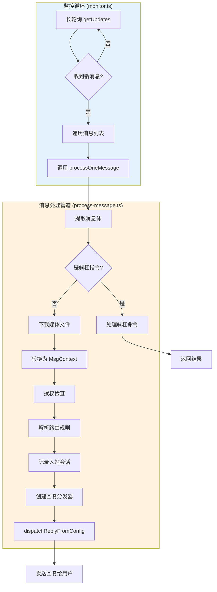
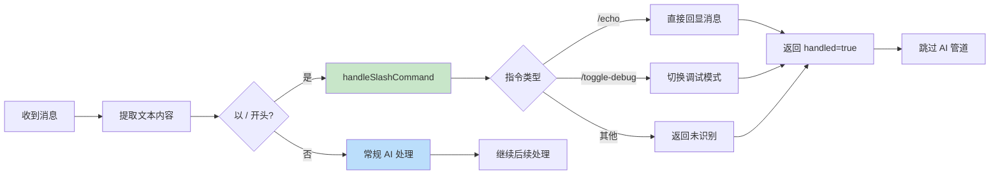
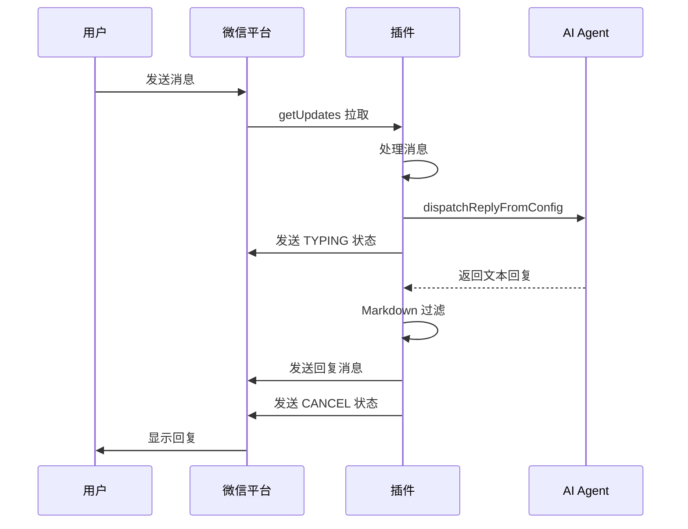

入站消息路由与处理是插件接收微信消息并转发到 AI 助手处理的核心管道。该模块负责从微信平台拉取消息、进行预处理、授权检查、媒体下载、会话管理，最终将消息分发给 AI 助手并处理回复。整个流程采用长轮询机制，确保低延迟的消息接收。

## 消息接收架构

入站消息处理始于监控循环，该循环通过长轮询 `getUpdates` API 从微信平台持续拉取新消息。监控循环独立运行于每个微信账号，通过同步游标实现断点续传，确保在网关重启后不会丢失消息。

监控循环位于 `src/monitor/monitor.ts`，使用 35 秒默认超时进行长轮询，每次成功轮询后更新同步游标并持久化到磁盘，以支持断点续传能力。[Sources: src/monitor/monitor.ts](src/monitor/monitor.ts#L14-L16)

## 消息处理流程详解

`processOneMessage` 函数是入站消息处理的核心入口，位于 `src/messaging/process-message.ts`。该函数接收微信原始消息对象和运行时依赖，完成从消息接收到回复生成的完整流程。

### 斜杠命令优先处理

处理流程首先检测消息是否为斜杠命令（以 `/` 开头）。如果是斜杠命令，系统优先处理并跳过后续的 AI 管道。这种设计允许管理员在无需 AI 参与的情况下执行诊断和控制操作。

支持的斜杠命令包括 `/echo`（回显消息并附带通道耗时统计）和 `/toggle-debug`（切换调试模式）。斜杠命令处理模块位于 `src/messaging/slash-commands.ts`。[Sources: src/messaging/process-message.ts](src/messaging/process-message.ts#L82-L97), [Sources: src/messaging/slash-commands.ts](src/messaging/slash-commands.ts#L2-L7)

### 媒体下载与处理

对于非斜杠命令的消息，系统会检查并下载媒体文件。下载优先级遵循：图片 > 视频 > 文件 > 语音（仅当语音未提供转文字时）。如果主消息中没有媒体，系统还会检查引用消息中是否包含媒体。

| 媒体类型 | 下载方法 | 存储字段 | MIME 类型 |
|---------|---------|---------|-----------|
| 图片 | AES-128-ECB 解密 | decryptedPicPath | image/* |
| 视频 | AES-128-ECB 解密 | decryptedVideoPath | video/mp4 |
| 文件 | AES-128-ECB 解密 | decryptedFilePath | application/octet-stream |
| 语音 | 解密 + SILK 转 WAV | decryptedVoicePath | audio/wav |

媒体下载过程位于 `src/media/media-download.ts`，通过 `downloadMediaFromItem` 函数实现。下载后的媒体文件通过框架统一的媒体存储接口保存，最大支持 100MB 文件。[Sources: src/messaging/process-message.ts](src/messaging/process-message.ts#L111-L152), [Sources: src/media/media-download.ts](src/media/media-download.ts#L12-L21)

### 消息上下文转换

原始微信消息通过 `weixinMessageToMsgContext` 函数转换为框架统一的消息上下文格式 `WeixinMsgContext`。转换过程提取文本内容、发件人 ID、时间戳等信息，并将下载的媒体路径附加到上下文中。

文本内容提取逻辑位于 `bodyFromItemList` 函数，能够处理文本消息、引用消息和语音转文字。对于引用消息，系统会构建 `[引用: 内容]` 格式的文本前缀；对于语音消息，如果 `voice_item.text` 存在，则直接使用转写文本。[Sources: src/messaging/inbound.ts](src/messaging/inbound.ts#L172-L197), [Sources: src/messaging/inbound.ts](src/messaging/inbound.ts#L220-L257)

### 授权与路由解析

消息处理流程包含严格的授权检查。系统通过 `resolveSenderCommandAuthorizationWithRuntime` 函数解析发送者的命令执行权限，授权策略基于配对机制（pairing），只有通过白名单配对的用户才能通过授权验证。

授权通过后，系统通过 `resolveAgentRoute` 解析消息路由规则，确定消息应该分发给哪个 AI Agent。路由解析基于配置文件中的路由规则，返回对应的 `agentId` 和 `sessionKey`。[Sources: src/messaging/process-message.ts](src/messaging/process-message.ts#L164-L228)

### 会话状态管理

为确保对话上下文连续性，系统在分发消息前记录入站会话信息。`recordInboundSession` 函数将消息与会话键（sessionKey）关联，并更新最后路由信息。这种机制允许 AI 模型在多轮对话中保持上下文连贯性。

同时，系统提取并存储 `context_token`，该令牌是微信平台提供的消息上下文标识，必须在所有出站消息中回显，以确保消息能正确发送到对应的聊天窗口。[Sources: src/messaging/process-message.ts](src/messaging/process-message.ts#L252-L263), [Sources: src/messaging/inbound.ts](src/messaging/inbound.ts#L14-L23)

## 回复分发与发送

消息分发通过 `createReplyDispatcherWithTyping` 创建带有打字指示器的回复分发器。打字指示器通过 `TypingStatus` 枚举状态向用户展示 AI 正在生成回复，提升用户体验。

回复内容在发送前会经过 `StreamingMarkdownFilter` 过滤，该流式过滤器使用字符级状态机去除微信不支持的 Markdown 语法（如代码块、删除线、加粗等），确保回复内容能在微信中正确显示。[Sources: src/messaging/process-message.ts](src/messaging/process-message.ts#L274-L338), [Sources: src/messaging/markdown-filter.ts](src/messaging/markdown-filter.ts#L1-L23)

### 媒体回复处理

如果 AI 回复包含媒体 URL（`mediaUrl`），系统会根据 URL 类型进行不同处理：本地文件路径直接使用，HTTP/HTTPS 远程 URL 下载到临时目录，然后调用 `sendWeixinMediaFile` 上传到 CDN 并发送。上传过程涉及获取预签名 URL、AES-128-ECB 加密和分片上传等步骤。[Sources: src/messaging/process-message.ts](src/messaging/process-message.ts#L333-L379)

## 错误处理与通知

消息处理过程中的错误不会中断主流程，而是通过 `sendWeixinErrorNotice` 函数以火后即忘的方式向用户发送错误通知。错误通知仅在存在 `context_token` 时发送，确保通知能正确回传到对应对话窗口。

错误通知内容根据错误类型进行定制：媒体下载失败、CDN 上传失败、网络超时等场景都有相应的提示文案。该模块位于 `src/messaging/error-notice.ts`。[Sources: src/messaging/error-notice.ts](src/messaging/error-notice.ts#L1-L31)

## 调试模式与链路追踪

插件提供基于账号的调试模式开关，通过 `/toggle-debug` 命令启用。调试模式下，系统会在每次 AI 回复发送后附加完整的链路耗时统计，包括平台到插件延迟、入站处理耗时、AI 生成耗时等关键指标。

调试模式状态持久化到磁盘文件 `<stateDir>/openclaw-weixin/debug-mode.json`，确保网关重启后状态保持。调试信息通过 `sendMessageWeixin` 以单独消息的形式发送给用户。[Sources: src/messaging/debug-mode.ts](src/messaging/debug-mode.ts#L1-L8), [Sources: src/messaging/process-message.ts](src/messaging/process-message.ts#L438-L482)

| 耗时指标 | 说明 | 计算方式 |
|---------|------|---------|
| 平台→插件 | 微信平台到插件的网络延迟 | receivedAt - eventTime |
| 入站处理 | 鉴权、路由、媒体下载耗时 | preDispatch - receivedAt |
| 媒体下载 | 媒体文件下载与解密耗时 | mediaDownload 专项统计 |
| AI 生成+回复 | AI 模型生成与消息发送耗时 | dispatchDone - preDispatch |
| 总耗时 | 端到端总延迟 | dispatchDone - eventTime |

## Context Token 管理

Context token 是微信平台提供的消息上下文令牌，必须在所有出站消息中回显。插件实现了双层缓存机制：内存 Map 作为主存储，磁盘文件作为持久化备份。这种设计确保在网关重启后能恢复对话上下文，避免消息发送到错误窗口。

Token 存储键格式为 `accountId:userId`，支持跨账号查询以自动识别发送账号。管理函数包括 `setContextToken`（设置）、`getContextToken`（获取）、`findAccountIdsByContextToken`（反向查询）。[Sources: src/messaging/inbound.ts](src/messaging/inbound.ts#L14-L113)

## 组件依赖关系

入站消息处理涉及多个模块的协同工作，核心组件包括：

1. **监控模块** (`monitor.ts`)：长轮询消息拉取、同步游标管理
2. **处理模块** (`process-message.ts`)：消息路由、授权、分发核心逻辑
3. **入站模块** (`inbound.ts`)：消息上下文转换、token 管理
4. **斜杠命令** (`slash-commands.ts`)：指令解析与执行
5. **调试模块** (`debug-mode.ts`)：调试模式开关与状态持久化
6. **媒体模块** (`media-download.ts`)：媒体下载与解密
7. **过滤模块** (`markdown-filter.ts`)：Markdown 语法过滤
8. **错误模块** (`error-notice.ts`)：错误通知发送

这些模块通过清晰的接口契约相互协作，形成高内聚、低耦合的架构。要深入了解长轮询机制，可参考 [长轮询 getUpdates 实现](10-chang-lun-xun-getupdates-shi-xian)；要了解会话管理，可参考 [会话状态管理与过期处理](13-hui-hua-zhuang-tai-guan-li-yu-guo-qi-chu-li)。媒体处理相关内容请查看 [CDN 上传与 AES-128-ECB 加密](14-cdn-shang-chuan-yu-aes-128-ecb-jia-mi) 和 [媒体下载与解密](15-mei-ti-xia-zai-yu-jie-mi)。

下一节将详细介绍 [Markdown 文本过滤](19-markdown-wen-ben-guo-lu) 机制，该机制确保 AI 生成的 Markdown 内容能兼容微信平台的显示限制。