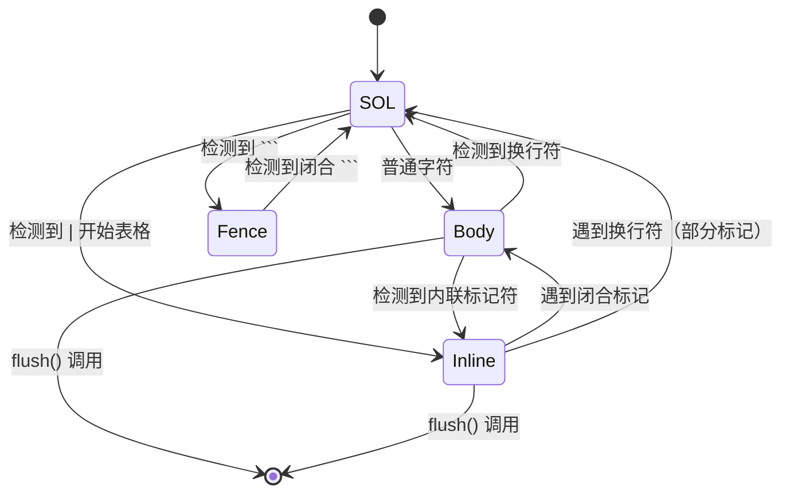

OpenClaw 微信插件通过 `StreamingMarkdownFilter` 类实现了流式 Markdown 文本过滤，这是一个字符级状态机，能够在输入时实时移除微信不支持的 Markdown 语法，确保纯文本内容能够正确显示。

## 设计动机

微信平台原生不支持 Markdown 格式渲染，若直接发送包含 Markdown 语法的文本（如 `**粗体**`、`` `代码` ``、`> 引用`），用户将看到原始标记而非格式化效果。该过滤器的设计目标是在消息发送前实时清理这些语法，同时保持文本的可读性和完整性。

过滤器采用流式处理架构，这意味着它在接收到文本的同时就能输出尽可能多的过滤后内容，仅需保留最小数量的字符用于模式消歧（例如末尾的 `*` 可能会变成 `***`）。这种设计确保了低延迟和高吞吐量，适合在实时消息管道中使用。

Sources: [markdown-filter.ts](src/messaging/markdown-filter.ts#L1-L18)

## 核心架构

### 状态机模型

`StreamingMarkdownFilter` 基于有限状态机（FSM）实现，包含四个主要状态：



**状态说明**：

| 状态 | 英文标识 | 功能描述 |
|------|---------|---------|
| **行首状态** | sol | 检测行首模式（代码块、引用、标题、列表、表格、水平线） |
| **正文状态** | body | 扫描内联模式触发器，输出安全字符 |
| **围栏状态** | fence | 在围栏代码块内部，透传内容直到闭合 ``` |
| **内联状态** | inline | 在内联标记对内累积内容 |

Sources: [markdown-filter.ts](src/messaging/markdown-filter.ts#L1-L18)

### 类结构

```typescript
class StreamingMarkdownFilter {
  private buf = "";                          // 输入缓冲区
  private fence = false;                      // 是否在代码块中
  private sol = true;                         // 是否在行首
  private inl: {                              // 内联状态
    type: "code" | "image" | "strike" | "bold3" | "italic" | "ubold3" | "uitalic" | "table";
    acc: string;
  } | null = null;

  feed(delta: string): string;    // 输入增量数据，返回过滤结果
  flush(): string;                // 强制刷新缓冲区，返回剩余结果
}
```

Sources: [markdown-filter.ts](src/messaging/markdown-filter.ts#L20-L27)

## 过滤规则详解

### 行首模式过滤

当处于 SOL 状态时，过滤器会识别并移除以下 Markdown 块级元素：

| 模式 | 语法示例 | 处理方式 |
|------|---------|---------|
| **代码块** | ```language ``` | 完全移除，内部内容透传 |
| **引用块** | `> 文本` | 移除 `>` 和后续空格 |
| **标题** | `##### 标题` | 仅移除 `#####` 到 `######` 级别 |
| **水平线** | `---`、`***`、`___` | 完全移除 |
| **表格行** | `\| 单元格1 \| 单元格2 \|` | 转换为制表符分隔的行 |
| **无序列表** | `- 项目`、`* 项目` | 移除列表标记和缩进 |
| **缩进块** | 4空格缩进 | 忽略，转入正文状态 |

Sources: [markdown-filter.ts](src/messaging/markdown-filter.ts#L75-L149)

### 内联模式过滤

在 Body 状态下，过滤器会识别以下内联标记并执行相应的处理：

| 标记类型 | 触发符 | 处理逻辑 |
|---------|--------|---------|
| **行内代码** | `` ` `` | 移除首尾反引号，保留内容 |
| **图片** | `` | 完全移除（包括 alt 文本和 URL） |
| **删除线** | `~~text~~` | 移除首尾 `~~`，保留文本 |
| **粗体** | `***text***` | 移除首尾 `***`，保留文本 |
| **斜体** | `*text*` | 移除首尾 `*`，保留文本（需非空格换行） |
| **下划线粗体** | `___text___` | 移除首尾 `___`，保留文本 |
| **下划线斜体** | `_text_` | 移除首尾 `_`，保留文本 |

Sources: [markdown-filter.ts](src/messaging/markdown-filter.ts#L151-L199)

### 边界处理策略

过滤器采用"保守保留，积极输出"的策略来处理可能的标记歧义：

1. **字符保留策略**：当缓冲区末尾可能构成标记时，暂停输出
   - `**`、`__`：保留 2 个字符（可能是粗体标记）
   - `*`、`_`、`~`、`!`：保留 1 个字符（可能是其他标记起始）

2. **换行边界处理**：
   - 行内代码、斜体、下划线斜体在遇到换行时，将未闭合标记还原为文本
   - 其他内联标记跨行时继续累积，直到找到闭合标记

Sources: [markdown-filter.ts](src/messaging/markdown-filter.ts#L200-L210)

## 集成到消息管道

### 处理流程

Markdown 过滤器集成在消息发送流程的 `deliver` 回调中，确保所有从 AI Agent 生成的回复都经过过滤：


Sources: [process-message.ts](src/messaging/process-message.ts#L320-L326)

### 代码实现

在 `process-message.ts` 中的使用方式：

```typescript
const text = (() => {
  const f = new StreamingMarkdownFilter();
  return f.feed(rawText) + f.flush();
})();
```

这种模式确保：
1. `feed()` 方法可以分批处理大文本流
2. `flush()` 方法强制输出所有缓冲内容
3. 整个过滤过程是同步的，无阻塞等待

Sources: [process-message.ts](src/messaging/process-message.ts#L320-L326)

### 表格行转换

对于 Markdown 表格，过滤器实现了智能转换逻辑：

1. **普通行**：`\| 单元格1 \| 单元格2 \|` → `单元格1\t单元格2`
2. **分隔行**：`\|---\|---\|` → 空字符串（完全移除）
3. **边缘空单元格**：正确处理开头和结尾的空 `|` 符号

Sources: [markdown-filter.ts](src/messaging/markdown-filter.ts#L385-L392)

## 使用示例

### 基础用法

```typescript
import { StreamingMarkdownFilter } from "./markdown-filter.js";

const filter = new StreamingMarkdownFilter();

// 单次完整过滤
const raw = "**粗体** 和 `代码` 以及 > 引用";
const filtered = filter.feed(raw) + filter.flush();
// 结果: "粗体 和 代码 以及 引用"
```

### 流式处理

```typescript
const filter = new StreamingMarkdownFilter();
let output = "";

// 分块处理（适合流式场景）
output += filter.feed("这是 **粗体** 文");
output += filter.feed("本，以及 `行内代码`");
output += filter.feed("\n\n> 这是一段引用");

// 刷新剩余缓冲区
output += filter.flush();
// 结果: "这是 粗体 文本，以及 行内代码\n\n这是一段引用"
```

Sources: [markdown-filter.ts](src/messaging/markdown-filter.ts#L29-L35)

### 转换效果对照

| 输入 Markdown | 过滤后输出 | 说明 |
|--------------|-----------|------|
| `**粗体文本**` | `粗体文本` | 移除粗体标记 |
| `` `代码内容` `` | `代码内容` | 移除行内代码标记 |
| `~~删除线~~` | `删除线` | 移除删除线标记 |
| `> 引用文本` | `引用文本` | 移除引用标记 |
| `\| A \| B \|` | `A\tB` | 表格转制表符 |
| `` | （空） | 完全移除图片标记 |
| `##### 标题` | `标题` | 移除标题标记 |

## 性能特性

### 时间复杂度

- **最佳情况**：O(n) - 一次线性扫描，每个字符处理次数为常数
- **最坏情况**：O(n) - 即使在状态切换时，回溯处理也受限

### 空间复杂度

- **缓冲区大小**：最大 3 个字符（用于 `***` 消歧）
- **内联累积**：取决于未闭合标记的长度，通常不超过单行

### 流式优势

流式设计带来的性能优势：

1. **低延迟**：无需等待完整文本输入即可开始输出
2. **内存高效**：仅需存储最小必要上下文
3. **实时响应**：适合在流式 AI 回复中边生成边过滤

Sources: [markdown-filter.ts](src/messaging/markdown-filter.ts#L29-L48)

## 限制与注意事项

### 不支持的 Markdown 特性

当前过滤器明确不转换以下 Markdown 特性（会移除或保留原始文本）：

- 有序列表（`1. 项目`）
- 链接（`[文本](url)`）
- 任务列表（`- [x] 已完成`）
- 脚注、定义列表等扩展语法
- HTML 标签

### 行为说明

1. **代码块内容**：完全透传，包括其中的 Markdown 语法
2. **嵌套标记**：按从外到内的顺序处理，可能产生意外结果
3. **转义字符**：不处理 Markdown 转义符（`\`），视为普通字符
4. **Unicode 支持**：完全支持 Unicode 字符，标记检测基于精确匹配

Sources: [markdown-filter.ts](src/messaging/markdown-filter.ts#L50-L73)

## 后续扩展

如需支持更多 Markdown 特性或自定义过滤规则，可以考虑以下方向：

1. **可配置过滤器**：通过配置文件定义保留或移除的 Markdown 语法
2. **智能链接转换**：将链接转换为 `[文本](url)` 纯文本形式
3. **代码高检测**：识别并标记代码块边界，在微信中使用引用样式
4. **表格优化**：将表格转换为更易读的文本排版

相关阅读：建议继续了解 [斜杠命令支持](20-xie-gang-ming-ling-zhi-chi) 和 [调试模式与链路追踪](21-diao-shi-mo-shi-yu-lian-lu-zhui-zong) 以掌握完整的消息处理机制。