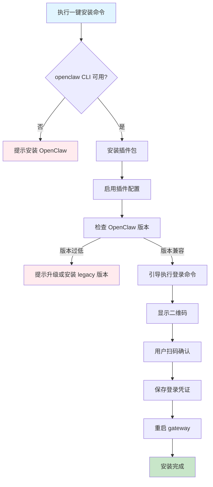
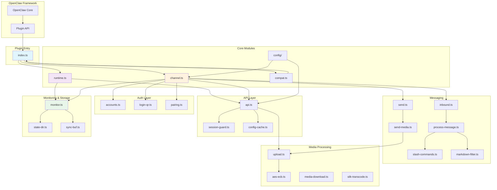

本指南面向初次使用 openclaw-weixin 插件的开发者，将引导您完成从环境准备到插件配置的全过程。插件通过扫码登录实现微信账号的自动化管理，支持多账号同时在线，并与 OpenClaw 框架深度集成。

## 前置条件

在开始安装之前，请确保您的开发环境满足以下基本要求。插件在注册时会执行严格的版本兼容性检查，不满足条件的宿主将导致插件拒绝加载。

| 依赖项 | 最低版本 | 验证命令 | 说明 |
|--------|----------|----------|------|
| Node.js | 22+ | `node --version` | 运行时环境 |
| OpenClaw | 2026.3.22+ | `openclaw --version` | 宿主框架，CLI 需可用 |

版本兼容性检查在插件的 `register()` 入口处即执行，通过解析 OpenClaw 的日期格式版本（YYYY.M.DD）并与最小支持版本进行比对，实现 fail-fast 机制。这种设计确保在插件初始化的最早阶段就能发现不兼容问题，避免后续运行时的异常。

Sources: [package.json](package.json#L52-L54), [index.ts](index.ts#L11-L13), [src/compat.ts](src/compat.ts#L1-L78)

## 版本兼容性

插件与 OpenClaw 宿主之间有严格的版本匹配要求。下表列出了各版本插件对应的 OpenClaw 版本范围及维护状态。

| 插件版本 | OpenClaw 版本范围 | npm dist-tag | 维护状态 |
|----------|-------------------|--------------|----------|
| 2.1.x | >=2026.3.22 | `latest` | 活跃开发 |
| 2.0.x | >=2026.3.22 | `latest` | 活跃开发 |
| 1.0.x | >=2026.1.0, <2026.3.22 | `legacy` | 维护模式 |

插件在启动时会自动检测宿主版本，如果发现超出支持范围，会抛出包含明确错误信息和建议操作的异常。这种机制避免了因 API 不匹配导致的不可预期行为。

Sources: [package.json](package.json#L33-L35), [README.zh_CN.md](README.zh_CN.md#L7-L18), [src/compat.ts](src/compat.ts#L68-L78)

## 一键安装

推荐使用一键安装脚本，它将自动完成插件安装、启用配置和引导登录。整个流程通过 npx 直接运行，无需预先安装任何工具。

```bash
npx -y @tencent-weixin/openclaw-weixin-cli install
```

一键安装流程将按以下步骤执行：



一键安装脚本会自动检测环境状态，并在遇到问题时给出明确的提示。对于大多数场景，这是最推荐的安装方式。

Sources: [README.zh_CN.md](README.zh_CN.md#L22-L24), [package.json](package.json#L28-L35)

## 手动安装

如果一键安装脚本不适用于您的环境，可以按照以下步骤手动完成插件安装。手动安装提供了更大的控制灵活性，适合需要对安装过程进行自定义的场景。

### 1. 安装插件

使用 OpenClaw CLI 安装插件包：

```bash
openclaw plugins install "@tencent-weixin/openclaw-weixin"
```

此命令会从 npm registry 下载最新版本的插件包，并将其安装到 OpenClaw 的插件目录中。

### 2. 启用插件

安装完成后，需要通过配置命令启用插件：

```bash
openclaw config set plugins.entries.openclaw-weixin.enabled true
```

插件配置采用层级结构，`plugins.entries.<plugin-id>.enabled` 控制插件是否在 OpenClaw 启动时加载。

### 3. 扫码登录

插件启用后，执行登录命令完成微信账号授权：

```bash
openclaw channels login --channel openclaw-weixin
```

终端将显示一个 ASCII 二维码，使用手机微信扫描并在手机端确认授权。确认后，登录凭证（包括 token 和会话状态）会自动保存到本地凭据存储中，无需额外手动操作。

### 4. 重启 gateway

登录凭证保存后，需要重启 gateway 以加载新的会话状态：

```bash
openclaw gateway restart
```

重启后，插件将通过长轮询机制与后端网关建立连接，开始接收和发送消息。

Sources: [README.zh_CN.md](README.zh_CN.md#L26-L45), [index.ts](index.ts#L16-L19)

## 配置说明

插件的配置基于 Zod Schema 定义，确保配置项的类型安全和合法性验证。配置通过 OpenClaw 的配置系统管理，支持热更新。

### 配置 Schema 结构

```typescript
{
  name?: string;                    // 账号显示名称
  enabled?: boolean;                // 账号是否启用
  baseUrl?: string;                 // 后端 API 基础 URL
  cdnBaseUrl?: string;              // CDN 基础 URL
  routeTag?: number;                // 路由标签
  accounts?: {                      // 多账号配置
    [accountId: string]: {
      name?: string;
      enabled?: boolean;
      baseUrl?: string;
      cdnBaseUrl?: string;
      routeTag?: number;
    }
  };
  channelConfigUpdatedAt?: string;   // ISO 8601 时间戳
}
```

### 配置项说明

| 配置项 | 类型 | 默认值 | 说明 |
|--------|------|--------|------|
| `name` | `string?` | - | 账号的友好显示名称 |
| `enabled` | `boolean?` | `true` | 控制账号是否活跃 |
| `baseUrl` | `string` | 内置默认值 | 后端网关 API 地址 |
| `cdnBaseUrl` | `string` | 内置默认值 | CDN 服务地址 |
| `routeTag` | `number?` | - | 消息路由标签 |
| `accounts` | `record?` | - | 多账号配置映射表 |
| `channelConfigUpdatedAt` | `string?` | - | 配置更新时间戳 |

插件使用 Zod 进行运行时类型验证，所有配置项在加载时都会经过严格的 Schema 检查。配置的变更会触发相应的运行时行为调整，如重新建立连接或更新路由规则。

Sources: [src/config/config-schema.ts](src/config/config-schema.ts#L1-L23), [openclaw.plugin.json](openclaw.plugin.json#L1-L13)

## 多账号配置

插件支持同时登录多个微信账号，每个账号拥有独立的会话状态和凭证。默认情况下，私聊会话可能共用同一会话桶，因此在多账号场景下建议启用上下文隔离。

### 添加新账号

要添加新的微信账号，只需再次执行登录命令：

```bash
openclaw channels login --channel openclaw-weixin
```

每次扫码登录都会创建一个新的账号条目，插件会为每个账号生成唯一的标识符并独立管理其会话状态。

### 配置上下文隔离

多账号同时在线时，建议按「账号 + 渠道 + 对端」的维度隔离私聊会话，避免不同账号的消息相互混淆：

```bash
openclaw config set session.dmScope per-account-channel-peer
```

隔离级别说明：

| 隔离级别 | 会话键构成 | 适用场景 |
|----------|------------|----------|
| `default` | 渠道 + 对端 | 单账号场景 |
| `per-account-channel-peer` | 账号 + 渠道 + 对端 | 多账号场景（推荐） |
| `per-account` | 账号 | 跨账号消息聚合 |

配置上下文隔离后，每个账号的私聊会话将被完全隔离，插件会根据会话键正确路由消息，确保消息的发送方和接收方对应关系准确无误。

Sources: [README.zh_CN.md](README.zh_CN.md#L48-L56), [src/storage/sync-buf.ts](src/storage/sync-buf.ts)

## 项目结构

了解插件的项目结构有助于深入理解其架构设计和扩展点。以下是插件的目录组织结构：

```
openclaw-weixin-plugin/
├── index.ts                    # 插件入口，定义元数据和注册逻辑
├── openclaw.plugin.json        # 插件清单文件，定义基础配置
├── package.json                # npm 包配置，定义依赖和元数据
├── src/
│   ├── channel.ts              # 通道主逻辑，实现通道接口
│   ├── runtime.ts              # 运行时状态管理
│   ├── compat.ts               # OpenClaw 版本兼容性检查
│   ├── api/                    # API 通信层
│   │   ├── api.ts              # API 客户端实现
│   │   ├── config-cache.ts     # 配置缓存管理
│   │   ├── session-guard.ts    # 会话状态守卫
│   │   └── types.ts            # API 类型定义
│   ├── auth/                   # 认证与授权
│   │   ├── accounts.ts         # 账号存储管理
│   │   ├── login-qr.ts         # 二维码登录实现
│   │   └── pairing.ts          # 配对授权逻辑
│   ├── cdn/                    # CDN 媒体处理
│   │   ├── aes-ecb.ts          # AES-128-ECB 加密
│   │   ├── cdn-upload.ts       # CDN 上传实现
│   │   ├── cdn-url.ts          # URL 构建工具
│   │   ├── pic-decrypt.ts      # 图片解密
│   │   └── upload.ts           # 上传逻辑封装
│   ├── config/                 # 配置管理
│   │   └── config-schema.ts    # Zod 配置 Schema
│   ├── media/                  # 媒体处理
│   │   ├── media-download.ts   # 媒体下载
│   │   ├── mime.ts             # MIME 类型识别
│   │   └── silk-transcode.ts   # SILK 语音转码
│   ├── messaging/              # 消息处理
│   │   ├── inbound.ts          # 入站消息处理
│   │   ├── process-message.ts  # 消息处理流水线
│   │   ├── send.ts             # 消息发送核心
│   │   ├── send-media.ts       # 媒体消息发送
│   │   ├── markdown-filter.ts  # Markdown 过滤
│   │   ├── slash-commands.ts   # 斜杠命令支持
│   │   ├── debug-mode.ts       # 调试模式
│   │   └── error-notice.ts     # 错误通知
│   ├── monitor/                # 监控与循环
│   │   └── monitor.ts          # 长轮询监控循环
│   ├── storage/                # 存储与持久化
│   │   ├── state-dir.ts        # 状态目录解析
│   │   └── sync-buf.ts         # 同步游标持久化
│   └── util/                   # 工具函数
│       ├── logger.ts           # 结构化日志
│       ├── random.ts           # 随机数生成
│       └── redact.ts           # 敏感信息脱敏
```

项目采用模块化设计，每个目录负责特定领域的功能。核心的通道逻辑在 `channel.ts` 中实现，通过注册机制集成到 OpenClaw 框架。运行时状态管理由 `runtime.ts` 负责，为其他模块提供统一的运行时访问接口。

Sources: [index.ts](index.ts#L1-L25), [src/channel.ts](src/channel.ts), [src/runtime.ts](src/runtime.ts#L1-L71)

## 架构概览

插件的整体架构围绕微信通道的核心功能展开，通过模块化的方式实现各个职责的解耦。下图展示了插件的主要组件及其交互关系。



插件通过 `index.ts` 的 `register()` 函数接入 OpenClaw 框架。注册过程中，兼容性检查模块会首先验证宿主版本，确保运行环境满足要求。运行时管理模块负责维护插件的全局状态，为其他模块提供统一的访问接口。通道模块是插件的核心，协调认证、消息处理、媒体上传等各个子模块完成微信通道的完整功能。

Sources: [index.ts](index.ts#L16-L25), [src/channel.ts](src/channel.ts), [src/runtime.ts](src/runtime.ts#L1-L71)

## 下一步

完成安装与配置后，建议按照以下顺序深入学习插件的其他功能：

- **[扫码登录流程](3-sao-ma-deng-lu-liu-cheng)**：了解二维码登录的详细机制和交互流程
- **[多账号管理与隔离配置](4-duo-zhang-hao-guan-li-yu-ge-chi-pei-zhi)**：深入掌握多账号场景下的高级配置技巧
- **[插件架构总览](5-cha-jian-jia-gou-zong-lan)**：从架构层面理解插件的设计理念和模块划分

如果在使用过程中遇到问题，可以参考调试模式相关的文档，了解如何开启链路追踪和日志分析。