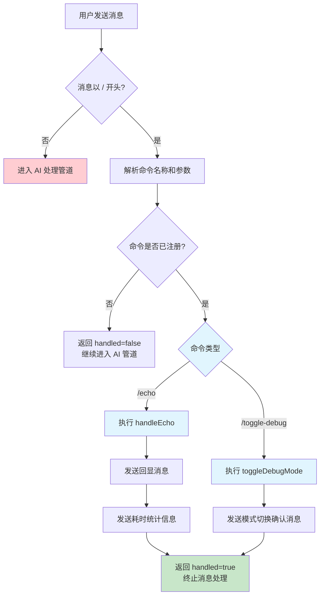

斜杠命令是一类特殊的微信消息，它们以 `/` 开头，用于触发插件内置功能，而无需经过 AI 处理管道。这些命令为开发者提供了快速诊断、调试和测试的便捷方式，同时也为最终用户提供了基础的交互能力。当前支持的斜杠命令包括消息回显和调试模式切换，它们在消息处理的最早阶段被识别并执行，有效减少了不必要的计算资源消耗。

## 支持的命令概览

OpenClaw Weixin 插件目前内置了两个斜杠命令，它们都设计用于调试和性能监控场景。下表列出了所有可用的命令及其功能描述：

| 命令格式 | 功能描述 | 使用场景 |
|---------|---------|---------|
| `/echo <message>` | 直接回复指定的消息内容，并附加完整的通道耗时统计信息 | 测试消息发送功能、诊断网络延迟、验证消息传递完整性 |
| `/toggle-debug` | 切换当前机器人的调试模式状态，开启后会在每条 AI 回复后追加全链路耗时信息 | 性能分析、问题排查、监控系统响应时间 |

这些命令的设计理念是轻量级和即时响应，它们在消息处理流水线中被优先处理，能够快速返回结果而不需要等待 AI 生成回复。

Sources: [src/messaging/slash-commands.ts](src/messaging/slash-commands.ts#L4-L7)

## 命令处理流程

斜杠命令的处理发生在消息接收后的最早阶段，在 AI 处理管道启动之前就被拦截和执行。下图展示了从用户发送消息到命令执行完成的完整流程：



在这个流程中，命令解析器首先检查消息文本是否以 `/` 开头。如果不是，则消息继续进入正常的 AI 处理管道。如果是斜杠命令，则进一步解析命令名称和参数，根据注册的命令处理器执行相应逻辑。命令执行成功后，系统会返回 `handled: true` 标记，表示消息已被完全处理，不再继续后续的 AI 处理流程。

Sources: [src/messaging/process-message.ts](src/messaging/process-message.ts#L82-L97)

## /echo 命令详解

`/echo` 命令用于测试消息发送功能和诊断系统性能。当用户发送 `/echo <message>` 时，系统会先回显用户指定的消息内容，然后发送一条包含详细耗时统计的信息。这个命令特别适合用于：

- 验证消息发送链路的完整性
- 诊断从平台到插件的网络延迟
- 测量插件内部处理时间

命令的执行流程可以分为两个步骤。首先，提取命令参数中的消息文本并发送回显消息。然后，计算并格式化耗时统计信息，包括事件时间戳、平台到插件的传输延迟以及插件处理耗时。最终的输出格式如下：

```
⏱ 通道耗时
├ 事件时间: 2024-01-15T08:30:45.123Z
├ 平台→插件: 42ms
└ 插件处理: 8ms
```

如果原始消息中不包含事件时间戳，则平台延迟显示为 "N/A"。这种设计使得即使在某些情况下无法获取精确的平台传输时间，仍然可以获取插件内部的处理耗时，为性能优化提供有价值的参考数据。

Sources: [src/messaging/slash-commands.ts](src/messaging/slash-commands.ts#L40-L59)

## /toggle-debug 命令详解

`/toggle-debug` 命令用于开启或关闭当前机器人的调试模式。调试模式的状态是持久化的，存储在磁盘文件中，因此即使插件重启后状态也会保持。这使得调试模式可以长期启用，用于持续的性能监控。

当用户执行 `/toggle-debug` 命令时，系统会切换当前账号的调试状态并发送确认消息。启用调试模式后，每条 AI 回复都会在末尾追加完整的链路耗时信息，包括：

- 消息接收时间
- 媒体下载耗时（如果有）
- AI 响应生成时间
- 消息发送耗时

调试模式的配置文件存储路径为 `<stateDir>/openclaw-weixin/debug-mode.json`，格式为 JSON 对象，其中 `accounts` 字段是一个键值对映射，键为账号 ID，值为布尔值表示是否启用调试模式。这种设计支持多账号场景，每个账号可以独立控制调试状态。

Sources: [src/messaging/debug-mode.ts](src/messaging/debug-mode.ts#L1-L9)

## 命令语法与参数解析

斜杠命令的语法设计遵循 Unix 风格的命令行约定，命令名称和参数通过空格分隔。解析过程遵循以下规则：

- **命令识别**：消息文本必须以 `/` 开头，不区分大小写（自动转换为小写）
- **参数提取**：第一个空格之后的所有内容被视为命令参数
- **参数长度**：参数内容会被记录到日志中，但只保留前 50 个字符以避免日志过大

例如，对于消息 `/echo 你好，这是一条测试消息`，解析结果为：
- 命令：`/echo`
- 参数：`你好，这是一条测试消息`

对于不带参数的命令如 `/toggle-debug`，参数部分为空字符串。解析器使用 `indexOf(" ")` 来查找第一个空格的位置，如果不存在则整个文本被视为命令名称。这种简单而高效的解析机制足以应对当前的命令需求，同时保持代码的可读性和可维护性。

Sources: [src/messaging/slash-commands.ts](src/messaging/slash-commands.ts#L72-L81)

## 错误处理机制

斜杠命令系统内置了完善的错误处理机制，确保即使在命令执行失败时也能给用户提供清晰的反馈。错误处理包括以下几个层面：

**执行层错误捕获**：所有命令处理器都被包裹在 try-catch 块中，如果命令执行过程中抛出异常，系统会捕获错误并记录日志。错误信息会被截取前 200 个字符，防止过长的错误消息影响用户体验。

**用户反馈**：在捕获到执行错误后，系统会尝试向用户发送错误提示消息，格式为 `❌ 指令执行失败: <错误详情>`。即使在发送错误消息失败的情况下，系统也会静默处理，避免错误传播导致消息处理中断。

**未知命令处理**：如果用户输入了未注册的斜杠命令，系统会返回 `handled: false`，将消息传递给后续的 AI 处理管道。这意味着未知的斜杠命令不会被当作错误处理，而是会被当作普通消息由 AI 进行解释和响应。

这种渐进式的错误处理策略确保了系统的健壮性，既提供了必要的错误反馈，又不会因为单点故障影响整体消息处理流程。

Sources: [src/messaging/slash-commands.ts](src/messaging/slash-commands.ts#L83-L109)

## 与消息处理管道的集成

斜杠命令系统深度集成到插件的消息处理管道中，在 `processOneMessage` 函数的最早阶段被调用。这个设计确保了斜杠命令能够以最快的速度响应，同时避免不必要的资源消耗。

消息处理流程首先调用 `extractTextBody` 函数从消息的 item_list 中提取文本内容，然后检查该文本是否以 `/` 开头。如果检测到斜杠命令，则立即调用 `handleSlashCommand` 函数进行处理。处理结果通过 `SlashCommandResult` 接口返回，其中 `handled` 字段指示消息是否已被完全处理。如果 `handled` 为 `true`，则函数直接返回，跳过后续的媒体下载、AI 处理等所有步骤。

这种早期拦截的设计模式带来了以下优势：
- **性能优化**：避免了不必要的 AI 调用和媒体下载操作
- **响应速度**：命令能够即时响应，无需等待 AI 生成
- **资源节约**：减少了服务器的计算和网络开销
- **清晰分离**：将系统级功能和 AI 逻辑完全解耦

Sources: [src/messaging/process-message.ts](src/messaging/process-message.ts#L82-L97)

## 上下文令牌传递

斜杠命令系统完整支持微信的上下文令牌机制，确保命令回复能够正确关联到原始会话。上下文令牌是微信平台为每条消息分配的唯一标识符，必须在所有回复消息中原样返回。

在调用 `handleSlashCommand` 函数时，系统会从原始消息中提取 `context_token` 并传递给命令上下文对象。该令牌随后被传递给 `sendReply` 函数，最终通过 `sendMessageWeixin` API 发送回复消息时包含在请求选项中。这种令牌传递链路确保了命令回复能够被微信平台正确路由到原始会话，维护了会话的连续性。

上下文令牌的管理机制还包括持久化存储，通过 `setContextToken` 和 `getContextToken` 函数实现内存缓存和磁盘备份。这种设计确保了即使在网关重启后，令牌仍然可用，不会中断正在进行的会话。斜杠命令系统直接使用这些基础设施，无需额外的令牌管理逻辑。

Sources: [src/messaging/slash-commands.ts](src/messaging/slash-commands.ts#L30-L37)

## 日志记录与可观测性

为了便于问题排查和系统监控，斜杠命令系统在关键节点记录了详细的日志信息。这些日志为开发者提供了完整的执行轨迹，有助于快速定位问题。

当接收到斜杠命令时，系统会记录命令名称和参数前 50 个字符，格式为 `[weixin] Slash command: <command>, args: <args>`。这条日志记录在信息级别，包含了足够的上下文信息用于问题诊断。

如果命令执行过程中发生错误，系统会在错误级别记录完整的异常堆栈信息，格式为 `[weixin] Slash command error: <error details>`。这些错误日志被发送到插件的统一日志系统，可以与其他模块的日志一起进行集中分析和监控。

除了命令执行日志外，斜杠命令还与全局的调试模式系统集成。当调试模式启用时，消息处理管道会记录更详细的链路追踪信息，包括每一步的耗时和状态。斜杠命令本身虽然不参与 AI 处理，但其执行结果（如 `/echo` 命令的耗时统计）可以为性能分析提供宝贵的数据支持。

Sources: [src/messaging/slash-commands.ts](src/messaging/slash-commands.ts#L81-L102)

## 扩展新命令

当前的斜杠命令系统设计为易于扩展，开发者可以按照以下模式添加新的命令：

1. **定义命令处理器**：创建一个异步函数，接收 `SlashCommandContext` 和参数字符串作为输入
2. **注册命令**：在 `handleSlashCommand` 函数的 switch 语句中添加新的 case 分支
3. **实现响应逻辑**：使用 `sendReply` 函数向用户发送响应消息
4. **错误处理**：确保所有异常都被捕获并转换为用户友好的错误消息

以下是一个新命令的模板示例：

```typescript
async function handleCustomCommand(
  ctx: SlashCommandContext,
  args: string,
): Promise<void> {
  try {
    // 实现命令逻辑
    const result = processCustomCommand(args);
    await sendReply(ctx, `执行结果: ${result}`);
  } catch (err) {
    throw new Error(`自定义命令失败: ${String(err)}`);
  }
}
```

然后在 `handleSlashCommand` 函数中注册：

```typescript
switch (command) {
  case "/custom":
    await handleCustomCommand(ctx, args);
    return { handled: true };
  // ... 其他命令
}
```

这种设计模式保持了代码的一致性和可维护性，新的命令可以无缝集成到现有框架中。

Sources: [src/messaging/slash-commands.ts](src/messaging/slash-commands.ts#L66-L110)

## 使用示例与最佳实践

以下是几个实际使用斜杠命令的典型场景：

**场景一：测试消息发送链路**
```
用户: /echo 这是一条测试消息
系统: 这是一条测试消息
系统: ⏱ 通道耗时
      ├ 事件时间: 2024-01-15T08:30:45.123Z
      ├ 平台→插件: 42ms
      └ 插件处理: 8ms
```

**场景二：开启性能监控**
```
用户: /toggle-debug
系统: Debug 模式已开启

用户: 请帮我写一段代码
系统: [AI 回复内容]
      ⏱ 链路耗时总览
      ├ 消息接收: 5ms
      ├ 媒体处理: 0ms
      ├ AI 响应: 1234ms
      └ 消息发送: 15ms
```

**最佳实践建议**：
- 定期使用 `/echo` 命令监控系统健康状态，关注延迟指标的变化趋势
- 在性能调优时启用 `/toggle-debug`，获取详细的链路耗时数据
- 斜杠命令不区分大小写，建议使用小写格式以保持一致性
- 参数过长的消息只会记录前 50 个字符，敏感信息应当避免直接通过参数传递

Sources: [src/messaging/slash-commands.ts](src/messaging/slash-commands.ts#L1-L7)

## 相关主题

斜杠命令系统是消息处理架构的重要组成部分，与其他模块密切配合。为了全面理解系统的工作原理，建议阅读以下相关文档：

- [入站消息路由与处理](18-ru-zhan-xiao-xi-lu-you-yu-chu-li) - 了解斜杠命令在消息处理管道中的位置
- [调试模式与链路追踪](21-diao-shi-mo-shi-yu-lian-lu-zhui-zong) - 深入学习调试模式的完整实现和链路追踪机制
- [错误通知机制](22-cuo-wu-tong-zhi-ji-zhi) - 了解系统级别的错误处理和通知策略
- [消息发送 sendMessage API](11-xiao-xi-fa-song-sendmessage-api) - 掌握底层消息发送 API 的使用方法

这些文档将帮助你构建完整的知识体系，从命令执行到消息传递的整个链路有更深入的理解。