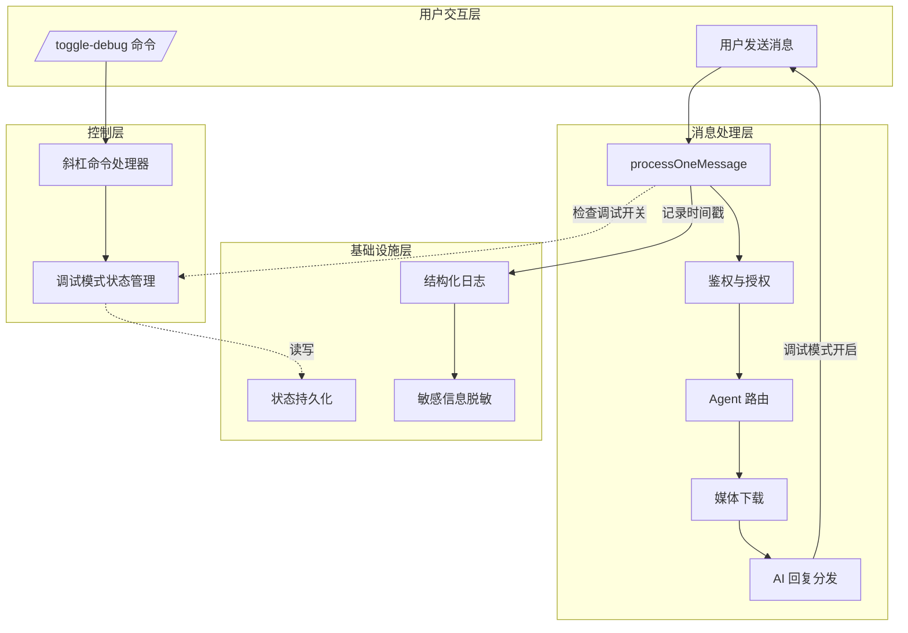

调试模式与链路追踪机制为 OpenClaw 微信插件提供了**端到端性能分析和问题诊断**能力。该系统通过账号级别的调试开关控制，将消息处理的完整生命周期拆解为可测量的时间片段，并在每条 AI 回复后自动附赠结构化的耗时报告。这不仅帮助开发者快速定位性能瓶颈，还为复杂的多步骤处理流程（鉴权、路由、媒体处理、AI 生成）提供了透明的执行视图。

Sources: [debug-mode.ts](src/messaging/debug-mode.ts#L1-L70)

## 核心架构设计

调试模式系统由三个协作模块组成：持久化状态管理、时间戳采集与追踪、以及结果展示。该架构的设计遵循了关注点分离原则，将状态存储、追踪逻辑和用户通知解耦到不同模块中。

Sources: [debug-mode.ts](src/messaging/debug-mode.ts#L1-L70), [process-message.ts](src/messaging/process-message.ts#L1-L200), [slash-commands.ts](src/messaging/slash-commands.ts#L1-L111)

## 调试模式状态管理

调试模式采用**账号粒度的开关设计**，每个 bot 账号可以独立启用或禁用调试功能。状态通过 JSON 文件持久化存储在状态目录中，确保网关重启后调试设置得以保留。状态文件格式简洁明了，以 `accountId` 作为键，布尔值表示是否启用调试模式。

状态文件位于 `<stateDir>/openclaw-weixin/debug-mode.json`，其中 `stateDir` 由环境变量 `OPENCLAW_STATE_DIR` 或 `CLAWDBOT_STATE_DIR` 指定，默认为用户主目录下的 `.openclaw`。这种设计允许在不同环境中灵活配置状态存储位置，同时保持向后兼容性。

Sources: [debug-mode.ts](src/messaging/debug-mode.ts#L9-L19), [state-dir.ts](src/storage/state-dir.ts#L1-L12)

### 核心 API

调试模式模块暴露了两个核心接口：`toggleDebugMode(accountId)` 用于切换调试开关，`isDebugMode(accountId)` 用于查询当前状态。`toggleDebugMode` 函数会读取现有状态、翻转指定账号的开关值、并尝试将新状态写回磁盘。即使持久化失败，函数也会返回新的状态值，确保调用者能获得正确的行为反馈。`isDebugMode` 则执行纯查询操作，在状态文件缺失或损坏时返回 `false`，实现了容错降级。

Sources: [debug-mode.ts](src/messaging/debug-mode.ts#L44-L58)

## 斜杠命令集成

调试模式通过斜杠命令 `/toggle-debug` 暴露给用户，提供了**无需重启即可动态切换**调试能力的便捷方式。当用户在对话中发送该命令时，`handleSlashCommand` 函数会识别命令类型，调用 `toggleDebugMode` 切换开关状态，并通过 `sendMessageWeixin` 向用户返回当前状态提示。这种设计将调试能力的控制权直接交给用户，特别适合在测试环境或生产环境中进行临时性能分析。

除调试开关外，系统还提供 `/echo` 命令用于测试通道响应时间。该命令绕过 AI 管道，直接回显用户消息并附加通道级别的耗时统计（平台→插件延迟、插件处理耗时），为网络和系统性能提供快速基准测试。

Sources: [slash-commands.ts](src/messaging/slash-commands.ts#L1-L111)

## 全链路时间戳追踪

当调试模式激活时，`processOneMessage` 函数会在消息处理的各个关键阶段记录时间戳，构建完整的执行时间轴。时间戳采集覆盖了消息生命周期的六个核心节点，为性能瓶颈定位提供量化依据。

### 追踪节点与测量指标

| 阶段 | 时间戳记录 | 测量指标 | 业务含义 |
|------|------------|----------|----------|
| 消息接收 | `receivedAt = Date.now()` | 平台→插件延迟 | 从微信平台产生消息到插件接收到的网络和队列延迟 |
| 媒体下载 | `mediaDownloadStart` 和 `mediaDownloadMs` | 媒体下载耗时 | 识别媒体类型、构建下载 URL、执行下载和转码的总时间 |
| 分发前准备 | `debugTs.preDispatch` | 入站处理耗时 | 包括鉴权、路由解析、媒体下载的总和 |
| AI 响应 | 推导计算 `aiMs = dispatchDoneAt - preDispatch` | AI 生成 + 回复耗时 | Agent 处理、模型推理、Markdown 过滤的时间总和 |
| 消息发送 | `debugDeliveries[i].ts` | 发送操作耗时 | 从 dispatcher 调用 deliver 到实际发送到微信平台的延迟 |
| 总耗时 | 根据 `eventTime` 和 `dispatchDoneAt` 计算端到端延迟 | 从消息产生到用户收到回复的完整时间 |

Sources: [process-message.ts](src/messaging/process-message.ts#L30-L52), [process-message.ts](src/messaging/process-message.ts#L427-L461)

### 调试追踪数据结构

调试追踪信息以树状文本格式组织，使用 Unicode 线条字符（`│`, `├`, `└`）构建层次化视图。每个追踪阶段由标题行（如 `── 收消息 ──`）开始，后续行使用前缀保持缩进一致。这种格式在移动设备上也具有良好的可读性，用户可以快速识别各个处理阶段和耗时数据。追踪信息同时被记录到结构化日志中，便于后续离线分析。

Sources: [process-message.ts](src/messaging/process-message.ts#L55-L62), [process-message.ts](src/messaging/process-message.ts#L440-L461)

## 结果展示机制

调试追踪结果的展示发生在消息处理的 `finally` 块中，确保无论 AI 回复是否成功，调试信息都能可靠地发送给用户。当且仅当调试模式开启且上下文令牌存在时，系统会组装完整的追踪文本并调用 `sendMessageWeixin` 发送。这种设计保证了调试信息与 AI 回复的**原子性关联**，即用户总是能收到与当前对话轮次对应的性能数据。

追踪报告的标题使用 `⏱ Debug 全链路` 明确标识内容类型，避免与正常业务消息混淆。发送操作包裹在 try-catch 块中，失败时仅记录错误日志而不影响主流程，体现了调试机制的**非侵入性**原则。

Sources: [process-message.ts](src/messaging/process-message.ts#L427-L485)

## 敏感信息保护

在记录日志和生成调试追踪时，系统应用多层防护确保**敏感数据泄露风险最小化**。`redactToken` 函数仅显示 token 的前 6 个字符并附加总长度，如 `abc123…(len=32)`，既保留可辨识性又隐藏完整值。`redactBody` 函数在截断 JSON 之前，先通过正则表达式将 `context_token`、`bot_token`、`authorization` 等敏感字段的值替换为 `<redacted>`。

URL 中的查询字符串（通常包含签名和时间戳）也被移除，仅保留 origin 和 pathname。这些保护措施确保调试模式和链路追踪在提升可观测性的同时，不会成为安全漏洞的源头。

Sources: [redact.ts](src/util/redact.ts#L1-L55)

## 调试模式与日志系统的协同

调试模式与结构化日志系统形成了**互补的可观测性层级**。日志系统提供全局、持久化的操作记录，按日期分片存储（`openclaw-YYYY-MM-DD.log`），使用 JSON Lines 格式便于日志聚合工具处理。每条日志条目包含子系统标识（`gateway/channels/openclaw-weixin`）、日志级别、时间戳、主机信息和运行时版本等元数据。

调试模式则提供**对话上下文内**的实时性能反馈，面向特定账号和特定消息轮次。日志系统支持动态调整日志级别（通过 `setLogLevel` 函数），而调试模式通过命令即时开关，两者结合使开发者能够根据问题性质选择合适的诊断工具：用日志排查系统性问题，用调试模式分析单次请求的端到端性能。

Sources: [logger.ts](src/util/logger.ts#L1-L146), [debug-mode.ts](src/messaging/debug-mode.ts#L44-L58)

## 典型应用场景

调试模式在实际使用中适用于以下场景：

1. **性能回归验证**：在代码变更前后对比各阶段耗时，快速定位导致响应时间增加的具体环节
2. **媒体下载优化**：通过 `mediaDownload` 耗时数据，识别 CDN 性能问题或本地转码瓶颈
3. **AI 配置调优**：分析 AI 生成耗时，评估不同模型或提示策略的响应速度影响
4. **网络延迟诊断**：平台→插件延迟数据帮助区分是微信平台队列问题还是本地网络问题
5. **集成测试**：使用 `/echo` 命令快速验证通道连通性和基础响应性能，无需触发 AI

Sources: [slash-commands.ts](src/messaging/slash-commands.ts#L20-L40), [process-message.ts](src/messaging/process-message.ts#L440-L461)

## 设计权衡与限制

调试模式的实现体现了几个关键的设计权衡：

**账号粒度 vs 用户粒度**：当前设计采用账号粒度的开关，无法针对特定用户启用调试。这种简化降低了状态管理复杂度，但在多用户共享 bot 账号时缺乏细粒度控制。

**同步发送 vs 异步队列**：调试追踪在 AI 回复后同步发送给用户，确保关联性但可能增加额外延迟。如果对延迟极度敏感，可考虑异步发送但失去即时反馈。

**持久化开销**：每次开关调试模式都触发磁盘 I/O 操作，对于频繁切换的场景可能成为性能瓶颈。可通过内存缓存结合定时刷新的优化策略改进。

**调试信息泄露**：虽然敏感字段已脱敏，但时间戳和操作序列仍可能被分析出系统行为模式。生产环境使用时应限制调试模式的开放对象。

Sources: [debug-mode.ts](src/messaging/debug-mode.ts#L44-L58), [process-message.ts](src/messaging/process-message.ts#L427-L485)

## 扩展阅读

调试模式与链路追踪机制是插件可观测性架构的重要组成部分。相关的文档包括：

- [结构化日志系统](27-jie-gou-hua-ri-zhi-xi-tong)：深入了解日志系统的实现细节和配置选项
- [入站消息路由与处理](18-ru-zhan-xiao-xi-lu-you-yu-chu-li)：理解消息处理流程的完整架构
- [长轮询监控循环实现](26-chang-lun-xun-jian-kong-xun-huan-shi-xian)：了解 `processOneMessage` 的调用上下文
- [斜杠命令支持](20-xie-gang-ming-ling-zhi-chi)：探索更多命令的扩展机制