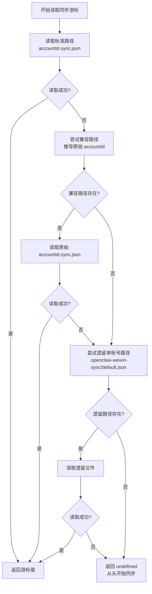
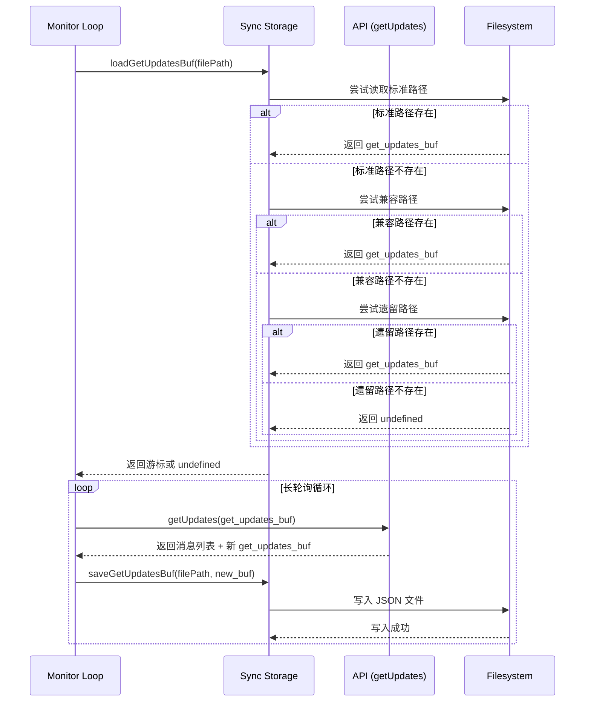

同步游标持久化机制确保微信长轮询 API 能够在系统重启后继续从上次的位置拉取消息，避免消息丢失或重复拉取。核心是保存服务端返回的 `get_updates_buf` 游标字符串，该游标是 Base64 编码的二进制数据，服务端用它标记客户端的同步位置。

## 核心数据结构与存储路径

同步游标以 JSON 文件形式持久化到磁盘，数据结构简洁明了：

```typescript
type SyncBufData = {
  get_updates_buf: string;  // Base64 编码的游标字符串
}
```

文件存储路径遵循账户隔离原则，每个微信账号对应独立的同步游标文件。主路径位于状态目录下的 accounts 子目录中，文件名由 accountId 和 `.sync.json` 后缀组成。完整路径结构为 `~/.openclaw/openclaw-weixin/accounts/{accountId}.sync.json`。

状态目录解析逻辑支持通过环境变量自定义，优先级顺序为 `OPENCLAW_STATE_DIR` > `CLAWDBOT_STATE_DIR` > 默认路径 `~/.openclaw`。这种设计允许测试环境和生产环境使用不同的状态目录。

Sources: [sync-buf.ts](src/storage/sync-buf.ts#L13-L24), [state-dir.ts](src/storage/state-dir.ts#L1-L12)

## 多级回退读取策略

为了确保向后兼容性，读取同步游标采用三级回退策略。该策略确保系统升级后仍能识别旧版本存储的游标数据，平滑迁移用户数据。



标准路径使用规范化的 accountId（如 `b0f5860fdecb-im-bot`），而旧版本使用原始 accountId（如 `b0f5860fdecb@im.bot`）。系统通过 `deriveRawAccountId` 函数实现逆向推导，将 `-im-bot` 后缀转换为 `@im.bot`，将 `-im-wechat` 后缀转换为 `@im.wechat`。

第三级回退针对最早期不支持多账号的版本，此时同步游标存储在 `~/.openclaw/agents/default/sessions/.openclaw-weixin-sync/default.json`。

Sources: [sync-buf.ts](src/storage/sync-buf.ts#L33-L76), [accounts.ts](src/auth/accounts.ts#L19-L30)

## 长轮询集成与持久化流程

同步游标的读写操作紧密集成在长轮询监控循环中。在 `monitorWeixinProvider` 函数启动时，系统会加载上次保存的游标，初始化长轮询的起始位置。每次成功调用 `getUpdates` API 后，服务端会在响应中返回新的 `get_updates_buf`，系统立即将其持久化到磁盘。



写入操作会自动创建不存在的父目录，确保新账号首次使用时不会因目录缺失而失败。文件内容以紧凑格式存储（无缩进），减少磁盘空间占用。

Sources: [monitor.ts](src/monitor/monitor.ts#L63-L85), [monitor.ts](src/monitor/monitor.ts#L142-L155), [sync-buf.ts](src/storage/sync-buf.ts#L77-L82)

## 游标生命周期管理

同步游标的生命周期与账号会话紧密相关。在长轮询启动时，系统会记录日志说明是否成功恢复了上次的游标以及游标数据的字节数。如果未找到历史游标，系统会记录"从头开始"的提示信息。

游标更新时机严格遵循"先调用 API，后保存游标"的原则。只有当 `getUpdates` API 调用成功返回（ret=0 或 errcode=0）且服务端返回了新的 `get_updates_buf` 时，才会执行持久化操作。这种设计确保只有在确认服务端已接收并处理了请求后，才会更新本地游标，避免因网络异常导致游标状态不一致。

在会话过期场景下（errcode=-14），系统会暂停该账号的所有请求一段时间，但不会清除已保存的游标。待会话恢复后，系统可以继续使用之前保存的游标继续拉取消息。

Sources: [monitor.ts](src/monitor/monitor.ts#L72-L85), [monitor.ts](src/monitor.ts#L103-L106), [monitor.ts](src/monitor.ts#L142-L155)

## 调试与故障排查

同步游标相关的日志输出使用结构化日志系统，日志标签为 `gateway/channels/openclaw-weixin/{accountId}`。在 DEBUG 级别下，系统会输出完整的文件路径、游标字节数以及游标内容的前 50 个字符（用于验证数据格式）。

常见故障排查场景包括：

| 现象 | 可能原因 | 排查方法 |
|------|----------|----------|
| 重启后消息重复 | 游标文件未正确保存 | 检查日志中的 `Saved new get_updates_buf` 记录 |
| 重启后消息丢失 | 游标文件读取失败或路径错误 | 验证 `syncFilePath` 日志输出，检查文件权限 |
| 跨版本升级后从头同步 | 未触发兼容路径回退 | 检查 `deriveRawAccountId` 日志，确认 accountId 格式 |
| 新账号无法保存游标 | 状态目录权限不足 | 检查 `~/.openclaw/openclaw-weixin/accounts` 目录写权限 |

日志文件位于 `<tmpDir>/openclaw-YYYY-MM-DD.log`，可通过 `OPENCLAW_LOG_LEVEL=DEBUG` 环境变量启用详细日志。在日志中搜索 `get_updates_buf` 关键字可以快速定位所有相关操作记录。

Sources: [monitor.ts](src/monitor/monitor.ts#L66-L85), [logger.ts](src/util/logger.ts#L1-L146)

## 关键 API 速查

| 函数 | 参数 | 返回值 | 用途 |
|------|------|--------|------|
| `getSyncBufFilePath(accountId)` | accountId: string | string (文件路径) | 计算同步游标文件的标准路径 |
| `loadGetUpdatesBuf(filePath)` | filePath: string | string \| undefined | 加载同步游标，支持多级回退 |
| `saveGetUpdatesBuf(filePath, buf)` | filePath, buf: string | void | 持久化同步游标，自动创建父目录 |

Sources: [sync-buf.ts](src/storage/sync-buf.ts#L13-L82)

## 相关章节阅读建议

同步游标持久化是存储与持久化模块的核心组件，与以下章节存在密切关联：

- **[状态目录解析](23-zhuang-tai-mu-lu-jie-xi)**：理解状态目录的解析逻辑和环境变量配置
- **[长轮询 getUpdates 实现](10-chang-lun-xun-getupdates-shi-xian)**：深入了解游标在 API 协议中的语义和使用方式
- **[多账号管理与隔离配置](4-duo-zhang-hao-guan-li-yu-ge-chi-pei-zhi)**：理解 accountId 的规范化和账号隔离机制
- **[会话状态管理与过期处理](13-hui-hua-zhuang-tai-guan-li-yu-guo-qi-chu-li)**：了解会话过期时游标的处理策略