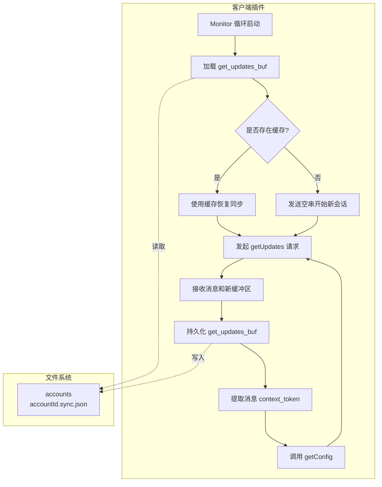
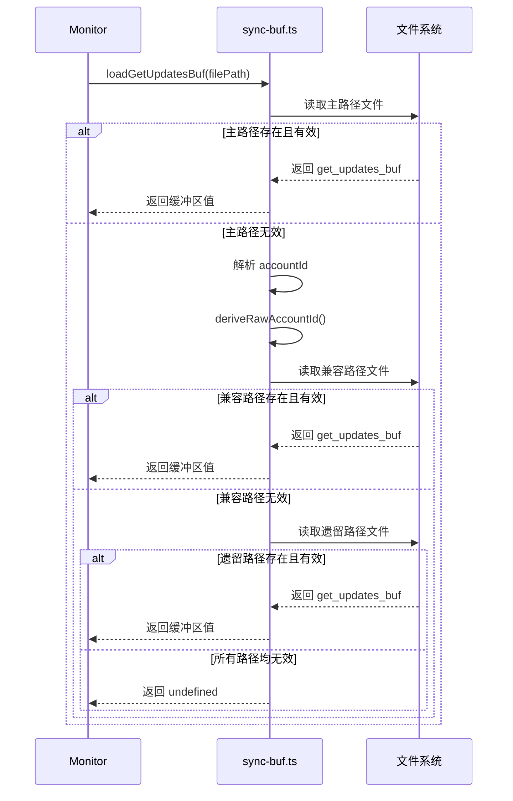

上下文令牌机制是微信插件实现消息同步和状态恢复的核心基础设施。该机制通过持久化同步游标和会话令牌，确保插件重启后能够从断点继续接收消息，避免重复处理或消息丢失。上下文令牌包含两个关键组件：`get_updates_buf` 用于长轮询同步，以及 `context_token` 用于用户配置获取。

## 上下文令牌架构

插件使用双令牌设计，分别服务于不同的 API 场景。`get_updates_buf` 是一个二进制缓冲区，在每次长轮询请求中作为客户端状态传递给服务器；服务器返回新的缓冲区，客户端必须缓存并用于下一次请求。`context_token` 则是附加在每条消息中的令牌，用于后续获取该用户配置时的鉴权。

Sources: [types.ts](src/api/types.ts#L179-L193), [types.ts](src/api/types.ts#L162)

### 令牌类型对比

| 令牌类型 | 用途 | 存储位置 | 生命周期 | 更新频率 |
|---------|------|---------|---------|---------|
| `get_updates_buf` | 长轮询同步游标 | JSON 文件 | 跨进程持久化 | 每次成功轮询后 |
| `context_token` | 用户配置获取 | 内存缓存 | 单次会话 | 随每条消息更新 |

### 数据流架构图

## get_updates_buf 持久化机制

`get_updates_buf` 以 JSON 格式持久化存储在用户主目录下的 `~/.openclaw/openclaw-weixin/accounts/{accountId}.sync.json` 文件中。文件结构简单，仅包含单个字段 `get_updates_buf`，其值为服务器返回的二进制缓冲区的字符串表示。这种设计确保了最小的存储开销和最快的读写性能。

Sources: [sync-buf.ts](src/storage/sync-buf.ts#L11-L23)

### 文件路径解析

存储路径由 `resolveStateDir()` 函数解析，支持环境变量 `OPENCLAW_STATE_DIR` 和 `CLAWDBOT_STATE_DIR` 覆盖，默认为 `~/.openclaw`。账号目录采用 `openclaw-weixin/accounts` 的层次结构，每个账号对应一个独立的 `.sync.json` 文件。

Sources: [state-dir.ts](src/storage/state-dir.ts#L4-L12), [sync-buf.ts](src/storage/sync-buf.ts#L6-L10)

### 写入操作

每次成功轮询后，插件立即保存新的 `get_updates_buf`。写入操作通过 `saveGetUpdatesBuf()` 函数实现，该函数会自动创建父目录（如果不存在），并将数据写入文件。为确保原子性，文件以同步方式写入，内容不包含格式化的空白字符。

Sources: [sync-buf.ts](src/storage/sync-buf.ts#L73-L82)

## 令牌恢复与兼容性处理

启动时，监控循环首先尝试从持久化文件中加载 `get_updates_buf`。如果找到有效缓存，插件将恢复到上次同步位置；否则，将发送空字符串启动新的长轮询会话。这种机制确保了插件重启后不会丢失消息处理进度。

Sources: [monitor.ts](src/monitor/monitor.ts#L67-L75)

### 多级回退策略

`loadGetUpdatesBuf()` 函数实现了三级回退机制，确保向后兼容性和平滑升级：

1. **主路径**：使用规范化账号 ID 的文件名（如 `b0f5860fdecb-im-bot.sync.json`）
2. **兼容路径**：尝试原始账号 ID 格式（如 `b0f5860fdecb@im.bot.sync.json`），用于旧版本升级
3. **遗留路径**：单账号时代的默认路径（`agents/default/sessions/.openclaw-weixin-sync/default.json`），用于非常旧的安装

这种设计允许插件无缝处理从单账号到多账号架构的迁移，以及账号 ID 格式的变更。

Sources: [sync-buf.ts](src/storage/sync-buf.ts#L44-L68)

### 令牌恢复流程图

## 上下文令牌在长轮询中的应用

`get_updates_buf` 在每次 `getUpdates` API 调用中被传递给服务器，请求体中包含 `get_updates_buf` 字段。服务器根据此缓冲区确定客户端的同步状态，仅返回客户端未处理的新消息。响应中包含更新后的 `get_updates_buf`，客户端必须立即保存以备下次请求使用。

Sources: [api.ts](src/api/api.ts#L205-L228)

### 长轮询超时处理

长轮询请求默认超时为 35 秒，服务器可以返回 `longpolling_timeout_ms` 字段建议下一次请求的超时时间。如果客户端达到超时但未收到响应（AbortError），插件会返回空响应并允许立即重试，这是长轮询的正常行为。

Sources: [monitor.ts](src/monitor/monitor.ts#L89-L101)

## 消息级上下文令牌处理

每条入站消息 `WeixinMessage` 都包含可选的 `context_token` 字段。该令牌在处理单条消息时被提取，并传递给 `WeixinConfigManager.getForUser()` 方法，用于获取该用户的配置信息（如 `typing_ticket`）。消息级令牌的生命周期仅限于单次消息处理过程，不进行持久化存储。

Sources: [types.ts](src/api/types.ts#L138-L162), [monitor.ts](src/monitor/monitor.ts#L179-L183)

### 配置缓存与令牌使用

`WeixinConfigManager` 实现了配置缓存机制，每个用户的配置缓存时间为 24 小时。`contextToken` 作为参数传递给 `getConfig` API，允许服务器验证请求的合法性。配置缓存使用指数退避策略处理失败情况，初始重试延迟为 2 秒，最大延迟为 1 小时。

Sources: [config-cache.ts](src/api/config-cache.ts#L13-L80)

## 会话过期与令牌重置

当服务器返回错误码 `-14`（`SESSION_EXPIRED_ERRCODE`）时，表示会话已过期。此时插件会触发会话暂停机制，暂停所有入站和出站 API 调用 1 小时。暂停期间，现有的 `get_updates_buf` 缓存被保留，但不用于发起请求，避免无效的重试尝试。

Sources: [session-guard.ts](src/api/session-guard.ts#L8-L59), [monitor.ts](src/monitor/monitor.ts#L102-L119)

### 会话恢复流程

会话暂停时间到达后，插件会自动恢复监控循环。此时使用之前保存的 `get_updates_buf` 尝试继续同步。如果会话仍然无效，服务器将再次返回错误码，插件会重复暂停-恢复循环，直至会话恢复或用户手动干预。

Sources: [monitor.ts](src/monitor/monitor.ts#L117-L125)

## 错误处理与重试机制

监控循环实现了连续失败计数和退避策略。当 `getUpdates` 请求失败（非会话过期）时，失败计数器递增。连续失败达到 3 次后，插件进入 30 秒退避期；失败次数少于 3 次时，仅延迟 2 秒重试。这种机制避免了短暂网络抖动导致的频繁重试，同时保持了对持续性问题的响应能力。

Sources: [monitor.ts](src/monitor.ts#L120-L150)

## 令牌清理与生命周期管理

上下文令牌没有显式的过期清理机制。`get_updates_buf` 随每次成功轮询自动更新，旧值被覆盖；`context_token` 仅在内存中使用，不持久化，随消息处理完成而自然消亡。会话过期时，现有 `get_updates_buf` 可能失效，但不会自动删除，而是在会话恢复后由服务器提供的新令牌替代。

Sources: [sync-buf.ts](src/storage/sync-buf.ts#L73-L82), [monitor.ts](src/monitor.ts#L151-L156)

## Next Steps

理解上下文令牌机制后，建议继续学习以下相关主题：

- [长轮询监控循环实现](26-chang-lun-xun-jian-kong-xun-huan-shi-xian) - 了解监控循环的完整实现细节
- [会话状态管理与过期处理](13-hui-hua-zhuang-tai-guan-li-yu-guo-qi-chu-li) - 深入了解会话生命周期管理
- [同步游标持久化](24-tong-bu-you-biao-chi-jiu-hua) - 探索持久化层的更多细节
- [API 协议类型定义](31-api-xie-yi-lei-xing-ding-yi) - 查看 API 接口的完整类型定义