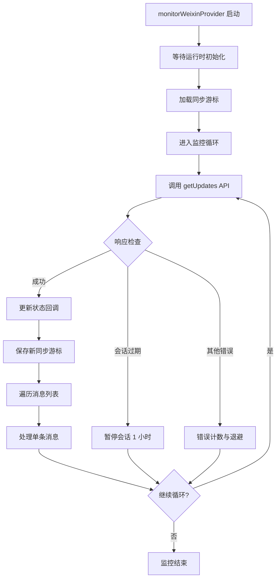

长轮询监控循环是 OpenClaw 微信插件的核心消息接收机制，负责持续监听微信服务器的新消息推送，确保消息的实时性和可靠性。该实现结合了长轮询协议特性、错误恢复策略和状态持久化机制，为插件提供了稳定的消息消费能力。

## 架构概览

监控循环采用事件驱动的架构设计，通过持续调用微信 API 的 `getUpdates` 接口获取新消息，处理后将同步游标持久化存储，确保在服务重启或网络中断后能够无缝恢复消息接收流程。

监控循环主要由 `monitorWeixinProvider` 函数驱动，该函数在 `src/monitor/monitor.ts` 中实现，作为插件的主要监控入口点。它负责协调整个消息接收、处理和状态同步流程。

Sources: [src/monitor/monitor.ts](src/monitor/monitor.ts#L38-L62)

## 运行时初始化

监控循环启动后，首先需要获取 OpenClaw 插件运行时环境，特别是 `channelRuntime` 组件。运行时初始化通过 `waitForWeixinRuntime` 函数实现，采用轮询方式等待全局运行时对象设置完成。

运行时等待机制设置了 10 秒的超时限制，轮询间隔为 100 毫秒。这种设计确保了插件在 OpenClaw 宿主环境完全初始化后再开始消息监听，避免了因运行时未就绪导致的错误。

Sources: [src/runtime.ts](src/runtime.ts#L27-L44)

## 同步游标管理

同步游标是长轮询机制的核心状态，用于标识消息消费的位置。插件在启动时从持久化存储加载历史游标，并在每次成功接收消息后更新游标。游标文件存储路径遵循 `~/.openclaw/openclaw-weixin/accounts/{accountId}.sync.json` 格式，每个账号对应独立的游标文件。

为了确保向后兼容，加载游标时会依次尝试三个路径：标准路径（新安装）、兼容路径（旧版本 raw ID 格式）和传统单账号路径。这种多级回退策略保证了从旧版本升级到多账号支持版本时的数据连续性。

Sources: [src/storage/sync-buf.ts](src/storage/sync-buf.ts#L56-L72)

## 长轮询核心循环

监控循环的主体是一个 `while` 循环，持续执行直到收到终止信号（`abortSignal`）。每次循环的核心步骤如下：

1. **发起长轮询请求**：调用 `getUpdates` API，携带当前同步游标和超时配置
2. **响应验证**：检查 API 返回的状态码（`ret` 和 `errcode`），识别错误类型
3. **状态更新**：成功时更新最后事件时间戳，通知网关存活状态
4. **游标持久化**：保存服务器返回的新同步游标
5. **消息分发**：遍历消息列表，调用 `processOneMessage` 处理每条消息

长轮询超时被设计为正常行为，当客户端超时（未在指定时间内收到服务器响应）时，API 函数返回空响应而不是抛出异常，允许监控循环直接重试。这种设计避免了不必要的错误日志和重试延迟。

Sources: [src/monitor/monitor.ts](src/monitor/monitor.ts#L88-L182)

## 错误处理与会话守护

监控循环实现了多层级的错误处理机制，根据错误类型采取不同的恢复策略：

| 错误类型 | 错误码 | 处理策略 | 恢复时长 |
|---------|--------|---------|---------|
| 会话过期 | -14 | 暂停所有请求 | 60 分钟 |
| 连续失败 | 其他 | 指数退避重试 | 最长 30 秒 |
| 单次失败 | 其他 | 短暂延迟后重试 | 2 秒 |

会话过期是一种特殊错误，当检测到 `errcode` 或 `ret` 等于 -14 时，调用 `pauseSession` 将账号暂停一小时。这可以防止在会话无效时频繁触发错误，给用户留出重新登录的时间。暂停状态使用内存中的 `Map` 结构存储，根据时间戳自动过期。

对于其他 API 错误，监控循环采用连续失败计数器，当达到 3 次失败时触发 30 秒退避，否则仅延迟 2 秒后重试。成功响应后重置计数器，确保短暂网络抖动不会触发长时间退避。

Sources: [src/monitor/monitor.ts](src/monitor/monitor.ts#L107-L147)

Sources: [src/api/session-guard.ts](src/api/session-guard.ts#L1-L40)

## 消息处理流程

每条入站消息通过 `processOneMessage` 函数独立处理，将消息处理逻辑从监控循环中分离，保持循环的简洁性。处理流程包括以下关键步骤：

1. **斜杠命令检测**：提取消息文本，若以 `/` 开头则调用命令处理器
2. **配置缓存查询**：获取发送者的用户配置，包括 `typingTicket`
3. **媒体下载**：识别并下载消息中的图片、视频等媒体内容
4. **消息转换**：将微信消息格式转换为 OpenClaw 消息上下文
5. **AI 管道调用**：通过 `channelRuntime` 将消息发送到 AI 处理管道

配置管理器 `WeixinConfigManager` 为每个用户维护独立的配置缓存，有效期 24 小时，采用指数退避策略在获取失败时重试，最长退避时间 1 小时。这种设计减少了对配置 API 的调用频率，同时确保配置的最终一致性。

Sources: [src/messaging/process-message.ts](src/messaging/process-message.ts#L61-L96)

Sources: [src/api/config-cache.ts](src/api/config-cache.ts#L31-L78)

## 动态超时调整

微信服务器可能在响应中包含 `longpolling_timeout_ms` 字段，用于指示下一次长轮询的建议超时时间。监控循环会响应这个字段并动态调整 `nextTimeoutMs`，实现与服务器端的协同优化。

默认长轮询超时为 35 秒，这个时间在响应延迟和实时性之间取得了平衡。当网络环境变化时，服务器端可以调整建议超时，客户端自动适配，提升整体连接效率。

Sources: [src/monitor/monitor.ts](src/monitor/monitor.ts#L103-L106)

## 终止机制

监控循环支持通过 `AbortSignal` 优雅终止。当信号被触发时，循环会在当前迭代结束后退出，确保正在处理的消息不会被中断。`sleep` 辅助函数也集成了信号监听，在等待期间可以立即响应终止请求。

Sources: [src/monitor/monitor.ts](src/monitor/monitor.ts#L210-L222)

## 配置参数说明

监控循环的关键配置参数在启动时通过 `MonitorWeixinOpts` 对象传入：

| 参数名 | 类型 | 默认值 | 说明 |
|-------|------|-------|------|
| `baseUrl` | string | 必填 | 微信 API 基础 URL |
| `cdnBaseUrl` | string | 必填 | CDN 基础 URL（用于媒体下载） |
| `token` | string? | 可选 | API 认证令牌 |
| `accountId` | string | 必填 | 账号唯一标识 |
| `allowFrom` | string[]? | 可选 | 允许发送消息的用户 ID 白名单 |
| `longPollTimeoutMs` | number? | 35000 | 长轮询超时时间（毫秒） |
| `abortSignal` | AbortSignal? | 可选 | 终止信号 |
| `setStatus` | function? | 可选 | 状态更新回调 |

Sources: [src/monitor/monitor.ts](src/monitor/monitor.ts#L19-L32)

## 相关文档

要深入了解相关机制的实现细节，可以参考以下文档：

- [长轮询 getUpdates 实现](10-chang-lun-xun-getupdates-shi-xian) - 了解 API 层面的长轮询协议实现
- [同步游标持久化](24-tong-bu-you-biao-chi-jiu-hua) - 深入了解游标存储和恢复机制
- [入站消息路由与处理](18-ru-zhan-xiao-xi-lu-you-yu-chu-li) - 了解消息处理管道的完整流程
- [配置缓存管理器](30-pei-zhi-huan-cun-guan-li-qi) - 了解用户配置的缓存和刷新策略