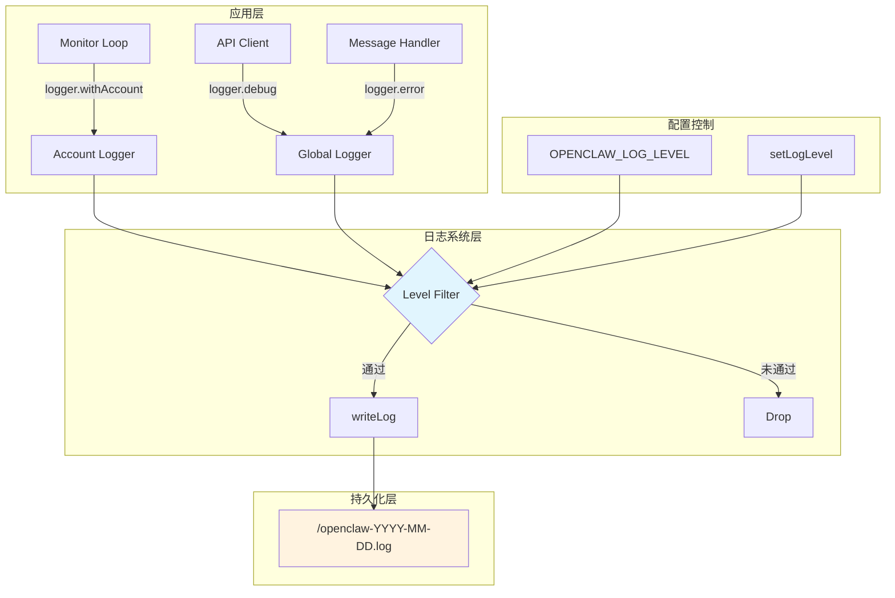

OpenClaw Weixin 插件采用统一的**结构化日志系统**，所有模块共享同一个日志文件格式。该系统提供六个日志级别、按账号上下文隔离的日志记录、JSON Lines 格式输出以及敏感信息自动脱敏等核心特性。日志系统遵循**最佳努力原则**，确保日志写入失败不会阻塞主业务流程，同时支持运行时动态调整日志级别，便于生产环境故障排查和开发阶段调试。

## 架构设计

日志系统的核心设计围绕**单例模式**和**上下文隔离**展开。全局 logger 实例通过工厂函数创建，支持通过 `withAccount()` 方法生成带有账号 ID 前缀的子日志记录器。所有日志最终写入同一目录下按日期分割的 JSON Lines 格式文件，文件路径由 OpenClaw 运行时环境自动解析。日志写入采用同步追加模式，简化了错误处理逻辑——任何写入失败仅被静默忽略，确保不影响插件核心功能。



从架构图可见，日志系统通过**级别过滤器**作为守门员，只有达到当前最低级别阈值的日志才会被格式化并写入文件。配置控制层提供环境变量和运行时 API 两种途径动态调整过滤阈值，实现生产环境与开发环境的灵活切换。

Sources: [logger.ts](src/util/logger.ts#L1-L146)

## 日志级别系统

插件采用 **tslog 兼容的级别 ID 体系**，使用数字标识符进行级别比较，数字越大表示严重程度越高。系统默认 INFO 级别（ID=3），这意味着 DEBUG 和 TRACE 级别的日志在生产环境中会被自动过滤。六个级别的语义定义如下：

- **TRACE (1)**：最详细的执行信息，仅用于深度调试场景
- **DEBUG (2)**：常规调试信息，用于追踪代码执行路径
- **INFO (3)**：重要业务事件，如模块启动、消息接收等
- **WARN (4)**：潜在问题警告，如缺少上下文令牌
- **ERROR (5)**：错误异常，如 API 调用失败、会话过期
- **FATAL (6)**：致命错误，导致服务无法继续运行

| 级别 | ID | 默认行为 | 典型使用场景 |
|------|----|----------|------------|
| TRACE | 1 | 过滤 | 深度调试，详细数据结构转储 |
| DEBUG | 2 | 过滤 | API 请求/响应详情，游标变化 |
| INFO | 3 | 记录 | 监控循环启动，入站消息，重要状态变更 |
| WARN | 4 | 记录 | 缺失配置，降级处理，非阻塞异常 |
| ERROR | 5 | 记录 | API 调用失败，会话过期，存储错误 |
| FATAL | 6 | 记录 | 致命服务错误（当前代码未直接使用） |

**级别控制机制**：系统首先读取环境变量 `OPENCLAW_LOG_LEVEL`（忽略大小写），如果未设置或值无效则回退到默认 INFO 级别。运行时可通过 `setLogLevel(level: string)` 函数动态调整最低级别，参数会自动转换为大写后进行验证。非法级别会抛出 Error 异常，有效级别列表包括 TRACE、DEBUG、INFO、WARN、ERROR、FATAL。

Sources: [logger.ts](src/util/logger.ts#L19-L40)

## 日志格式与结构

每条日志记录采用 **JSON Lines 格式**，即每行一个独立的 JSON 对象。这种格式便于日志聚合工具（如 ELK、Loki）解析和查询，同时保持人类可读性。日志对象包含以下核心字段：

```json
{
  "0": "gateway/channels/openclaw-weixin/wx_abc123",
  "1": "Monitor started: baseUrl=https://api.example.com timeoutMs=35000",
  "_meta": {
    "runtime": "node",
    "runtimeVersion": "v18.17.0",
    "hostname": "macbook-pro.local",
    "name": "gateway/channels/openclaw-weixin/wx_abc123",
    "parentNames": ["openclaw"],
    "date": "2024-01-15T08:23:45.123Z",
    "logLevelId": 3,
    "logLevelName": "INFO"
  },
  "time": "2024-01-15T16:23:45.123+08:00"
}
```

**字段说明**：
- `"0"`：Logger 名称，子系统路径加可选的账号 ID
- `"1"`：实际日志消息，包含账号前缀（如果存在）
- `_meta`：元数据对象，包含运行时环境、主机名、日期、级别等结构化信息
- `time`：本地时区 ISO 8601 格式时间戳，通过 `toLocalISO()` 函数将 UTC 时间转换为本地时间表示

**时间戳处理**：`toLocalISO()` 函数通过计算时区偏移量手动调整 Date 对象，然后调用 `toISOString()` 生成本地时钟数字显示的字符串。例如北京时间 UTC+8 时区，`date` 字段仍为 UTC 格式，而 `time` 字段则显示为 `+08:00` 后缀的本地时间。

Sources: [logger.ts](src/util/logger.ts#L61-L95)

## 日志轮转与存储

日志文件采用**按日分割**的轮转策略，每天自动创建新的日志文件。日志目录路径由 OpenClaw SDK 的 `resolvePreferredOpenClawTmpDir()` 函数解析，通常指向系统临时目录（如 macOS 的 `/tmp` 或 Linux 的 `/var/tmp`）。文件命名格式为 `openclaw-YYYY-MM-DD.log`，其中日期部分基于本地时区生成。

文件路径解析逻辑：
1. 调用 `localDateKey()` 获取当前本地日期字符串（如 `2024-01-15`）
2. 使用 `path.join()` 组合日志目录和文件名
3. 首次写入前通过 `fs.mkdirSync(MAIN_LOG_DIR, {recursive: true})` 创建目录

**持久化保证**：采用同步追加模式 `fs.appendFileSync()` 写入，虽然牺牲了一定性能，但确保了日志顺序性和简化了错误处理。写入操作被包裹在 `try-catch` 块中，任何 I/O 错误都会被静默忽略，这是遵循**最佳努力原则**的设计决策——日志系统不应成为影响业务稳定性的瓶颈。

Sources: [logger.ts](src/util/logger.ts#L69-L77)

## 账号上下文隔离

插件支持多账号并发运行场景，日志系统通过 `withAccount(accountId: string)` 方法实现**账号级别的日志隔离**。该方法返回一个新的 Logger 实例，所有日志消息会自动添加 `[accountId]` 前缀，且 logger 名称会扩展为 `SUBSYSTEM/accountId` 格式。

```typescript
// 全局 logger
logger.info("Starting plugin");
// 输出: "0": "gateway/channels/openclaw-weixin", "1": "Starting plugin"

// 账号上下文 logger
const aLog = logger.withAccount("wx_abc123");
aLog.info("Monitor started");
// 输出: "0": "gateway/channels/openclaw-weixin/wx_abc123", "1": "[wx_abc123] Monitor started"
```

**使用场景**：在监控循环中，每个账号通过 `const aLog = logger.withAccount(accountId)` 创建专属日志记录器，所有该账号相关的日志都通过 `aLog.info/debug/error` 输出。这种设计便于日志查询工具按账号 ID 过滤日志，快速定位特定账号的问题。

Sources: [logger.ts](src/util104-L114); [monitor.ts](src/monitor/monitor.ts#L47-L49)

## 敏感信息脱敏

日志系统与**敏感信息脱敏工具**紧密集成，防止在日志中泄露令牌、密钥等敏感数据。脱敏工具位于 `src/util/redact.ts`，提供三个核心函数：

1. **`redactToken(token, prefixLen)`**：显示令牌前 N 个字符和总长度，如 `a1b2c3…(len=32)`
2. **`redactBody(body, maxLen)`**：截断 JSON 主体，同时自动识别并替换敏感字段值
3. **`redactUrl(url)`**：移除 URL 查询字符串（通常包含签名/令牌），仅保留 origin 和 pathname

```typescript
// API 调试日志示例（自动脱敏）
logger.debug(`POST ${redactUrl(url.toString())} body=${redactBody(params.body)}`);
// 输出: POST https://api.example.com/cgi-bin/message body={"context_token":"<redacted>","text":"hello"}…(truncated, totalLen=156)
```

**敏感字段识别**：正则表达式 `/\b(context_token|bot_token|token|authorization|Authorization)\b/` 用于匹配 JSON 键名，匹配到的字段值会被替换为 `"<redacted>"`。这种设计在保持日志详细度的同时确保了安全性，尤其适合调试 API 交互场景。

Sources: [redact.ts](src/util/redact.ts#L1-L55); [api.ts](src/api/api.ts#L181-L182)

## 实际使用示例

日志系统在插件各个模块中被广泛使用，不同场景下选择合适的日志级别和方法。以下是典型使用模式的对比：

| 使用场景 | 日志级别 | 方法调用 | 示例输出 |
|----------|----------|----------|----------|
| 监控循环启动 | INFO | `aLog.info()` | Monitor started: baseUrl=... timeoutMs=35000 |
| API 请求详情 | DEBUG | `logger.debug()` | POST https://api... body={"context_token":"<redacted>",...} |
| 同步游标变化 | DEBUG | `aLog.debug()` | Saved new get_updates_buf (45 bytes) |
| 会话过期错误 | ERROR | `aLog.error()` | getUpdates: session expired (errcode=40001), pausing all requests for 5 min |
| 缺少上下文令牌 | WARN | `logger.warn()` | sendWeixinErrorNotice: no contextToken for to=..., sending without context |

**监控循环中的日志记录**展示了账号上下文的典型使用模式：

```typescript
export async function monitorWeixinProvider(opts: MonitorWeixinOpts): Promise<void> {
  const aLog: Logger = logger.withAccount(accountId);
  
  // INFO 级别记录重要生命周期事件
  aLog.info(`Monitor started: baseUrl=${baseUrl} timeoutMs=${longPollTimeoutMs}`);
  
  // DEBUG 级别记录详细执行细节
  aLog.debug(`getUpdates: get_updates_buf=${getUpdatesBuf.substring(0, 50)}..., timeoutMs=${nextTimeoutMs}`);
  
  // ERROR 级别记录异常情况
  aLog.error(`getUpdates: session expired (errcode=${resp.errcode}), pausing all requests for ${Math.ceil(pauseMs / 60_000)} min`);
}
```

**API 调试日志**展示了敏感信息脱敏的实际应用：

```typescript
function buildCommonHeaders(): Record<string, string> {
  const headers: Record<string, string> = {
    "iLink-App-Id": ILINK_APP_ID,
    "iLink-App-ClientVersion": String(ILINK_APP_CLIENT_VERSION),
  };
  // ... 日志记录时自动脱敏 URL 和 body
  logger.debug(`GET ${redactUrl(url.toString())}`);
  logger.debug(`${params.label} status=${res.status} raw=${redactBody(rawText)}`);
}
```

Sources: [monitor.ts](src/monitor/monitor.ts#L49-L84); [api.ts](src/api/api.ts#L117-L156)

## 配置与调试

日志系统提供两种配置途径控制日志输出量，分别适用于不同环境：

**环境变量配置**：通过 `OPENCLAW_LOG_LEVEL` 环境变量在启动时设置日志级别，这是生产环境推荐的配置方式。例如：
```bash
# 启用详细调试日志
OPENCLAW_LOG_LEVEL=DEBUG openclaw channels login --channel openclaw-weixin

# 仅记录警告和错误
OPENCLAW_LOG_LEVEL=WARN openclaw daemon start
```

**运行时动态调整**：通过 `setLogLevel(level: string)` 函数在运行时修改日志级别，无需重启服务。此功能适用于临时调试场景，可通过 OpenClaw 的管理接口或 REPL 环境调用。

**日志文件定位**：通过 `logger.getLogFilePath()` 方法获取当前日志文件的完整路径，便于实时监控日志输出。监控循环在启动时会记录同步文件路径，用于后续追踪游标持久化操作。

```typescript
aLog.debug(`syncFilePath: ${syncFilePath}`);
aLog.debug(`Using previous get_updates_buf (${getUpdatesBuf.length} bytes)`);
```

**日志查询技巧**：在日志文件中搜索特定关键词可以快速定位问题：
- `get_updates_buf`：追踪同步游标变化
- `session expired`：查找会话过期事件
- `[wx_abc123]`：过滤特定账号的日志

Sources: [logger.ts](src/util/logger.ts#L28-L40); [sync-buf.md](.zread/wiki/drafts/24-tong-bu-you-biao-chi-jiu-hua.md#L115-L118)

## 最佳实践

基于插件的实际使用经验，以下是日志系统的推荐实践：

**级别选择准则**：
- 生产环境保持默认 INFO 级别，仅记录重要业务事件
- 开发调试时启用 DEBUG 级别，但注意日志文件体积增长
- TRACE 级别仅用于深度问题排查，使用完毕后及时关闭
- ERROR/FATAL 级别日志应包含足够的上下文信息，便于根本原因分析

**账号隔离使用**：在多账号场景中，始终通过 `logger.withAccount(accountId)` 创建账号专属日志记录器，避免使用全局 logger 记录账号相关的日志，确保日志查询时可以精确过滤。

**敏感信息保护**：任何包含令牌、密钥、签名的日志必须使用脱敏工具处理。对于自定义 JSON 对象，优先使用 `redactBody()` 而非手动截断，确保所有敏感字段都被识别和替换。

**错误处理策略**：日志系统遵循**永不抛出**原则，所有日志相关的异常都应被静默处理。在关键业务逻辑中，不应依赖日志操作的成功与否来决定后续流程。

**性能考量**：在高频循环（如长轮询监控）中谨慎使用 DEBUG 级别日志，避免大量 I/O 操作影响性能。对于循环中的高频数据（如游标变化），可以仅记录摘要信息而非完整数据转储。

Sources: [logger.ts](src/util/logger.ts#L128-L132); [monitor.ts](src/monitor/monitor.ts#L64-L67)

---

日志系统是插件稳定性和可维护性的重要基础设施。通过合理使用日志级别、账号上下文隔离和敏感信息脱敏，开发者可以在不影响生产环境性能的前提下，获得足够的诊断信息。建议结合[调试模式与链路追踪](21-diao-shi-mo-shi-yu-lian-lu-zhui-zong)和[长轮询监控循环实现](26-chang-lun-xun-jian-kong-xun-huan-shi-xian)等文档，全面了解插件的可观测性体系。