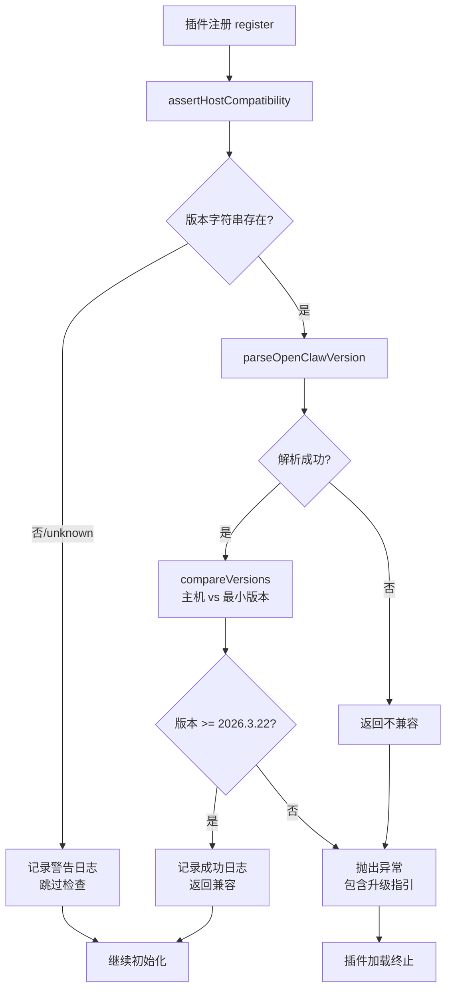

OpenClaw 插件系统采用基于日期的版本格式，本模块确保插件只在兼容的主机版本上运行，防止因 API 变更导致的运行时错误。版本兼容性检查在插件注册的最早期执行，作为快速失败守卫，在任何初始化副作用发生前拦截不兼容的环境。

## 版本格式规范

OpenClaw 使用语义化日期版本格式 `YYYY.M.DD`（例如 `2026.3.22`），这种格式能够精确反映 API 的演进时间线。版本字符串可能包含预发布后缀（如 `-beta.1`），但兼容性检查仅基于核心日期部分进行判断。本插件当前支持的最小主机版本为 `2026.3.22`，定义在 `SUPPORTED_HOST_MIN` 常量中，该值与 `package.json` 中的 `openclaw.install.minHostVersion` 配置保持一致。

Sources: [src/compat.ts](src/compat.ts#L11) [package.json](package.json#L51-L53)

## 核心功能实现

版本兼容性检查模块提供三个层次的 API：版本解析、版本比较和兼容性断言。`parseOpenClawVersion()` 函数接受版本字符串并返回包含年、月、日的对象，若字符串无法解析则返回 `null`。解析过程会自动剥离预发布后缀，只保留核心日期部分进行有效判断。版本组件都经过数字类型转换和有效性验证，确保后续比较操作的安全性。

Sources: [src/compat.ts](src/compat.ts#L23-L31)

`compareVersions()` 函数执行三阶段字典序比较：首先比较年份，若相同则比较月份，最后比较日期。返回值为 `-1`、`0` 或 `1`，分别表示第一个版本小于、等于或大于第二个版本。这种实现方式确保了日期版本的正确语义比较，同时避免了直接比较时间戳可能导致的边界问题。

Sources: [src/compat.ts](src/compat.ts#L36-L42)

`isHostVersionSupported()` 函数是兼容性判断的核心逻辑，它解析主机版本字符串并与最小支持版本进行比较，返回布尔值表示是否满足要求。该函数在版本解析失败时保守返回 `false`，确保未知版本不会绕过兼容性检查。

Sources: [src/compat.ts](src/compat.ts#L47-L52)

## 快速失败机制

`assertHostCompatibility()` 函数是插件注册流程的第一道防线，它封装了完整的兼容性检查逻辑并提供友好的错误处理。该函数处理三种场景：版本字符串缺失或为 `unknown` 时记录警告并跳过检查、版本满足要求时记录成功日志、版本不满足时抛出包含详细错误信息的异常。错误信息会明确指出当前版本、最低要求版本，并提供升级或安装兼容版本的操作指引。

Sources: [src/compat.ts](src/compat.ts#L60-L77)

这种快速失败机制的设计确保了以下关键特性：

- **零副作用失败**：在任何模块初始化或副作用发生前拦截不兼容环境
- **明确的错误指引**：异常消息包含版本信息和解决方案路径
- **可观察性**：通过结构化日志记录检查结果，便于问题诊断

## 插件集成点

版本兼容性检查在插件入口 `index.ts` 的 `register()` 函数中被调用，位于所有其他初始化逻辑之前。这种设计确保了即使插件在较旧的 OpenClaw 版本上被加载，也会在进入任何模块代码前失败，避免因 API 不匹配导致的不可预测行为。

Sources: [index.ts](index.ts#L14-L16)

调用时直接从 `api.runtime?.version` 获取主机版本字符串，这个版本信息由 OpenClaw 插件 SDK 在运行时注入。兼容性检查通过后，插件才会继续设置运行时上下文并注册微信渠道处理器。

Sources: [index.ts](index.ts#L18-L22)

## 版本决策流程

## 日志记录与可观察性

兼容性检查通过插件的结构化日志系统记录结果，日志子系统使用 `gateway/channels/openclaw-weixin` 作为命名空间前缀。成功的兼容性检查会记录 INFO 级别日志，包含主机版本和最低要求版本的比较结果；无法确定版本时记录 WARN 级别日志；版本不满足要求时则通过异常抛出，错误信息会显示在主进程日志中。

Sources: [src/util/logger.ts](src/util/logger.ts#L14)

## 版本策略与演进

当前插件版本 `2.1.7` 要求 OpenClaw 主机版本至少为 `2026.3.22`，这个最低版本反映了插件所依赖的关键 API 特性。从 CHANGELOG 可以看出，插件在 `2.1.2` 版本中修复了在 OpenClaw `2026.3.31+` 上的静态检查警告，表明插件持续跟进主机版本的演进。当 OpenClaw 引入新的 API 或移除旧 API 时，插件会相应调整 `SUPPORTED_HOST_MIN` 常量，确保在支持的版本范围内功能正常。

Sources: [CHANGELOG.zh_CN.md](CHANGELOG.zh_CN.md#L43-L46) [package.json](package.json#L2)

## 最佳实践

插件开发者使用版本兼容性检查时应遵循以下原则：在 `register()` 函数的最开始调用 `assertHostCompatibility()`，确保在任何模块初始化之前执行；为版本兼容性设置合理的最小版本，避免限制过严导致用户无法使用，也避免限制过宽导致在旧版本上出现运行时错误；在版本升级时评估 API 变更的影响，适时提高最低版本要求并在 CHANGELOG 中明确说明；为用户提供清晰的错误消息，包含当前版本、最低要求版本和解决方案路径。

Sources: [src/compat.ts](src/compat.ts#L55-L59)

## 相关文档

版本兼容性检查是插件稳定运行的基础保障，它与插件的运行时管理和配置加载密切相关。建议继续阅读以下文档以深入了解插件的完整架构：

- [结构化日志系统](27-jie-gou-hua-ri-zhi-xi-tong) - 了解兼容性检查使用的日志机制
- [插件架构总览](5-cha-jian-jia-gou-zong-lan) - 理解插件注册和生命周期
- [配置 Schema 定义](29-pei-zhi-schema-ding-yi) - 探索插件配置与版本策略的关联