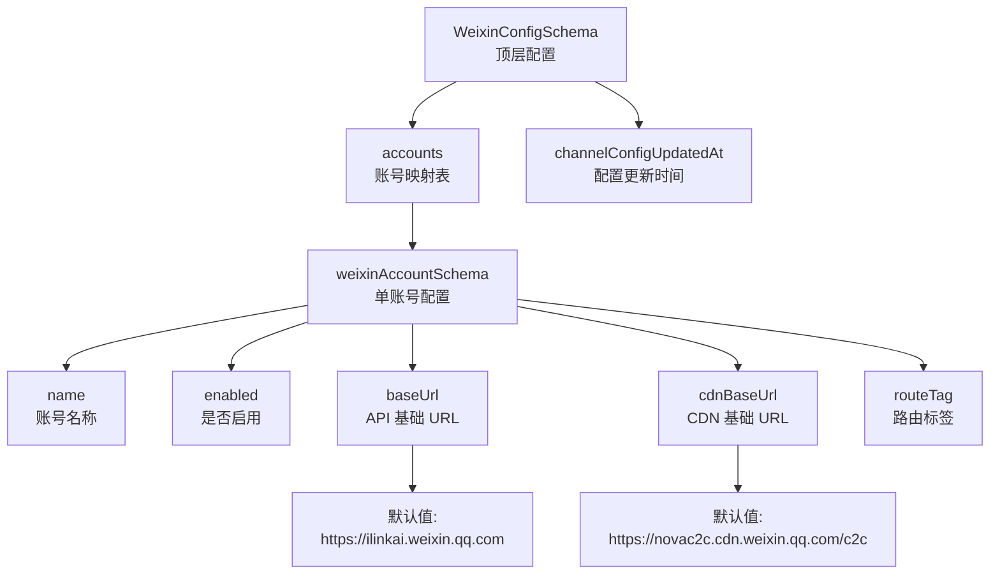

配置 Schema 是 OpenClaw Weixin 插件的核心组件，它使用 Zod 库定义了严格的类型验证规则，确保配置数据的正确性和一致性。通过配置 Schema，开发者可以为单个或多个微信账号设置个性化的连接参数、启用状态和路由标签等选项。

## Schema 架构概览

配置 Schema 采用分层结构设计，顶层 Schema 包含账号集合和配置更新时间戳，每个账号则拥有独立的配置项。这种设计既支持单账号简单配置，也支持多账号的复杂场景管理。



Sources: [src/config/config-schema.ts](src/config/config-schema.ts#L9-L22)

## 单账号配置定义

单账号配置 `weixinAccountSchema` 定义了每个微信账号的基本连接参数和行为选项。这些字段在配置文件中都是可选的，系统提供了合理的默认值，确保插件在最小配置下也能正常运行。

| 字段名 | 类型 | 必填 | 默认值 | 说明 |
|--------|------|------|--------|------|
| `name` | `string` | 否 | - | 账号的显示名称，便于识别和管理多个账号 |
| `enabled` | `boolean` | 否 | - | 账号启用状态，设为 `false` 可临时禁用该账号 |
| `baseUrl` | `string` | 否 | `https://ilinkai.weixin.qq.com` | OpenClaw 网关 API 的基础 URL |
| `cdnBaseUrl` | `string` | 否 | `https://novac2c.cdn.weixin.qq.com/c2c` | 媒体文件 CDN 基础 URL |
| `routeTag` | `number` | 否 | - | 路由标签，用于指定 OpenClaw 的消息路由规则 |

Sources: [src/config/config-schema.ts](src/config/config-schema.ts#L9-L15), [src/auth/accounts.ts](src/auth/accounts.ts#L12-L13)

## 顶层配置定义

`WeixinConfigSchema` 继承了单账号配置的所有字段，并扩展了账号集合和配置更新时间戳。这种设计允许在单账号模式下直接配置顶层字段，也支持多账号模式下通过 `accounts` 对象为每个账号单独配置。

| 字段名 | 类型 | 必填 | 说明 |
|--------|------|------|------|
| `accounts` | `Record<string, weixinAccountSchema>` | 否 | 账号映射表，键为账号 ID，值为该账号的配置对象 |
| `channelConfigUpdatedAt` | `string` | 否 | ISO 8601 格式的时间戳，每次成功登录后更新，触发网关重新加载配置 |

Sources: [src/config/config-schema.ts](src/config-schema.ts#L18-L22)

## 配置示例

以下配置展示了单账号和多账号两种使用场景：

### 单账号配置（简化模式）

```json
{
  "channels": {
    "openclaw-weixin": {
      "name": "我的微信",
      "enabled": true,
      "baseUrl": "https://ilinkai.weixin.qq.com",
      "cdnBaseUrl": "https://novac2c.cdn.weixin.qq.com/c2c",
      "routeTag": 1001
    }
  }
}
```

### 多账号配置

```json
{
  "channels": {
    "openclaw-weixin": {
      "accounts": {
        "abc123@im.bot": {
          "name": "客服机器人",
          "enabled": true,
          "baseUrl": "https://ilinkai.weixin.qq.com",
          "cdnBaseUrl": "https://novac2c.cdn.weixin.qq.com/c2c",
          "routeTag": 1001
        },
        "def456@im.wechat": {
          "name": "个人微信",
          "enabled": true,
          "baseUrl": "https://ilinkai.weixin.qq.com",
          "cdnBaseUrl": "https://novac2c.cdn.weixin.qq.com/c2c",
          "routeTag": 1002
        }
      },
      "channelConfigUpdatedAt": "2025-01-15T10:30:00.000Z"
    }
  }
}
```

Sources: [src/auth/accounts.ts](src/auth/accounts.ts#L355-L380)

## 配置解析与合并

插件在运行时通过 `resolveWeixinAccount` 函数合并配置文件和存储的凭证数据，形成最终可用的账号配置对象。合并规则遵循以下优先级：

1. **账号特定配置优先**：如果 `accounts[accountId]` 中定义了某个字段，则优先使用该值
2. **Section 级别配置兜底**：如果账号特定配置未定义，则使用 Section 级别的配置
3. **存储凭证覆盖 baseUrl**：账号登录时保存的 `baseUrl` 会覆盖配置文件中的值
4. **默认值最后保障**：未定义的 `baseUrl` 和 `cdnBaseUrl` 使用代码中的默认常量

Sources: [src/auth/accounts.ts](src/auth/accounts.ts#L355-L380), [src/auth/accounts.ts](src/auth/accounts.ts#L183-L212)

## 配置刷新机制

当用户通过二维码登录成功后，插件会调用 `triggerWeixinChannelReload` 函数更新 `channelConfigUpdatedAt` 时间戳。这一机制确保 OpenClaw 网关能够感知配置变更并重新加载最新配置，而无需手动重启服务。

```typescript
// 每次成功登录后触发配置刷新
await triggerWeixinChannelReload();
```

Sources: [src/auth/accounts.ts](src/auth/accounts.ts#L297-L318)

## 配置 Schema 的注册

配置 Schema 在插件入口文件中通过 `buildChannelConfigSchema` 辅助函数包装后注册到 OpenClaw 框架。框架利用这个 Schema 进行配置验证，确保用户提供的配置符合类型要求。

```typescript
import { WeixinConfigSchema } from "./src/config/config-schema.js";

export default {
  id: "openclaw-weixin",
  configSchema: buildChannelConfigSchema(WeixinConfigSchema),
  // ...
};
```

Sources: [index.ts](index.ts#L1-L14)

## 配置存储位置

配置文件默认存储在 OpenClaw 的状态目录中，具体路径可以通过环境变量 `OPENCLAW_CONFIG` 自定义。对于未提供环境变量的情况，插件会在状态目录下查找 `openclaw.json` 文件。

Sources: [src/auth/accounts.ts](src/auth/accounts.ts#L246-L250)

## 下一步学习

了解配置 Schema 的定义后，建议继续阅读以下文档以深入理解配置管理机制：

- [配置缓存管理器](30-pei-zhi-huan-cun-guan-li-qi) - 了解如何缓存和管理从网关获取的动态配置
- [账号存储与管理](8-zhang-hao-cun-chu-yu-guan-li) - 了解凭证和账号数据的持久化机制
- [插件架构总览](5-cha-jian-jia-gou-zong-lan) - 了解配置在整个插件架构中的角色和作用