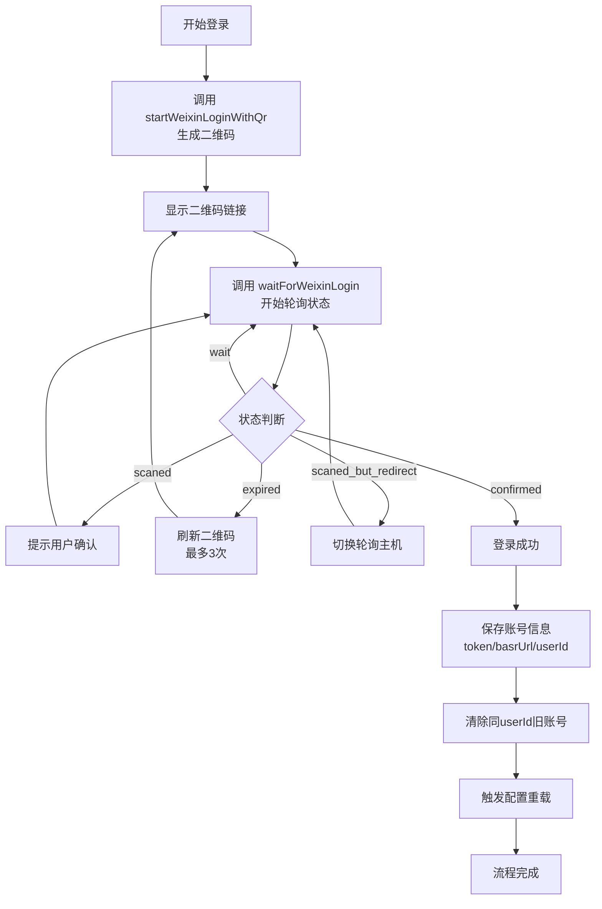

本文档面向初学者开发者，详细介绍如何使用微信扫码登录功能将微信账号连接到 OpenClaw 插件。扫码登录是获取微信机器人访问权限的核心流程，理解此流程后即可继续进行消息收发和功能开发。

Sources: [login-qr.ts](src/auth/login-qr.ts#L1-L327)

## 流程概述

扫码登录流程是一个异步的多步骤过程，主要分为四个阶段：**生成二维码**、**用户扫码**、**等待确认**、**完成连接**。整个过程通过长轮询机制实时获取二维码状态变化，最长支持8分钟的等待时间。



Sources: [login-qr.ts](src/auth/login-qr.ts#L109-L327)

## 核心概念

### 会话标识

扫码登录使用两个关键标识来追踪登录状态：

| 标识符 | 类型 | 用途 | 生成方式 |
|--------|------|------|----------|
| sessionKey | string | 本次登录会话的唯一标识 | 可自定义，未指定时自动生成 UUID |
| qrcode | string | 微信服务器返回的二维码ID | 由 `get_bot_qrcode` 接口返回 |

sessionKey 用于在内存中维护活跃登录会话，同一 sessionKey 可以复用未过期的二维码，避免重复生成。qrcode 则是用于向服务器查询二维码状态的实际标识。

Sources: [login-qr.ts](src/auth/login-qr.ts#L7-L18)

### 二维码状态

二维码在整个生命周期中会经历多种状态，每种状态对应不同的处理逻辑：

| 状态值 | 含义 | 处理方式 |
|--------|------|----------|
| `wait` | 等待扫码 | 继续轮询，每隔1秒查询一次 |
| `scaned` | 已扫码，等待确认 | 输出提示信息，继续轮询 |
| `confirmed` | 已确认，登录成功 | 提取 botToken、baseUrl 等信息，保存账号 |
| `expired` | 二维码过期 | 重新获取二维码（最多3次） |
| `scaned_but_redirect` | 扫码后需要切换服务节点 | 更新轮询主机地址 |

Sources: [login-qr.ts](src/auth/login-qr.ts#L32-L46)

### 关键超时参数

登录流程涉及多个超时配置，合理理解这些参数有助于优化用户体验：

| 参数名称 | 默认值 | 说明 |
|----------|--------|------|
| `ACTIVE_LOGIN_TTL_MS` | 300000 (5分钟) | 二维码在内存中的有效时间 |
| `QR_LONG_POLL_TIMEOUT_MS` | 35000 (35秒) | 单次状态查询的客户端超时 |
| 默认总超时 | 480000 (8分钟) | 等待用户扫码的最大时间 |

Sources: [login-qr.ts](src/auth/login-qr.ts#L20-L22)

## 实现步骤

### 第一步：生成二维码

调用 `startWeixinLoginWithQr` 函数发起登录请求。该函数会向微信服务器请求生成二维码，并将二维码信息存储在内存中以便后续查询。

```typescript
const result = await startWeixinLoginWithQr({
  accountId: 'my-weixin-account',  // 可选，指定账号ID
  apiBaseUrl: 'https://ilinkai.weixin.qq.com',
  botType: '3',                     // 可选，机器人类型
});

console.log(result.message);        // "使用微信扫描以下二维码，以完成连接。"
console.log(result.qrcodeUrl);      // 二维码图片链接
console.log(result.sessionKey);     // 会话标识，后续轮询需要
```

函数返回的 `qrcodeUrl` 是一个完整的图片链接，可以直接在浏览器中打开或显示给用户。二维码生成后会保存5分钟，期间重复调用会直接返回已存在的二维码。

Sources: [login-qr.ts](src/auth/login-qr.ts#L109-L162)

### 第二步：轮询等待扫码

使用 `waitForWeixinLogin` 函数持续查询二维码状态，直到用户完成扫码确认或超时。此函数内部采用循环轮询机制，自动处理状态变化和网络错误。

```typescript
const waitResult = await waitForWeixinLogin({
  sessionKey: result.sessionKey,    // 使用第一步返回的 sessionKey
  apiBaseUrl: 'https://ilinkai.weixin.qq.com',
  timeoutMs: 480000,                // 可选，最长等待时间
  verbose: true,                    // 可选，输出详细日志
});

if (waitResult.connected) {
  console.log("登录成功！");
  console.log("Bot Token:", waitResult.botToken);
  console.log("Account ID:", waitResult.accountId);
  console.log("User ID:", waitResult.userId);
} else {
  console.error("登录失败:", waitResult.message);
}
```

轮询过程中，函数会自动输出状态提示：
- 扫码后显示 "👀 已扫码，在微信继续操作..."
- 二维码过期时显示 "⏳ 二维码已过期，正在刷新..."
- 登录成功时显示 "✅ 与微信连接成功！"

Sources: [login-qr.ts](src/auth/login-qr.ts#L166-L326)

### 第三步：保存账号信息

登录成功后，系统会自动保存以下信息到账号文件：

| 字段 | 类型 | 说明 |
|------|------|------|
| token | string | Bot API 访问令牌，用于后续所有API请求 |
| baseUrl | string | API基础地址，用于后续请求 |
| userId | string | 微信用户ID，用于白名单控制 |
| savedAt | string | 保存时间戳 |

账号文件存储在状态目录下的 `accounts/{accountId}.json` 中，文件权限设置为 600，确保安全性。同时，系统会自动清除具有相同 userId 的旧账号，避免上下文混淆。

Sources: [accounts.ts](src/auth/accounts.ts#L183-L212)

### 第四步：触发配置重载

保存账号信息后，插件会自动更新 `openclaw.json` 配置文件中的 `channelConfigUpdatedAt` 字段，触发 OpenClaw 框架重新加载频道配置，确保新账号立即生效。

Sources: [accounts.ts](src/auth/accounts.ts#L297-L318)

## 错误处理

### 常见错误场景

| 错误场景 | 表现 | 处理建议 |
|----------|------|----------|
| 二维码过期 | 返回 `expired` 状态，显示刷新提示 | 自动刷新二维码（最多3次），超过限制后需重新开始 |
| 网络超时 | 轮询请求失败或超时 | 系统自动重试，继续轮询 |
| 服务重定向 | 返回 `scaned_but_redirect` 状态 | 自动切换到新的轮询主机地址 |
| 多次过期 | 二维码过期次数超过3次 | 提示用户重新开始登录流程 |
| 缺少 bot_id | 登录确认后服务器未返回 ilink_bot_id | 返回错误，需要重新登录 |

Sources: [login-qr.ts](src/auth/login-qr.ts#L221-L264)

### IDC 重定向机制

微信服务可能部署在多个数据中心（IDC），用户扫码后可能会被重定向到就近的服务节点。当轮询返回 `scaned_but_redirect` 状态时，系统会自动提取 `redirect_host` 字段，更新后续轮询的 API 地址。

```typescript
case "scaned_but_redirect": {
  const redirectHost = statusResponse.redirect_host;
  if (redirectHost) {
    const newBaseUrl = `https://${redirectHost}`;
    activeLogin.currentApiBaseUrl = newBaseUrl;
    logger.info(`IDC redirect, switching polling host to ${redirectHost}`);
  }
  break;
}
```

这种机制确保了扫码后的状态查询路由到正确的服务节点，提高连接成功率。

Sources: [login-qr.ts](src/auth/login-qr.ts#L267-L277)

## 内存管理

### 活跃登录清理

为防止内存泄漏，系统会在以下场景清理过期的登录会话：

1. **生成新二维码前**：调用 `purgeExpiredLogins()` 删除所有超过5分钟的会话
2. **登录成功后**：立即删除当前会话
3. **登录失败后**：删除对应的会话记录
4. **轮询超时后**：删除超时的会话

会话使用 `Map<string, ActiveLogin>` 结构存储，key 为 sessionKey，value 包含二维码ID、生成时间、当前状态等信息。

Sources: [login-qr.ts](src/auth/login-qr.ts#L30-L59)

## 后续学习路径

完成扫码登录后，您已经具备了微信机器人的访问权限。建议按以下顺序继续学习：

1. **[多账号管理与隔离配置](4-duo-zhang-hao-guan-li-yu-ge-chi-pei-zhi)**：学习如何管理多个微信账号，实现不同账号的配置隔离。

2. **[二维码登录机制](7-er-wei-ma-deng-lu-ji-zhi)**：深入了解二维码登录的协议细节和实现原理。

3. **[长轮询 getUpdates 实现](10-chang-lun-xun-getupdates-shi-xian)**：学习如何使用保存的 token 接收微信消息。

4. **[消息发送 sendMessage API](11-xiao-xi-fa-song-sendmessage-api)**：学习如何发送消息到微信。