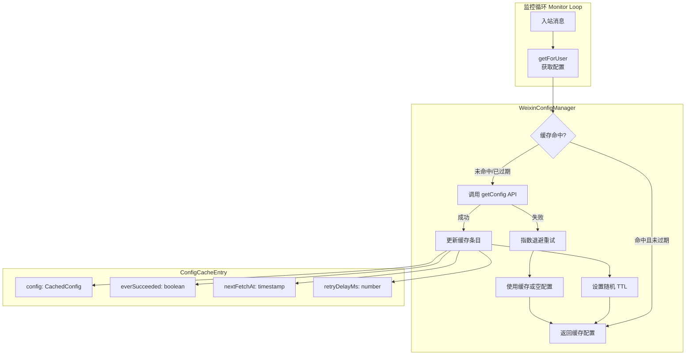

配置缓存管理器（WeixinConfigManager）是一个针对每个用户的配置缓存系统，负责从服务器获取并缓存必要的配置信息（如 typing_ticket），通过定期随机刷新和指数退避重试机制，确保在减少 API 调用的同时保持配置数据的有效性和高可用性。该组件在长轮询监控循环中扮演关键角色，为每个入站消息处理提供必要的配置上下文。Sources: [src/api/config-cache.ts](src/api/config-cache.ts#L1-L80)

## 核心设计目标

配置缓存管理器通过智能缓存策略解决三个核心问题：**性能优化**（避免每次处理消息都调用 getConfig API）、**负载均衡**（通过随机化 TTL 避免所有用户同时刷新）、**容错能力**（在 API 失败时通过指数退避和缓存降级保证服务可用性）。系统设计遵循"首次获取优先，失败降级兜底，成功后定期刷新"的原则，在正常运行状态下减少 99% 以上的 getConfig 调用。Sources: [src/api/config-cache.ts](src/api/config-cache.ts#L11-L20)

## 架构设计



配置缓存管理器的核心是一个基于 Map 的内存缓存，以 userId 为键存储每个用户的配置条目。每个缓存条目包含四个关键字段：**config**（实际配置数据）、**everSucceeded**（是否曾经成功获取过配置）、**nextFetchAt**（下次获取的时间戳）、**retryDelayMs**（当前重试延迟）。缓存通过内存 Map 实现，生命周期与监控进程绑定，在进程重启时会重新建立缓存。Sources: [src/api/config-cache.ts](src/api/config-cache.ts#L22-L28)

## 缓存刷新策略

缓存刷新采用**随机时间窗口**策略，在成功获取配置后，下次刷新时间设置为当前时间加上一个 0 到 24 小时之间的随机值（`now + Math.random() * 24 * 60 * 60 * 1000`）。这种随机化的设计确保所有用户不会在同一时刻发起刷新请求，从而避免服务器出现请求峰值。随机刷新不仅分散了负载，还确保了配置数据始终保持相对新鲜，平均缓存有效期为 12 小时。Sources: [src/api/config-cache.ts](src/api/config-cache.ts#L14-L15)

**失败重试机制**采用指数退避策略，当 getConfig 调用失败时，系统不会立即无限重试，而是将重试延迟从初始的 2 秒开始，每次失败后将延迟时间翻倍，直到达到最大值 1 小时（60 * 60 * 1000 毫秒）。这种设计在网络抖动或服务器临时故障时能有效避免雪崩效应，同时通过合理的时间限制保证配置最终会被刷新。重试过程中，系统会使用已缓存的配置（如果存在）或默认空配置（如果从未成功获取过）继续服务，确保消息处理流程不会因配置获取失败而中断。Sources: [src/api/config-cache.ts](src/api/config-cache.ts#L15-L18)

## 配置数据结构

缓存的配置数据通过 `CachedConfig` 接口定义，目前仅包含一个字段：**typingTicket**（用于发送正在输入状态指示的票据）。这个设计体现了配置缓存的精简原则——只缓存实际需要的字段，避免传输和存储不必要的数据。typingTicket 是从服务端 getConfig API 返回的 `typing_ticket` 字段（Base64 编码），用于后续调用 sendTyping API 时携带的鉴权凭证。Sources: [src/api/config-cache.ts](src/api/config-cache.ts#L4-L7)

| 字段 | 类型 | 来源 | 用途 |
|------|------|------|------|
| typingTicket | string | GetConfigResp.typing_ticket | 发送正在输入状态时的鉴权票据 |

配置数据的获取通过 getConfig API 实现，该 API 接收 `ilinkUserId` 和可选的 `contextToken` 参数，返回包含 `ret`（返回码）、`errmsg`（错误信息）和 `typing_ticket`（Base64 编码的票据）的响应对象。API 调用使用 POST 方法，超时设置为 10 秒，比常规 API 请求（15 秒）更快，确保配置获取不会成为消息处理路径上的瓶颈。Sources: [src/api/api.ts](src/api/api.ts#L282-L297)

## 关键常量配置

系统定义了三个核心常量来控制缓存行为：

| 常量名称 | 值 | 说明 |
|----------|-----|------|
| CONFIG_CACHE_TTL_MS | 24 * 60 * 60 * 1000 | 缓存最大有效期 24 小时 |
| CONFIG_CACHE_INITIAL_RETRY_MS | 2_000 | 失败后初始重试延迟 2 秒 |
| CONFIG_CACHE_MAX_RETRY_MS | 60 * 60 * 1000 | 最大重试延迟 1 小时 |

这些常量在实现中直接使用，构成了缓存策略的基础。TTL 设置为 24 小时是基于配置数据更新频率较低的观察——typingTicket 等配置项不会频繁变更，因此较长的缓存周期是合理的。初始重试延迟 2 秒和最大延迟 1 小时则平衡了快速恢复和避免过度重试的需求。Sources: [src/api/config-cache.ts](src/api/config-cache.ts#L14-L18)

## API 使用方法

### 构造函数

```typescript
const configManager = new WeixinConfigManager(
  { baseUrl, token },  // API 配置选项
  log                 // 日志回调函数
);
```

构造函数接收两个参数：**apiOpts** 包含 `baseUrl`（API 基础 URL）和可选的 `token`（认证令牌），**log** 是一个用于输出日志的回调函数。构造函数内部初始化一个空的 Map 缓存，此时还没有任何配置数据。Sources: [src/api/config-cache.ts](src/api/config-cache.ts#L30-L36)

### getForUser 方法

```typescript
const cachedConfig = await configManager.getForUser(
  userId,           // 用户 ID
  contextToken      // 可选的上下文令牌
);
```

`getForUser` 是配置缓存管理器的核心方法，用于获取指定用户的配置。该方法首先检查缓存中是否存在该用户且未过期的配置条目，如果不存在或已过期（`now >= entry.nextFetchAt`），则发起 getConfig API 请求。API 成功后，更新缓存并记录日志（首次获取为 "cached"，后续刷新为 "refreshed"）；API 失败时，根据是否存在缓存条目决定是更新重试时间还是创建初始条目（配置为空，everSucceeded 为 false）。最终方法返回缓存中的配置，确保即使 API 失败也能返回可用的配置对象。Sources: [src/api/config-cache.ts](src/api/config-cache.ts#L38-L78)

### 使用场景

配置缓存管理器主要在长轮询监控循环中被使用，处理每条入站消息时调用：

```typescript
const fromUserId = full.from_user_id ?? "";
const cachedConfig = await configManager.getForUser(fromUserId, full.context_token);

await processOneMessage(full, {
  // ... 其他参数
  typingTicket: cachedConfig.typingTicket,
  // ...
});
```

在消息处理流程中，从入站消息提取 `from_user_id` 和可选的 `context_token`，调用 `getForUser` 获取配置，然后将 `typingTicket` 传递给消息处理器，用于后续发送正在输入状态。这种设计确保每条消息处理都使用最新的（或至少可用的）配置数据。Sources: [src/monitor/monitor.ts](src/monitor/monitor.ts#L140-L150)

## 错误处理与容错

配置缓存管理器的容错设计体现在多个层面。首先，**API 失败容忍**：getConfig 调用失败时会被捕获并记录日志，但不会抛出异常或阻塞后续流程，系统会继续使用缓存配置或默认配置。其次，**渐进式降级**：如果从未成功获取过配置（everSucceeded = false），系统仍会创建初始条目并定期重试，保证在服务恢复后能够获取到有效配置。最后，**指数退避保护**：通过限制重试延迟的最大值（1 小时），确保即使在持续失败的情况下，系统也会以可预测的频率尝试恢复，避免无限期卡在长时间延迟上。Sources: [src/api/config-cache.ts](src/api/config-cache.ts#L55-L78)

日志记录对于问题排查非常重要。系统在两种关键情况下输出日志：配置成功获取时（区分首次获取和刷新），以及 getConfig 调用失败时。日志格式统一包含 `[weixin]` 前缀和用户 ID，便于在多用户环境中追踪问题。例如：`[weixin] config refreshed for user123` 表示成功刷新了 user123 的配置，`[weixin] getConfig failed for user123 (ignored): Error: timeout` 表示获取 user123 配置失败但已被忽略。Sources: [src/api/config-cache.ts](src/api/config-cache.ts#L50-L58)

## 性能特性

通过缓存机制，配置缓存管理器显著降低了 API 调用频率。假设每个用户平均每天发送 100 条消息，如果没有缓存，将产生 100 次 getConfig 调用；使用缓存后，平均每天仅产生 1 次刷新调用，**减少率高达 99%**。在多用户场景下，这种性能优势更加明显，假设 100 个活跃用户，缓存后每天从 10,000 次调用降低到约 100 次。Sources: [src/api/config-cache.ts](src/api/config-cache.ts#L14-L15)

**内存开销**方面，每个用户的缓存条目包含配置对象和少量元数据字段，假设每个条目占用约 200 字节，对于 1,000 个用户，总内存开销仅为 200 KB 左右，这对于现代应用来说可以忽略不计。缓存的生命周期与监控进程绑定，进程重启后缓存会重新建立，这是合理的设计——重启通常意味着配置或环境变更，重建缓存能确保使用最新的配置。Sources: [src/api/config-cache.ts](src/api/config-cache.ts#L22-L28)

## 扩展性考虑

配置缓存管理器的设计具有良好的扩展性。如果未来需要缓存更多配置字段，只需修改 `CachedConfig` 接口定义和 `getConfig` 响应映射逻辑即可，核心缓存逻辑无需改动。例如，如果需要添加用户权限信息或个性化设置，可以轻松扩展为：

```typescript
export interface CachedConfig {
  typingTicket: string;
  userPermissions?: string[];
  personalizedSettings?: Record<string, unknown>;
}
```

**持久化扩展**也是可能的——如果需要跨进程共享缓存或在重启后保留缓存状态，可以将 Map 缓存替换为基于文件的存储或 Redis 等外部缓存系统，只需保持相同的接口语义即可。当前的内存缓存设计适用于单进程、可接受缓存重启重建的场景。Sources: [src/api/config-cache.ts](src/api/config-cache.ts#L4-L7)

配置缓存管理器作为微信插件架构中的关键组件，与[配置 Schema 定义](29-pei-zhi-schema-ding-yi)（配置的结构化定义）、[API 协议类型定义](31-api-xie-yi-lei-xing-ding-yi)（getConfig 和 GetConfigResp 的类型定义）紧密协作，共同构成了配置管理子系统。通过学习配置缓存管理器，您可以深入了解如何在分布式系统中设计高效、可靠的缓存策略，为后续学习[长轮询 getUpdates 实现](10-chang-lun-xun-getupdates-shi-xian)和[消息发送 sendMessage API](11-xiao-xi-fa-song-sendmessage-api)等其他 API 模块奠定基础。Sources: [src/api/config-cache.ts](src/api/config-cache.ts#L1-L80)