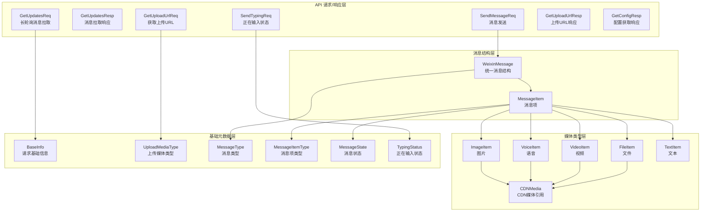

本页定义了 OpenClaw 微信插件与微信协议交互的完整类型系统。这些类型基于微信原生 Protocol Buffers 消息结构，经过 JSON 序列化适配，覆盖了从消息收发到媒体上传的所有 API 协议接口。类型系统采用严格的 TypeScript 定义，确保了编译时类型安全，同时通过 Base64 编码处理二进制字段，实现 JSON over HTTP 的无缝传输。

Sources: [src/api/types.ts](src/api/types.ts)

## 核心类型架构概览

微信插件协议类型系统采用分层设计，自底向上构建了完整的 API 抽象层。底层为基础请求元数据（BaseInfo），中间层为媒体与消息组件类型（CDNMedia、MessageItem），顶层为完整 API 请求/响应结构（GetUpdatesReq、SendMessageReq）。所有二进制字段在 JSON 层面均以 Base64 字符串形式传输，客户端需在发送前编码、接收后解码。类型系统同时兼容新旧协议，通过 `@deprecated` 标记提供向后兼容性支持。

Sources: [src/api/types.ts](src/api/types.ts#L1-L50)

## 基础元数据类型

BaseInfo 是所有 CGI 请求的公共元数据载体，目前仅包含 `channel_version` 字段，用于标识插件版本号。该版本号从 `package.json` 动态读取，通过 `buildBaseInfo()` 函数构建并附加到每个请求中。消息类型常量定义了消息的来源（USER/BOT/NONE）、消息项类型（TEXT/IMAGE/VOICE/FILE/VIDEO/NONE）以及消息状态（NEW/GENERATING/FINISH），这些枚举值用于消息路由和处理逻辑判断。

Sources: [src/api/api.ts](src/api/api.ts#L28-L48)

| 枚举类型 | 常量名 | 值 | 用途说明 |
|---------|--------|-----|---------|
| MessageType | USER | 1 | 用户发送的消息 |
| MessageType | BOT | 2 | Bot 发送的消息 |
| MessageType | NONE | 0 | 无效或未定义消息 |
| MessageItemType | TEXT | 1 | 纯文本消息 |
| MessageItemType | IMAGE | 2 | 图片消息 |
| MessageItemType | VOICE | 3 | 语音消息 |
| MessageItemType | FILE | 4 | 文件消息 |
| MessageItemType | VIDEO | 5 | 视频消息 |
| MessageState | NEW | 0 | 新消息，尚未生成 |
| MessageState | GENERATING | 1 | 消息生成中 |
| MessageState | FINISH | 2 | 消息生成完成 |

Sources: [src/api/types.ts](src/api/types.ts#L30-L56)

## 消息结构类型

WeixinMessage 是统一的消息结构定义，替代了旧的分散式 Message + MessageContent + FullMessage 结构。该类型包含完整的消息元数据：序列号、消息 ID、发送者/接收者 ID、客户端 ID、创建/更新/删除时间戳、会话 ID、群组 ID、消息类型/状态、消息项列表以及上下文令牌。消息项列表（`item_list`）支持多条目，可实现同时包含文本、图片、语音等多媒体内容的复合消息。

Sources: [src/api/types.ts](src/api/types.ts#L82-L111)

MessageItem 是消息的最小可处理单元，根据 `type` 字段决定包含的具体内容。每种消息类型对应一个专用的 `*_item` 字段：`text_item` 存储文本、`image_item` 存储图片、`voice_item` 存储语音、`video_item` 存储视频、`file_item` 存储文件。消息项还包含时间戳、完成标记以及引用消息（`ref_msg`）字段，用于实现回复和引用功能。

Sources: [src/api/types.ts](src/api/types.ts#L67-L81)

## CDN 媒体类型

CDNMedia 是所有媒体类型的统一 CDN 引用结构，包含加密参数、AES 密钥（Base64 编码）、加密类型（0=仅加密 fileid，1=打包缩略图/中图等信息）以及完整下载 URL。对于入站消息解密，优先使用 `aeskey` 字段（16 字节十六进制字符串）而非 `media.aes_key`，确保解密密钥的一致性。

Sources: [src/api/types.ts](src/api/types.ts#L59-L65)

图片类型（ImageItem）包含原图和缩略图两个 CDN 引用，并提供尺寸信息（中图尺寸、缩略图尺寸、高度、宽度、高清尺寸）。语音类型（VoiceItem）包含编码类型（1=pcm，2=adpcm，3=feature，4=speex，5=amr，6=silk，7=mp3，8=ogg-speex）、采样率、播放时长以及语音转文字内容。视频类型（VideoItem）包含视频大小、播放时长、视频 MD5 以及缩略图信息。文件类型（FileItem）提供文件名、MD5 和长度信息。

Sources: [src/api/types.ts](src/api/types.ts#L58-L76)

## 长轮询消息拉取类型

GetUpdatesReq 定义了长轮询消息拉取请求结构，包含已废弃的 `sync_buf` 字段（仅兼容保留）和新版 `get_updates_buf` 字段（本地缓存的全量上下文缓冲区）。首次请求或重置后应发送空字符串。GetUpdatesResp 定义了响应结构，包含返回码、错误码、错误消息、消息列表、上下文缓冲区（用于下次请求传递）以及服务端建议的长轮询超时时间（毫秒）。

Sources: [src/api/types.ts](src/api/types.ts#L113-L127)

错误码 `-14` 表示会话过期，触发会话守护机制暂停该账号一小时。`get_updates_buf` 需要持久化到本地文件系统，路径为 `~/.openclaw/openclaw-weixin/accounts/{accountId}.sync.json`，并在下次请求时读取发送。这确保了消息拉取的连续性和断点续传能力。

Sources: [src/api/session-guard.ts](src/api/session-guard.ts#L6-L7), [src/storage/sync-buf.ts](src/storage/sync-buf.ts#L24-L29)

## 消息发送类型

SendMessageReq 是消息发送请求结构，包装单个 `WeixinMessage`。响应类型 `SendMessageResp` 目前为空结构，仅用于类型对齐。消息发送前需要根据媒体类型获取 CDN 上传 URL，上传加密后的媒体内容，然后构造包含 `CDNMedia` 引用的 `WeixinMessage` 发送。

Sources: [src/api/types.ts](src/api/types.ts#L129-L135)

SendTypingReq 用于发送正在输入状态，包含接收者 ID（`ilink_user_id`）、输入票据（`typing_ticket`）和状态（1=正在输入，2=取消输入）。输入票据从 `GetConfigResp` 获取，需要定期刷新缓存。SendTypingResp 返回操作结果，包含返回码和错误消息。

Sources: [src/api/types.ts](src/api/types.ts#L199-L223)

## CDN 上传类型

GetUploadUrlReq 定义了获取 CDN 上传 URL 的请求结构，包含文件密钥、媒体类型（见 UploadMediaType 枚举）、接收者 ID、原文件明文大小/MD5、密文大小（AES-128-ECB 加密后）、缩略图明文大小/MD5、缩略图密文大小以及是否需要缩略图上传 URL 的标志。AES 密钥字段用于加密传输。

Sources: [src/api/types.ts](src/api/types.ts#L10-L27)

GetUploadUrlResp 返回原图和缩略图的加密上传参数以及完整的上传 URL（服务端直接拼接，客户端无需处理）。上传时使用 AES-128-ECB 算法加密原始文件内容，将密文 POST 到返回的 URL，响应头中的 `x-encrypted-param` 作为下载参数存储到 `CDNMedia.encrypt_query_param` 字段。

Sources: [src/api/types.ts](src/api/types.ts#L29-L36), [src/cdn/cdn-upload.ts](src/cdn/cdn-upload.ts#L14-L42)

## 配置缓存类型

CachedConfig 定义了从 `GetConfigResp` 提取的配置子集，目前仅包含 `typingTicket` 字段。`WeixinConfigManager` 类实现按用户缓存配置，包含 24 小时 TTL、随机刷新时间、失败时指数退避重试（最大 1 小时）机制。配置缓存确保了输入状态票据的及时更新和高可用性。

Sources: [src/api/config-cache.ts](src/api/config-cache.ts#L4-L13)

GetConfigResp 是配置获取响应结构，包含返回码、错误消息和 Base64 编码的输入票据（`typing_ticket`）。配置获取失败时忽略错误，使用上一次缓存值或默认值，确保消息发送流程不中断。

Sources: [src/api/types.ts](src/api/types.ts#L218-L223), [src/api/config-cache.ts](src/api/config-cache.ts#L32-L51)

## 请求头构建规范

虽然不属于类型定义范畴，但理解请求头构建对于完整理解 API 协议至关重要。每个 API 请求携带多个固定请求头：`iLink-App-Id`（从 `package.json` 读取）、`iLink-App-ClientVersion`（uint32 编码版本号，格式为 `0x00MMNNPP`）、`SKRouteTag`（从配置加载的路由标签）、`Authorization`（Bearer Token）以及随机生成的 `X-WECHAT-UIN`（uint32 十进制字符串转 Base64）。

Sources: [src/api/api.ts](src/api/api.ts#L50-L96)

版本号编码函数 `buildClientVersion` 将语义化版本号转换为 uint32：高 8 位固定为 0，剩余 24 位分别为 major<<16 \| minor<<8 \| patch。例如版本 "1.0.11" 编码为 `0x0001000B`（十进制 65547）。这种编码方式符合微信协议的二进制版本号规范。

Sources: [src/api/api.ts](src/api/api.ts#L36-L48)

## 下一步学习路径

掌握 API 协议类型定义后，建议按以下顺序深入理解协议细节：

1. [消息类型与状态码](32-xiao-xi-lei-xing-yu-zhuang-tai-ma) - 了解消息流转中的状态转换机制
2. [请求头构建规范](33-qing-qiu-tou-gou-jian-gui-fan) - 深入理解 HTTP 请求头的完整构建逻辑
3. [长轮询 getUpdates 实现](10-chang-lun-xun-getupdates-shi-xian) - 学习如何使用类型定义实现消息拉取
4. [消息发送 sendMessage API](11-xiao-xi-fa-song-sendmessage-api) - 掌握消息发送的完整流程
5. [CDN 预签名 URL 获取与上传](12-cdn-yu-qian-ming-url-huo-qu-yu-shang-chuan) - 理解媒体上传的类型使用细节