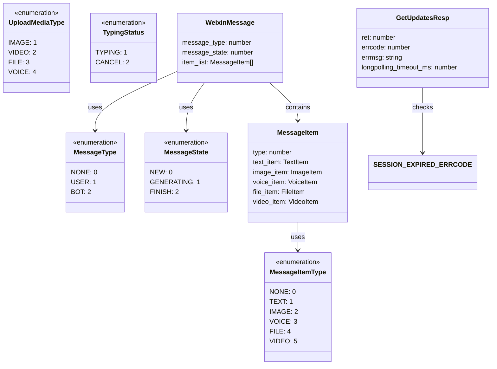
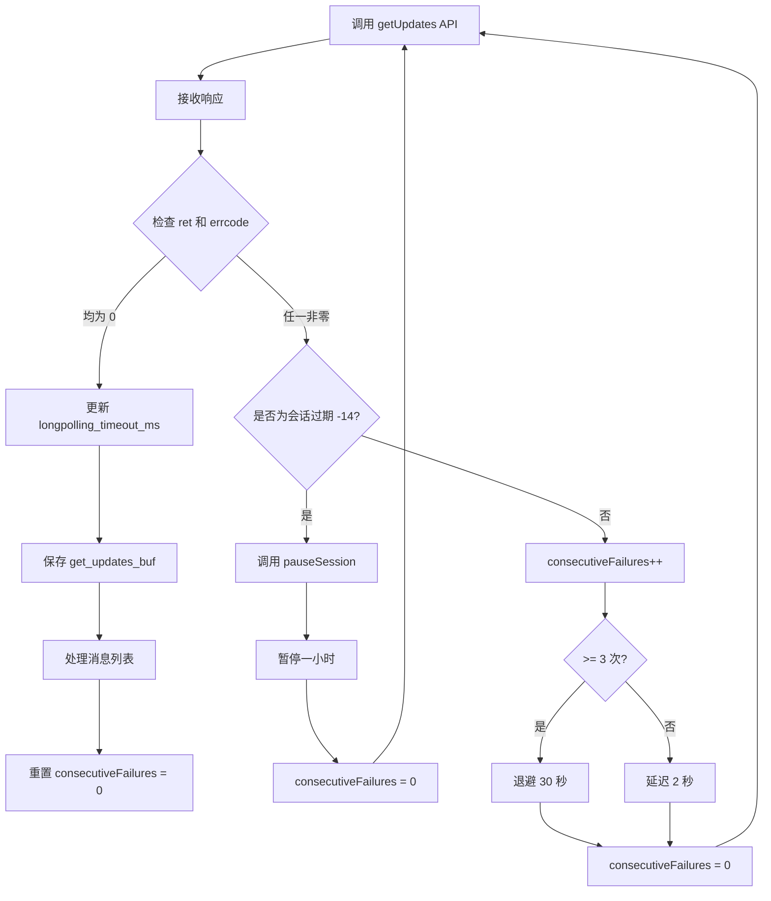

本文档详细说明 OpenClaw 微信插件的消息类型定义和 API 状态码规范。消息类型体系由多个枚举值构成，分别标识消息发送者身份、内容类型、传输状态以及媒体资源分类。状态码则用于表示 API 调用的执行结果和错误类型，包括通用返回码和特定的业务错误码。

Sources: [src/api/types.ts](src/api/types.ts#L1-L227)

## 消息发送者类型

消息发送者类型通过 `MessageType` 枚举区分消息的来源方，帮助识别消息是来自真实用户还是机器人。

```typescript
export const MessageType = {
  NONE: 0,
  USER: 1,
  BOT: 2,
} as const;
```

- **NONE (0)**: 未知类型，用于未分类或初始化状态
- **USER (1)**: 真实用户发送的消息
- **BOT (2)**: 机器人发送的消息

该字段位于 `WeixinMessage` 接口的 `message_type` 属性中，作为消息的元数据之一，供下游处理逻辑根据发送者身份进行差异化的处理策略。

Sources: [src/api/types.ts](src/api/types.ts#L51-L55)

## 消息内容类型

消息内容类型通过 `MessageItemType` 枚举标识消息承载的具体数据格式，包括文本、图片、语音、文件和视频五种类型。

```typescript
export const MessageItemType = {
  NONE: 0,
  TEXT: 1,
  IMAGE: 2,
  VOICE: 3,
  FILE: 4,
  VIDEO: 5,
} as const;
```

- **NONE (0)**: 未定义内容类型
- **TEXT (1)**: 纯文本消息，通过 `text_item` 字段承载文本内容
- **IMAGE (2)**: 图片消息，通过 `image_item` 字段承载图片 CDN 引用和缩略图信息
- **VOICE (3)**: 语音消息，通过 `voice_item` 字段承载语音编码类型、采样率、播放时长等信息
- **FILE (4)**: 文件消息，通过 `file_item` 字段承载文件名、MD5、大小等元信息
- **VIDEO (5)**: 视频消息，通过 `video_item` 字段承载视频和缩略图的 CDN 引用

消息内容类型定义在 `MessageItem` 接口的 `type` 字段中，每条消息可包含一个或多个内容项，构成 `item_list` 数组。处理入站消息时，通过 `isMediaItem()` 辅助函数判断消息项是否属于媒体类型（图片、视频、文件或语音），以便进行相应的下载和解密操作。

Sources: [src/api/types.ts](src/api/types.ts#L57-L64), [src/messaging/inbound.ts](src/messaging/inbound.ts#L162-L170)

## 消息传输状态

消息传输状态通过 `MessageState` 枚举标识消息在生成和传递过程中的生命周期阶段。

```typescript
export const MessageState = {
  NEW: 0,
  GENERATING: 1,
  FINISH: 2,
} as const;
```

- **NEW (0)**: 新消息，尚未开始处理
- **GENERATING (1)**: 正在生成中，适用于流式响应或长时间生成的消息
- **FINISH (2)**: 已完成生成，可以完整呈现给用户

该状态通过 `WeixinMessage` 接口的 `message_state` 属性传递，对于支持流式输出的场景尤为重要。同时，`MessageItem` 接口也包含 `is_completed` 布尔字段，用于标识单个消息项是否已完成渲染。

Sources: [src/api/types.ts](src/api/types.ts#L66-L70)

## 媒体上传类型

媒体上传类型通过 `UploadMediaType` 枚举区分上传文件的资源类别，影响服务端返回的上传参数和加密密钥生成逻辑。

```typescript
export const UploadMediaType = {
  IMAGE: 1,
  VIDEO: 2,
  FILE: 3,
  VOICE: 4,
} as const;
```

- **IMAGE (1)**: 图片上传，需同时提供原图和缩略图的元信息
- **VIDEO (2)**: 视频上传，需同时提供视频和缩略图的元信息
- **FILE (3)**: 普通文件上传，只需提供文件本身的信息
- **VOICE (4)**: 语音上传，通常指 SILK 格式的语音文件

该类型在 `GetUploadUrlReq` 请求的 `media_type` 字段中指定，服务端根据媒体类型决定是否返回缩略图上传参数（`thumb_upload_param`）。图片和视频上传时，若不显式设置 `no_need_thumb` 为 `true`，则必须提供缩略图的原始大小、MD5 和加密大小。

Sources: [src/api/types.ts](src/api/types.ts#L12-L17), [src/api/types.ts](src/api/types.ts#L19-L49)

## 正在输入状态

正在输入状态通过 `TypingStatus` 枚举控制对方界面上的"对方正在输入..."提示。

```typescript
export const TypingStatus = {
  TYPING: 1,
  CANCEL: 2,
} as const;
```

- **TYPING (1)**: 显示正在输入状态
- **CANCEL (2)**: 取消正在输入状态

该状态通过 `SendTypingReq` 请求的 `status` 字段发送，需要配合从 `GetConfigResp` 获取的 `typing_ticket` 使用。长时间无响应时，应主动发送 CANCEL 状态以避免误导用户。

Sources: [src/api/types.ts](src/api/types.ts#L202-L213), [src/api/types.ts](src/api/types.ts#L215-L218)

## API 响应状态码

API 响应通过两个状态码字段表示执行结果：`ret` 和 `errcode`。所有 API 响应接口（`GetUpdatesResp`、`SendTypingResp`、`GetConfigResp`）都遵循相同的状态码规范。

| 字段 | 类型 | 描述 | 成功值 |
|------|------|------|--------|
| ret | number | 通用返回码 | 0 |
| errcode | number | 服务端错误码 | 0 |
| errmsg | string | 错误描述信息 | 空/不存在 |

当 `ret` 或 `errcode` 任一非零时，视为 API 调用失败。监控循环会检查这两个字段，并根据错误码类型采取相应的恢复策略，包括重试、退避或会话暂停。

Sources: [src/api/types.ts](src/api/types.ts#L177-L190), [src/monitor/monitor.ts](src/monitor/monitor.ts#L107-L109)

## 会话过期错误码

会话过期错误码是微信协议中定义的特殊错误类型，用于标识 bot 会话已失效，需要重新登录。

```typescript
export const SESSION_EXPIRED_ERRCODE = -14;
```

当 `getUpdates` 或其他 API 返回 `errcode` 或 `ret` 等于 `-14` 时，表示当前会话已过期。插件会触发会话保护机制，暂停该账号的所有 API 请求一小时（`SESSION_PAUSE_DURATION_MS = 60 * 60 * 1000`），期间不再进行重试，避免频繁调用已失效的令牌。暂停结束后，监控循环会自动恢复请求，如果会话仍然无效，将再次触发暂停。

会话保护状态通过 `pauseSession()`、`isSessionPaused()` 和 `assertSessionActive()` 函数管理。所有 API 调用入口（如发送消息、获取上传 URL）在执行前都应调用 `assertSessionActive()`，若会话处于暂停状态则会抛出异常，阻止无效请求发出。

Sources: [src/api/session-guard.ts](src/api/session-guard.ts#L5-L6), [src/api/session-guard.ts](src/api/session-guard.ts#L10-L17), [src/monitor/monitor.ts](src/monitor/monitor.ts#L111-L125)

## 长轮询超时处理

长轮询请求（`getUpdates`）存在两种超时场景：客户端超时和服务器超时。

- **客户端超时**：由插件本地设置的 `timeoutMs` 参数控制（默认 35000ms），当该时间内未收到响应时，本地会中止请求。为保持长轮询语义，客户端超时被视为正常情况，返回 `ret: 0`、空消息列表的响应，监控循环会立即重试。
- **服务器超时**：服务端通过 `longpolling_timeout_ms` 字段动态建议下一次轮询的超时时长，监控循环会使用该值更新 `nextTimeoutMs` 变量，实现与服务端协商的自适应超时策略。

客户端超时不会计入 `consecutiveFailures` 计数器，不影响退避逻辑；只有真正的 API 错误（`ret` 或 `errcode` 非零）才会触发失败计数和退避重试。

Sources: [src/api/api.ts](src/api/api.ts#L205-L241), [src/monitor/monitor.ts](src/monitor/monitor.ts#L103-L106), [src/monitor/monitor.ts](src/monitor.ts#L234-L238)

## 错误恢复策略

当 API 返回错误状态码时，监控循环根据错误类型和连续失败次数采取分层恢复策略：

| 连续失败次数 | 处理策略 | 延迟时间 |
|------------|---------|---------|
| 1-2 次 | 立即重试 | 2000ms |
| 3 次及以上 | 退避重试 | 30000ms |
| 会话过期 (-14) | 暂停一小时 | 3600000ms |

`MAX_CONSECUTIVE_FAILURES` 常量设置为 3，用于触发退避逻辑的阈值。任何成功的 API 响应（`ret` 和 `errcode` 均为 0）都会重置 `consecutiveFailures` 计数器。

对于会话过期错误，插件不仅暂停 API 调用，还会调用 `pauseSession()` 记录暂停时间戳。在暂停期间，`isSessionPaused()` 函数返回 `true`，阻止所有 API 请求发出。当暂停时间到达后，下次请求时自动清除暂停状态，恢复正常请求流程。

Sources: [src/monitor/monitor.ts](src/monitor/monitor.ts#L14-L17), [src/monitor/monitor.ts](src/monitor.ts#L128-L147)

## 消息类型结构关系

以下类图展示了消息类型枚举、接口和状态码之间的结构关系：



Sources: [src/api/types.ts](src/api/types.ts#L137-L167), [src/api/types.ts](src/api/types.ts#L177-L190)

## 错误处理流程

以下流程图展示了监控循环处理 API 响应和错误状态的决策逻辑：



Sources: [src/monitor/monitor.ts](src/monitor/monitor.ts#L88-L182), [src/api/session-guard.ts](src/api/session-guard.ts#L11-L17)

## 下一步阅读

- [API 协议类型定义](31-api-xie-yi-lei-xing-ding-yi): 了解完整的 API 请求/响应接口定义
- [长轮询 getUpdates 实现](10-chang-lun-xun-getupdates-shi-xian): 深入理解长轮询机制和同步游标管理
- [会话状态管理与过期处理](13-hui-hua-zhuang-tai-guan-li-yu-guo-qi-chu-li): 掌握会话保护机制的实现细节
- [入站消息路由与处理](18-ru-zhan-xiao-xi-lu-you-yu-chu-li): 学习消息处理流程和类型转换