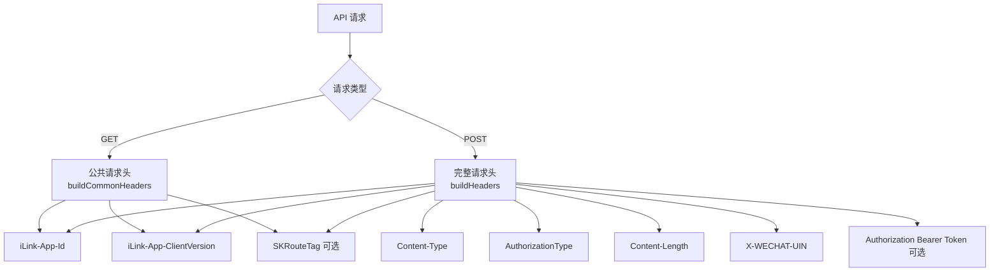
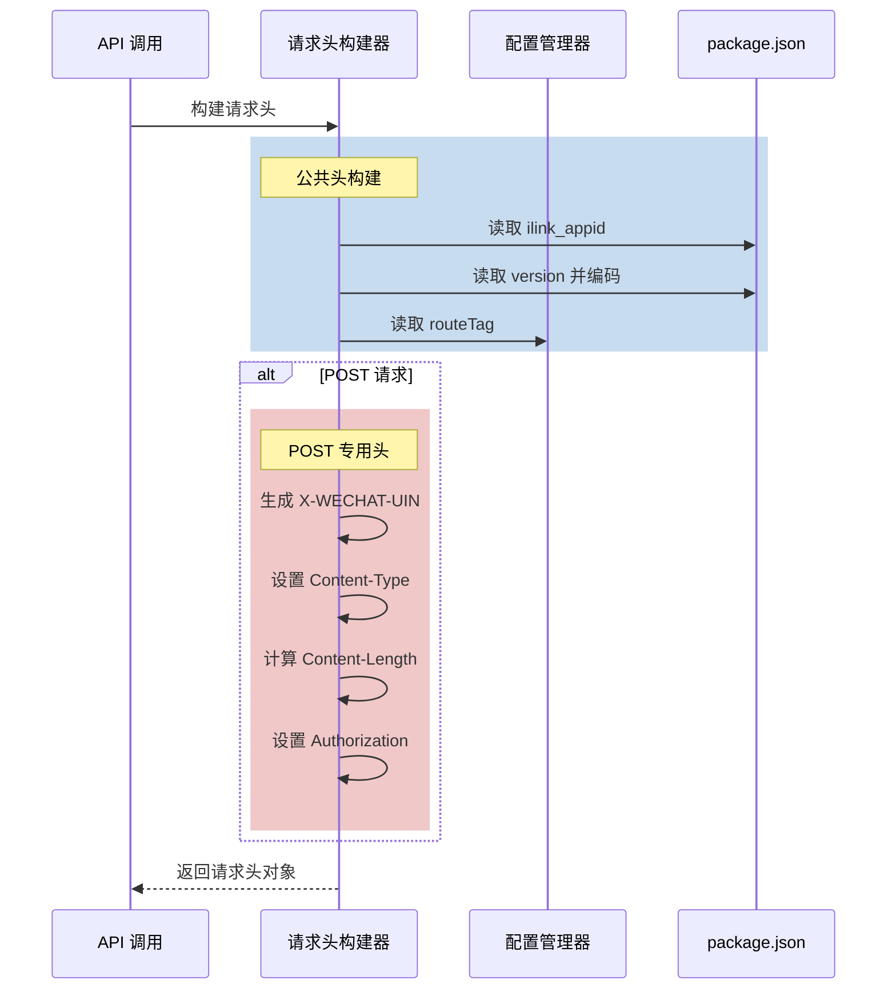

本规范定义了与微信 iLink API 通信时所需的 HTTP 请求头构建规则。所有 API 请求必须遵循这些规范以确保服务器正确识别和验证客户端身份。

Sources: [src/api/api.ts](src/api/api.ts#L1-L200)

## 请求头架构概览

微信插件使用分层请求头架构，区分 GET 和 POST 请求。GET 请求使用轻量级公共头，而 POST 请求则包含完整的认证和内容元数据。



Sources: [src/api/api.ts](src/api/api.ts#L94-L110)

## 公共请求头

公共请求头适用于所有 API 请求（GET 和 POST），包含应用身份标识和路由信息。

### 应用标识头

| 字段名 | 来源 | 类型 | 示例值 | 说明 |
|--------|------|------|--------|------|
| `iLink-App-Id` | `package.json` 的 `ilink_appid` 字段 | string | `"bot"` | 标识应用的唯一 ID |
| `iLink-App-ClientVersion` | 从 `package.json` 版本号编码而来 | number | `131591` | 32 位整数编码的版本号 |

版本号编码规则：`0x00MMNNPP`，其中：
- 高 8 位固定为 0x00
- MM = major 版本（8 位）
- NN = minor 版本（8 位）
- PP = patch 版本（8 位）

计算公式：`(major << 16) \| (minor << 8) \| patch`

例如：版本 `"2.1.7"` → `0x00020107` = 131591

Sources: [src/api/api.ts](src/api/api.ts#L22-L50)

### 路由标签

| 字段名 | 来源 | 类型 | 说明 |
|--------|------|------|------|
| `SKRouteTag` | OpenClaw 配置文件 | string/number | 路由标识，用于灰度发布等场景 |

`SKRouteTag` 的读取优先级：
1. **账号级别**：`channels.openclaw-weixin.accounts[accountId].routeTag`
2. **通道级别**：`channels.openclaw-weixin.routeTag`
3. **默认值**：不包含该头

Sources: [src/auth/accounts.ts](src/auth/accounts.ts#L280-L295)

## POST 请求专用头

POST 请求在公共头基础上增加以下字段，用于内容传递和认证。

### 内容元数据头

| 字段名 | 值 | 说明 |
|--------|-----|------|
| `Content-Type` | `"application/json"` | 请求体格式 |
| `AuthorizationType` | `"ilink_bot_token"` | 认证类型标识 |
| `Content-Length` | UTF-8 字节长度 | 请求体大小 |

Sources: [src/api/api.ts](src/api/api.ts#L94-L110)

### 认证与标识头

| 字段名 | 生成方式 | 说明 |
|--------|----------|------|
| `Authorization` | `Bearer ${token}` | Bearer token 认证，仅在提供 token 时包含 |
| `X-WECHAT-UIN` | 随机生成 | 用户标识符，每次请求不同 |

`X-WECHAT-UIN` 生成算法：
1. 生成 4 字节随机数（uint32）
2. 转换为十进制字符串
3. Base64 编码

Sources: [src/api/api.ts](src/api/api.ts#L69-L82)

## 请求体元数据

所有 POST 请求的 JSON 请求体必须包含 `base_info` 字段，用于传递插件版本信息。

### BaseInfo 结构

```typescript
interface BaseInfo {
  channel_version?: string;  // 从 package.json version 读取
}
```

### BaseInfo 嵌入位置

每个 API 请求体都将 `base_info` 作为顶级字段：

- `getUpdates`: `{ get_updates_buf: string, base_info: BaseInfo }`
- `sendMessage`: `{ msg: WeixinMessage, base_info: BaseInfo }`
- `getUploadUrl`: `{ filekey: string, media_type: number, ..., base_info: BaseInfo }`
- `getConfig`: `{ ilink_user_id: string, context_token: string, base_info: BaseInfo }`
- `sendTyping`: `{ to_user_id: string, typing_ticket: string, base_info: BaseInfo }`

Sources: [src/api/api.ts](src/api/api.ts#L51-L57)
Sources: [src/api/api.ts](src/api/api.ts#L205-L319)

## 完整请求示例

### GET 请求示例

**获取配置**（`getConfig`，实际为 POST 但用于说明公共头）：

```http
GET /ilink/bot/getconfig HTTP/1.1
Host: ilinkai.weixin.qq.com
iLink-App-Id: bot
iLink-App-ClientVersion: 131591
SKRouteTag: v2  # 可选
```

### POST 请求示例

**发送消息**（`sendMessage`）：

```http
POST /ilink/bot/sendmessage HTTP/1.1
Host: ilinkai.weixin.qq.com
Content-Type: application/json
AuthorizationType: ilink_bot_token
Content-Length: 1234
X-WECHAT-UIN: MTY5MjQzNzI2Mw==
Authorization: Bearer your_token_here
iLink-App-Id: bot
iLink-App-ClientVersion: 131591
SKRouteTag: v2

{
  "msg": { "message_id": 123, "from_user_id": "user1", "to_user_id": "user2", ... },
  "base_info": { "channel_version": "2.1.7" }
}
```

Sources: [src/api/api.ts](src/api/api.ts#L94-L110)
Sources: [src/api/api.ts](src/api/api.ts#L243-L257)

## 请求头构建流程



Sources: [src/api/api.ts](src/api/api.ts#L94-L110)

## 超时配置

不同类型的 API 请求使用不同的超时时间：

| 请求类型 | 默认超时 | 说明 |
|----------|----------|------|
| 长轮询（`getUpdates`） | 35,000 ms | 服务器可能保持请求直到有新消息 |
| 常规 API（`sendMessage`, `getUploadUrl`） | 15,000 ms | 标准操作超时 |
| 轻量级 API（`getConfig`, `sendTyping`） | 10,000 ms | 快速配置类操作 |

Sources: [src/api/api.ts](src/api/api.ts#L58-L65)

## 错误处理与会话管理

请求失败时，插件会根据错误码进行会话状态管理：

- **会话过期**：当服务器返回错误码 `-14` 时，触发一小时暂停机制
- **暂停期间**：所有入站和出站 API 调用将被拒绝
- **恢复机制**：一小时后自动恢复或手动重置

Sources: [src/api/session-guard.ts](src/api/session-guard.ts#L1-L59)

## 日志记录与调试

所有请求头在发送前都会记录调试日志，其中 `Authorization` 字段会被脱敏处理为 `Bearer ***` 以保护敏感信息。

Sources: [src/api/api.ts](src/api/api.ts#L105-L109)

## 相关文档

- [API 协议类型定义](31-api-xie-yi-lei-xing-ding-yi)：了解请求和响应的数据结构
- [长轮询 getUpdates 实现](10-chang-lun-xun-getupdates-shi-xian)：深入了解长轮询机制
- [消息发送 sendMessage API](11-xiao-xi-fa-song-sendmessage-api)：消息发送的完整流程
- [CDN 预签名 URL 获取与上传](12-cdn-yu-qian-ming-url-huo-qu-yu-shang-chuan)：媒体上传相关 API
- [会话状态管理与过期处理](13-hui-hua-zhuang-tai-guan-li-yu-guo-qi-chu-li)：会话生命周期管理