Base64 和 Hex 编码在微信协议中承担着二进制数据传输、密钥表示和标识符生成等关键职责。两种编码方式各有其应用场景：Base64 主要用于 JSON 协议中的二进制数据传输和网络协议表示，Hex 则常用于密钥和标识符的紧凑表示。本项目在 API 通信、媒体加密和会话管理等模块中涉及多种编码转换模式。

Sources: [src/api/types.ts](src/api/types.ts#L1-L3)

## Base64 编码应用

Base64 编码在项目中主要用于将二进制数据转换为可在 JSON 协议中安全传输的 ASCII 字符串。

### JSON 协议二进制数据传输

API 协议明确约定："API uses JSON over HTTP; bytes fields are base64 strings in JSON" [src/api/types.ts](src/api/types.ts#L2-L3)。此约定适用于以下关键字段：

- **get_updates_buf**：长轮询同步缓冲区，包含完整的上下文数据 [src/api/types.ts](src/api/types.ts#L174-L174)
- **sync_buf**：遗留同步缓冲区字段（兼容性保留）[src/api/types.ts](src/api/types.ts#L172-L172)
- **CDNMedia.aes_key**：CDN 媒体引用的 AES 密钥，使用 Base64 编码的字节表示 [src/api/types.ts](src/api/types.ts#L81-L81)

这些 Base64 编码的字段在 API 请求和响应中直接作为 JSON 字符串传输，无需额外处理。持久化时同样保持 Base64 格式，例如在 `~/.openclaw/openclaw-weixin/accounts/{accountId}.sync.json` 文件中存储 `get_updates_buf` [src/storage/sync-buf.ts](src/storage/sync-buf.ts#L28-L31)。

### HTTP 请求头生成

X-WECHAT-UIN 请求头使用 Base64 编码生成随机标识符：

```typescript
function randomWechatUin(): string {
  const uint32 = crypto.randomBytes(4).readUInt32BE(0);
  return Buffer.from(String(uint32), "utf-8").toString("base64");
}
```

[src/api/api.ts](src/api/types.ts#L88-L91)

此生成的 UIN 作为每个 API 请求的标识符，用于请求追踪和去重。

### CDN 媒体密钥表示

在发送媒体消息时，内部 Hex 编码的 AES 密钥需要转换为 Base64 格式以符合协议要求。转换模式统一应用于图片、视频和文件上传：

```typescript
const imageItem: MessageItem = {
  type: MessageItemType.IMAGE,
  image_item: {
    media: {
      encrypt_query_param: uploaded.downloadEncryptedQueryParam,
      aes_key: Buffer.from(uploaded.aeskey).toString("base64"),
      encrypt_type: 1,
    },
    mid_size: uploaded.fileSizeCiphertext,
  },
};
```

[src/messaging/send.ts](src/messaging/send.ts#L158-L170)

Sources: [src/messaging/send.ts](src/messaging/send.ts#L158-L170), [src/messaging/send.ts](src/messaging/send.ts#L187-L199), [src/messaging/send.ts](src/messaging/send.ts#L213-L225)

## Hex 编码应用

Hex 编码（十六进制编码）主要用于密钥的紧凑表示和随机标识符生成，具有可读性好、长度固定的特点。

### AES 密钥内部表示

AES-128-ECB 密钥为 16 字节（128 位），使用 Hex 编码后正好为 32 个字符。项目内部统一使用 Hex 编码存储和传递密钥：

```typescript
const aeskey = crypto.randomBytes(16);
// ...
aeskey: aeskey.toString("hex"),
```

[src/cdn/upload.ts](src/cdn/upload.ts#L52-L64)

在 `UploadedFileInfo` 接口中明确标注："AES-128-ECB key, hex-encoded; convert to base64 for CDNMedia.aes_key" [src/cdn/upload.ts](src/cdn/upload.ts#L22-L22)。此注释指出了 Hex 是内部表示格式，而 Base64 是协议要求的格式。

### 随机标识符生成

工具函数中使用 Hex 编码生成随机后缀，确保标识符的唯一性和可读性：

```typescript
export function generateId(prefix: string): string {
  return `${prefix}:${Date.now()}-${crypto.randomBytes(4).toString("hex")}`;
}

export function tempFileName(prefix: string, ext: string): string {
  return `${prefix}-${Date.now()}-${crypto.randomBytes(4).toString("hex")}${ext}`;
}
```

[src/util/random.ts](src/util/random.ts#L5-L17)

4 字节随机数转换为 8 个 Hex 字符，提供了足够的熵值用于区分不同的消息和文件。

### 入站消息优先字段

入站消息的 `ImageItem.aeskey` 字段被明确标注为 "Raw AES-128 key as hex string (16 bytes); preferred over media.aes_key for inbound decryption" [src/api/types.ts](src/api/types.ts#L87-L87)。此字段提供直接可用的 Hex 格式密钥，避免了解析 `media.aes_key` 的复杂性，是入站消息解密的首选字段。

## 编码转换模式

项目涉及多种编码转换场景，主要分为出站转换和入站解析两类。

### Hex → Base64 转换（出站）

在发送媒体消息时，需要将内部 Hex 编码的密钥转换为协议要求的 Base64 格式。此模式统一应用于所有媒体类型：

```typescript
aes_key: Buffer.from(uploaded.aeskey).toString("base64")
```

转换过程：Hex 字符串（32 字符）→ Buffer（16 字节）→ Base64 字符串（约 24 字符）。此转换确保了密钥在 JSON 协议中的正确传输 [src/messaging/send.ts](src/messaging/send.ts#L162-L163)。

### Base64 → Hex 转换（入站）

在下载入站媒体时，如果消息包含 `ImageItem.aeskey` 字段（Hex 格式），需要将其转换为 Base64 格式用于解密函数：

```typescript
const aesKeyBase64 = img.aeskey
  ? Buffer.from(img.aeskey, "hex").toString("base64")
  : img.media.aes_key;
```

[src/media/media-download.ts](src/media/media-download.ts#L33-L36)

此逻辑提供了后备机制：优先使用 `aeskey`（Hex），不存在时使用 `media.aes_key`（Base64），确保兼容性。

### 双层编码解析（文件/语音/视频）

下载文件、语音和视频时，`CDNMedia.aes_key` 可能存在两种编码模式：

- **base64(raw 16 bytes)**：直接解码得到 16 字节密钥，用于图片
- **base64(hex string of 16 bytes)**：解码后得到 32 个 Hex 字符，需再次解析为 16 字节密钥，用于文件/语音/视频

```typescript
function parseAesKey(aesKeyBase64: string, label: string): Buffer {
  const decoded = Buffer.from(aesKeyBase64, "base64");
  if (decoded.length === 16) {
    return decoded;
  }
  if (decoded.length === 32 && /^[0-9a-fA-F]{32}$/.test(decoded.toString("ascii"))) {
    // hex-encoded key: base64 → hex string → raw bytes
    return Buffer.from(decoded.toString("ascii"), "hex");
  }
  const msg = `${label}: aes_key must decode to 16 raw bytes or 32-char hex string, got ${decoded.length} bytes`;
  logger.error(msg);
  throw new Error(msg);
}
```

[src/cdn/pic-decrypt.ts](src/cdn/pic-decrypt.ts#L28-L41)

这种双层编码处理反映了服务端对不同媒体类型的密钥编码策略差异，客户端需同时支持两种模式以确保完全兼容。

## 类型定义与规范

TypeScript 类型定义明确了编码格式的约束和语义。

### CDN 媒体接口

```typescript
/** CDN media reference; aes_key is base64-encoded bytes in JSON. */
export interface CDNMedia {
  encrypt_query_param?: string;
  aes_key?: string;
  /** 加密类型: 0=只加密fileid, 1=打包缩略图/中图等信息 */
  encrypt_type?: number;
  /** 完整下载 URL（服务端直接返回，无需客户端拼接） */
  full_url?: string;
}
```

[src/api/types.ts](src/api/types.ts#L80-L88)

注释明确标注 `aes_key` 为 "base64-encoded bytes in JSON"，指出了编码格式。

### 图片媒体接口

```typescript
export interface ImageItem {
  /** 原图 CDN 引用 */
  media?: CDNMedia;
  /** 缩略图 CDN 引用 */
  thumb_media?: CDNMedia;
  /** Raw AES-128 key as hex string (16 bytes); preferred over media.aes_key for inbound decryption. */
  aeskey?: string;
  url?: string;
  // ...
}
```

[src/api/types.ts](src/api/types.ts#L90-L100)

`aeskey` 字段的注释强调了三个关键点：
1. 格式：Hex 字符串（16 字节）
2. 优先级：优于 `media.aes_key`
3. 用途：入站消息解密

### GetUpdates 请求/响应

```typescript
/** GetUpdates request: bytes fields are base64 strings in JSON. */
export interface GetUpdatesReq {
  /** @deprecated compat only, will be removed */
  sync_buf?: string;
  /** Full context buf cached locally; send "" when none (first request or after reset). */
  get_updates_buf?: string;
}

/** GetUpdates response: bytes fields are base64 strings in JSON. */
export interface GetUpdatesResp {
  ret?: number;
  // ...
  msgs?: WeixinMessage[];
  /** @deprecated compat only */
  sync_buf?: string;
  /** Full context buf to cache locally and send on next request. */
  get_updates_buf?: string;
  // ...
}
```

[src/api/types.ts](src/api/types.ts#L168-L190)

两个接口的注释都重复了 "bytes fields are base64 strings in JSON" 规范，确保了二进制数据字段编码的一致性。

## 编码转换流程图

下面的流程图展示了在不同场景下的编码转换路径：

```mermaid
flowchart TB
    subgraph 出站媒体发送
        A1[生成 AES-128 密钥<br/>crypto.randomBytes 16]
        A2[Hex 编码<br/>aeskey.toString hex]
        A3[上传到 CDN<br/>getUploadUrl uploadBufferToCdn]
        A4[Hex → Base64 转换<br/>Buffer.from aeskey hex.toString base64]
        A5[构建 JSON 消息<br/>SendMessageReq]
        A6[发送到服务端<br/>API JSON HTTP]
    end
    
    subgraph 入站媒体下载 图片
        B1[接收入站消息<br/>GetUpdatesResp]
        B2[检查 aeskey 字段<br/>Hex 格式]
        B3[Hex → Base64 转换<br/>Buffer.from aeskey hex.toString base64]
        B4[解析密钥<br/>parseAesKey]
        B5[下载并解密<br/>downloadAndDecryptBuffer]
    end
    
    subgraph 入站媒体下载 文件 语音 视频
        C1[接收入站消息<br/>GetUpdatesResp]
        C2[获取 media.aes_key<br/>Base64 编码]
        C3[Base64 解码<br/>Buffer.from aeskeyBase64 base64]
        C4{解码后长度?}
        C5[16 字节<br/>直接使用]
        C6[32 字节 Hex<br/>Hex → Raw]
        C7[下载并解密<br/>downloadAndDecryptBuffer]
    end
    
    A1 --> A2 --> A3 --> A4 --> A5 --> A6
    B1 --> B2 --> B3 --> B4 --> B5
    C1 --> C2 --> C3 --> C4 --> C5
    C4 --> C6 --> C7
```



Sources: [src/cdn/upload.ts](src/cdn/upload.ts#L48-L79), [src/media/media-download.ts](src/media/media-download.ts#L28-L59), [src/cdn/pic-decrypt.ts](src/cdn/pic-decrypt.ts#L28-L60)

## 编码应用场景对比表

| 编码格式 | 应用场景 | 数据长度/格式 | 用途 | 关键位置 |
|---------|---------|--------------|------|---------|
| **Base64** | get_updates_buf | 变长（二进制数据） | JSON 协议传输同步缓冲区 | [src/api/types.ts](src/api/types.ts#L174) |
| **Base64** | CDNMedia.aes_key | 24 字符（16 字节） | CDN 媒体引用的密钥表示 | [src/api/types.ts](src/api/types.ts#L81) |
| **Base64** | X-WECHAT-UIN | 变长（数字字符串） | HTTP 请求头标识符 | [src/api/api.ts](src/api/api.ts#L88-L91) |
| **Hex** | UploadedFileInfo.aeskey | 32 字符（16 字节） | 内部上传文件密钥表示 | [src/cdn/upload.ts](src/cdn/upload.ts#L22) |
| **Hex** | ImageItem.aeskey | 32 字符（16 字节） | 入站图片解密密钥 | [src/api/types.ts](src/api/types.ts#L87) |
| **Hex** | generateId 后缀 | 8 字符（4 字节） | 唯一标识符生成 | [src/util/random.ts](src/util/random.ts#L5-L8) |
| **Base64(Hex)** | 文件/语音/视频密钥 | 44 字符（32 Hex 字符） | 双层编码的密钥表示 | [src/cdn/pic-decrypt.ts](src/cdn/pic-decrypt.ts#L29-L30) |

## 关键编码转换函数

### parseAesKey - 密钥解析函数

```typescript
function parseAesKey(aesKeyBase64: string, label: string): Buffer {
  const decoded = Buffer.from(aesKeyBase64, "base64");
  if (decoded.length === 16) {
    return decoded;
  }
  if (decoded.length === 32 && /^[0-9a-fA-F]{32}$/.test(decoded.toString("ascii"))) {
    // hex-encoded key: base64 → hex string → raw bytes
    return Buffer.from(decoded.toString("ascii"), "hex");
  }
  const msg = `${label}: aes_key must decode to 16 raw bytes or 32-char hex string, got ${decoded.length} bytes (base64="${aesKeyBase64}")`;
  logger.error(msg);
  throw new Error(msg);
}
```

[src/cdn/pic-decrypt.ts](src/cdn/pic-decrypt.ts#L28-L41)

此函数是处理入站媒体密钥的核心逻辑，支持两种编码模式并提供清晰的错误提示。

### randomWechatUin - UIN 生成函数

```typescript
function randomWechatUin(): string {
  const uint32 = crypto.randomBytes(4).readUInt32BE(0);
  return Buffer.from(String(uint32), "utf-8").toString("base64");
}
```

[src/api/api.ts](src/api/api.ts#L88-L91)

生成过程：4 字节随机数 → 32 位无符号整数 → 十进制字符串 → Base64 编码。

## 协议兼容性考虑

项目设计中充分考虑了协议演进和兼容性：

1. **多编码模式支持**：`parseAesKey` 同时处理直接 Base64 和 Base64(Hex) 两种模式，适应服务端对不同媒体类型的密钥编码策略 [src/cdn/pic-decrypt.ts](src/cdn/pic-decrypt.ts#L28-L41)。

2. **字段优先级**：`ImageItem.aeskey` 字段作为入站解密的首选，避免了解析 `media.aes_key` 的复杂性，但保留了后备机制 [src/media/media-download.ts](src/media/media-download.ts#L33-L36)。

3. **遗留字段标记**：`sync_buf` 字段标记为 `@deprecated`，但保留以支持旧版本的同步缓冲区格式 [src/api/types.ts](src/api/types.ts#L172-L172)。

4. **空字符串默认值**：首次请求或重置后，`get_updates_buf` 应发送空字符串而非省略字段，确保服务端正确识别初始状态 [src/api/types.ts](src/api/types.ts#L174-L175)。

Sources: [src/api/api.ts](src/api/api.ts#L215-L223), [src/storage/sync-buf.ts](src/storage/sync-buf.ts#L52-L60)

## 相关页面链接

- **[API 协议类型定义](31-api-xie-yi-lei-xing-ding-yi)**：了解完整的 TypeScript 接口定义和字段说明
- **[CDN 上传与 AES-128-ECB 加密](14-cdn-shang-chuan-yu-aes-128-ecb-jia-mi)**：深入了解加密过程和密钥生成
- **[媒体下载与解密](15-mei-ti-xia-zai-yu-jie-mi)**：查看入站媒体的完整下载和解密流程
- **[长轮询 getUpdates 实现](10-chang-lun-xun-getupdates-shi-xian)**：了解同步缓冲区的使用和管理