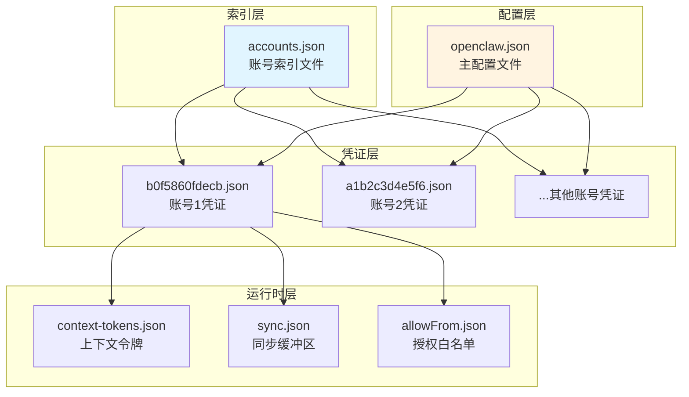
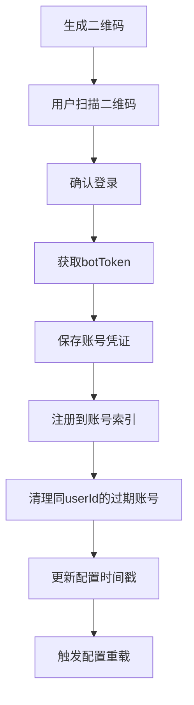
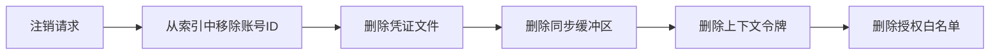

本页面介绍 openclaw-weixin 插件的多账号管理机制，包括账号的隔离存储、配置管理和生命周期管理。通过理解这些内容，您将能够在一个插件实例中同时管理多个微信账号，并确保它们之间的数据和配置完全隔离。

## 核心概念

多账号管理是指在一个 OpenClaw 实例中通过 openclaw-weixin 插件同时连接和管理多个微信账号的能力。这种设计使得单个机器人服务可以代表多个业务主体或多个微信账号进行消息收发，每个账号拥有独立的认证凭证、会话状态和配置参数。

账号隔离是指确保不同账号的运行时数据互不干扰的机制，包括凭证文件、上下文令牌、同步缓冲区、授权白名单等所有状态数据的独立存储和管理。

Sources: [src/auth/accounts.ts](src/auth/accounts.ts#L1-L381)

## 架构设计

多账号管理系统采用三层架构：索引层、凭证层和运行时层。索引层维护所有已登录账号的ID列表；凭证层为每个账号存储独立的认证信息和元数据；运行时层处理会话状态和上下文令牌的生命周期。



Sources: [src/auth/accounts.ts](src/auth/accounts.ts#L49-L89)

## 存储结构与隔离机制

### 目录组织

所有微信账号的持久化数据都存储在状态目录下的 `openclaw-weixin` 子目录中，确保与其他插件的数据隔离。状态目录默认位于 `~/.openclaw`，也可以通过环境变量 `OPENCLAW_STATE_DIR` 自定义。

Sources: [src/storage/state-dir.ts](src/storage/state-dir.ts#L5-L12)

### 账号索引

账号索引文件 `accounts.json` 存储所有通过二维码登录注册的账号ID列表。当新的账号登录时，系统会将其ID添加到此列表；当账号被注销时，对应的ID会从列表中移除。这个索引是账号查找和管理的入口点。

| 文件 | 路径 | 作用 |
|------|------|------|
| accounts.json | `{stateDir}/openclaw-weixin/accounts.json` | 账号ID索引列表 |

Sources: [src/auth/accounts.ts](src/auth/accounts.ts#L49-L89)

### 账号凭证文件

每个账号拥有独立的凭证文件，文件名为 `{accountId}.json`，存储该账号的认证信息。这种设计确保了不同账号的凭证完全隔离，互不影响。凭证文件包含以下字段：

| 字段 | 类型 | 说明 |
|------|------|------|
| token | string | 微信机器人认证令牌 |
| savedAt | string | 令牌保存时间（ISO 8601格式） |
| baseUrl | string | API基础URL |
| userId | string | 登录用户的微信ID（用于清理过期账号） |

凭证文件权限设置为 0600（仅所有者可读写），确保敏感信息安全。

Sources: [src/auth/accounts.ts](src/auth/accounts.ts#L114-L217)

### 运行时状态隔离

每个账号的运行时状态也完全隔离，包括：

- **上下文令牌**：`{accountId}.context-tokens.json` 存储该账号与各对话伙伴的上下文令牌，用于消息发送时正确路由。
- **同步缓冲区**：`{accountId}.sync.json` 存储长轮询的同步游标，确保重启后能从正确位置继续接收消息。
- **授权白名单**：`openclaw-weixin-{accountId}-allowFrom.json` 存储通过配对授权的用户ID列表，框架使用此列表进行访问控制。

Sources: [src/messaging/inbound.ts](src/messaging/inbound.ts#L1-L100) [src/auth/pairing.ts](src/auth/pairing.ts#L41-L80)

## 账号生命周期

### 登录流程

当用户通过二维码登录新账号时，系统会执行以下步骤：



1. **凭证保存**：将 `botToken`、`baseUrl`、`userId` 等信息写入 `{accountId}.json` 文件。
2. **索引注册**：将账号ID添加到 `accounts.json` 索引文件中。
3. **过期账号清理**：检查是否存在与当前 `userId` 相同的其他账号记录，如果有则清理这些记录及相关的上下文令牌，防止令牌匹配歧义。
4. **配置更新**：更新 `openclaw.json` 中的 `channelConfigUpdatedAt` 时间戳，触发网关重载配置。

Sources: [src/auth/accounts.ts](src/auth/accounts.ts#L90-L128) [src/auth/login-qr.ts](src/auth/login-qr.ts#L200-L327)

### 账号查找与解析

系统通过 `resolveWeixinAccount` 函数查找和解析账号配置。该函数会合并以下三个来源的配置：

1. **主配置文件**：`openclaw.json` 中的通道级别配置和账号级别配置。
2. **凭证文件**：存储的 `token` 和 `baseUrl`。
3. **默认值**：`DEFAULT_BASE_URL` 和 `CDN_BASE_URL` 作为回退值。

配置优先级为：账号级别配置 > 通道级别配置 > 默认值。

Sources: [src/auth/accounts.ts](src/auth/accounts.ts#L355-L381)

### 账号注销

当需要注销账号时，系统会执行以下清理操作：



`clearWeixinAccount` 函数会删除与账号关联的所有文件，确保不留任何残留数据。

Sources: [src/auth/accounts.ts](src/auth/accounts.ts#L221-L244)

### 过期账号自动清理

当同一微信用户通过新的二维码登录时，系统会自动清理旧的账号记录。这是通过 `clearStaleAccountsForUserId` 函数实现的，它会遍历所有已注册的账号，找到 `userId` 相同但 `accountId` 不同的账号记录并清理它们。这种机制防止了上下文令牌匹配歧义，确保新账号的会话能正确工作。

Sources: [src/auth/accounts.ts](src/auth/accounts.ts#L90-L128)

## 配置选项

每个账号可以在 `openclaw.json` 中配置独立的参数。配置结构分为通道级别和账号级别：

| 配置项 | 类型 | 默认值 | 说明 |
|--------|------|--------|------|
| name | string | undefined | 账号显示名称 |
| enabled | boolean | true | 是否启用该账号 |
| baseUrl | string | https://ilinkai.weixin.qq.com | API基础URL |
| cdnBaseUrl | string | https://novac2c.cdn.weixin.qq.com/c2c | CDN基础URL |
| routeTag | number/string | undefined | 路由标签（高级配置） |

配置示例：

```json
{
  "channels": {
    "openclaw-weixin": {
      "routeTag": "default-route",
      "accounts": {
        "b0f5860fdecb@im.bot": {
          "name": "客服机器人1",
          "enabled": true,
          "routeTag": 1001
        },
        "a1b2c3d4e5f6@im.wechat": {
          "name": "客服机器人2",
          "enabled": false,
          "baseUrl": "https://custom.weixin.qq.com"
        }
      }
    }
  }
}
```

Sources: [src/config/config-schema.ts](src/config/config-schema.ts#L1-L23)

## 兼容性处理

系统提供了向后兼容机制，支持从旧版本的账号ID格式和数据结构迁移：

1. **账号ID格式兼容**：旧版本使用 `@im.bot` 或 `@im.wechat` 后缀的原始ID，新版本使用标准化格式（如 `b0f5860fdecb-im-bot`）。系统会自动尝试两种格式来查找账号数据。

2. **单账号凭证兼容**：旧版本将凭证存储在 `credentials/openclaw-weixin/credentials.json` 文件中。新版本会先尝试查找新的账号文件，如果未找到则回退到旧的凭证文件。

Sources: [src/auth/accounts.ts](src/auth/accounts.ts#L26-L45) [src/auth/accounts.ts](src/auth/accounts.ts#L157-L182)

## 实践建议

### 账号命名规范

为每个账号配置有意义的 `name` 字段，便于在日志和监控中区分不同账号。建议使用业务标识符，如 `客服账号-华北`、`通知机器人-生产`。

### 状态检查

使用日志系统监控账号的登录状态和会话健康度。系统会记录账号的登录、注销、令牌过期等关键事件，便于排查问题。

### 备份与恢复

定期备份 `{stateDir}/openclaw-weixin/` 目录，可以快速恢复所有账号的凭证和运行时状态。在迁移或灾难恢复场景下，只需备份目录复制到新环境即可。

### 权限管理

确保 `{stateDir}/openclaw-weixin/` 目录及其子目录的访问权限正确设置，凭证文件应设置为 0600 权限，防止未授权访问。

## 下一步阅读

通过理解本页面的多账号管理机制，您可以继续学习以下相关内容：

- **[账号存储与管理](8-zhang-hao-cun-chu-yu-guan-li)** - 深入了解账号数据结构的详细设计和存储策略
- **[配对授权与白名单机制](9-pei-dui-shou-quan-yu-bai-ming-dan-ji-zhi)** - 学习如何管理每个账号的授权用户列表
- **[二维码登录机制](7-er-wei-ma-deng-lu-ji-zhi)** - 了解二维码登录的完整流程和实现细节
- **[会话状态管理与过期处理](13-hui-hua-zhuang-tai-guan-li-yu-guo-qi-chu-li)** - 掌握会话状态的生命周期管理