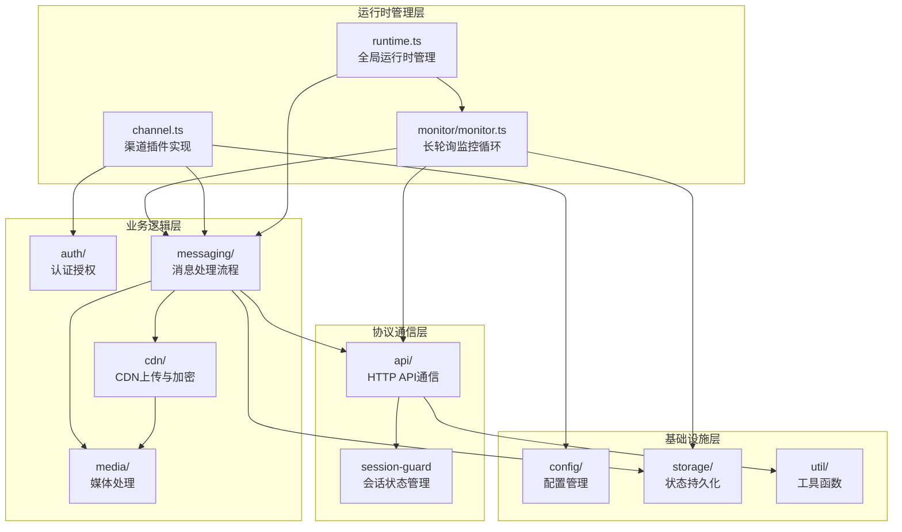
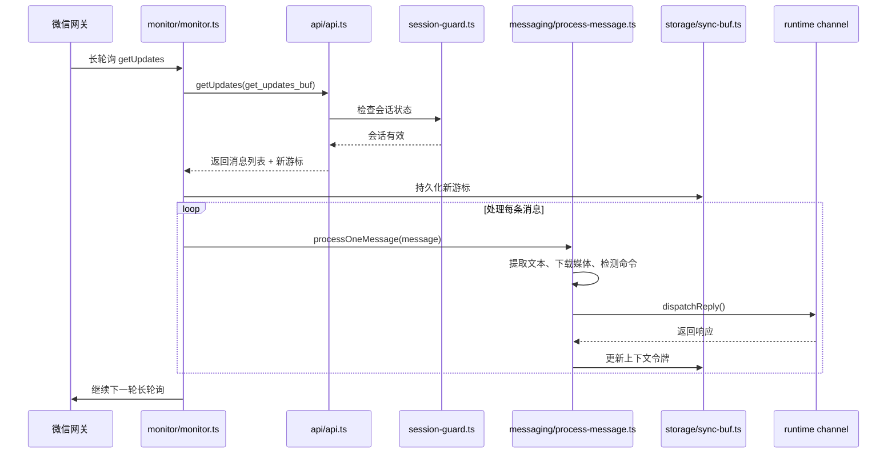
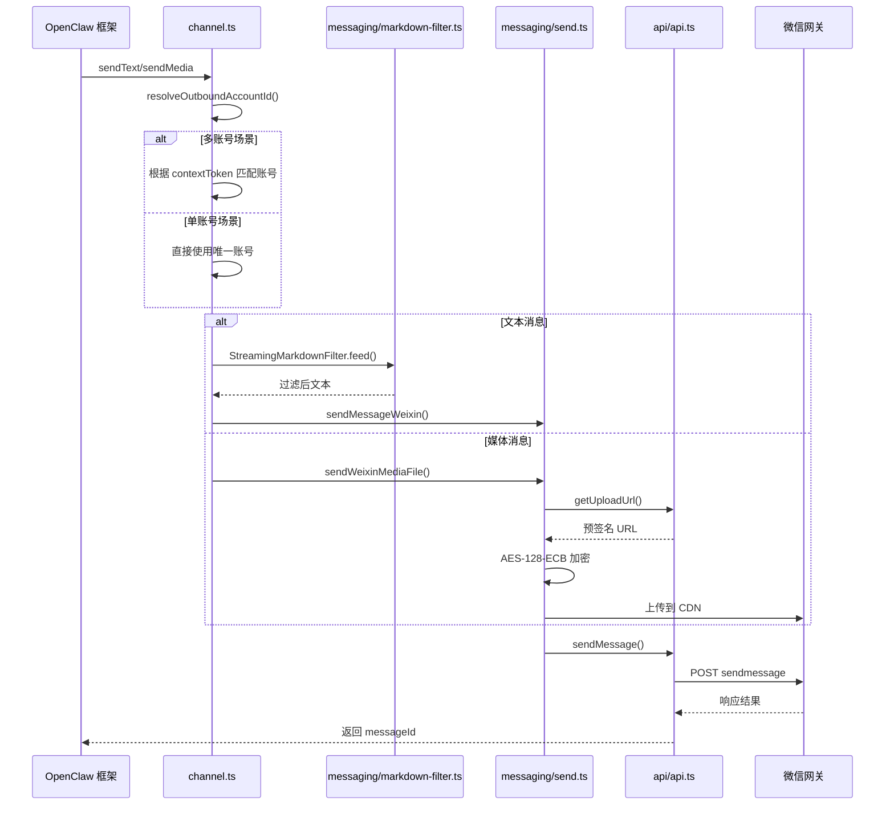

OpenClaw Weixin 插件是一个基于 OpenClaw 插件 SDK 构建的渠道插件，通过扫码授权方式接入微信生态。插件采用长轮询机制获取消息，支持文本、图片、视频、文件等多种消息类型，并提供了完善的媒体处理、多账号管理和会话隔离机制。

Sources: [index.ts](index.ts#L9-L24), [README.zh_CN.md](README.zh_CN.md#L5-L6)

## 插件注册机制

插件通过 `index.ts` 导出符合 OpenClaw 插件规范的入口对象，包含插件 ID、名称、描述、配置 Schema 和注册函数。在注册阶段，插件会进行版本兼容性检查（fail-fast 策略），确保在执行任何副作用之前拒绝不兼容的宿主版本，随后设置全局运行时实例并注册微信渠道。

```typescript
export default {
  id: "openclaw-weixin",
  name: "Weixin",
  description: "Weixin channel (getUpdates long-poll + sendMessage)",
  configSchema: buildChannelConfigSchema(WeixinConfigSchema),
  register(api: OpenClawPluginApi) {
    assertHostCompatibility(api.runtime?.version);
    if (api.runtime) {
      setWeixinRuntime(api.runtime);
    }
    api.registerChannel({ plugin: weixinPlugin });
  },
};
```

插件 ID 为 `openclaw-weixin`，版本号遵循语义化版本控制，当前为 2.1.7。最低支持的 OpenClaw 宿主版本为 `>=2026.3.22`，依赖 `zod` 进行配置 Schema 验证，开发依赖包含 `silk-wasm` 用于语音格式转码。

Sources: [index.ts](index.ts#L9-L24), [package.json](package.json#L2-L57), [src/compat.ts](src/compat.ts#L1)

## 整体架构设计

插件架构采用分层设计，自下而上分为基础设施层、协议通信层、业务逻辑层和运行时管理层。基础设施层提供配置管理、状态持久化和工具函数；协议通信层负责与微信网关的 HTTP API 交互；业务逻辑层处理认证授权、媒体上传下载和消息处理流程；运行时管理层监控长轮询循环并协调各模块协作。



核心架构体现了以下设计原则：**关注点分离**（各模块职责清晰）、**依赖注入**（运行时和配置通过参数传递）、**容错与恢复**（同步游标持久化、会话暂停机制）和**可观测性**（结构化日志、调试模式、链路追踪）。

Sources: [src/channel.ts](src/channel.ts#L135-L179), [src/monitor/monitor.ts](src/monitor/monitor.ts#L38-L67), [src/runtime.ts](src/runtime.ts#L12-L44)

## 目录结构详解

插件源代码组织在 `src/` 目录下，按照功能模块划分：

| 模块路径 | 核心文件 | 职责说明 |
|---------|---------|---------|
| `src/` | `channel.ts` | 渠道插件入口实现，包含消息发送、账号解析等核心逻辑 |
| `src/runtime.ts` | `runtime.ts` | 全局运行时实例管理，支持异步等待和回退机制 |
| `src/compat.ts` | `compat.ts` | OpenClaw 版本兼容性检查 |
| `src/api/` | `api.ts`, `types.ts`, `config-cache.ts`, `session-guard.ts` | HTTP API 通信、类型定义、配置缓存、会话状态管理 |
| `src/auth/` | `accounts.ts`, `login-qr.ts`, `pairing.ts` | 账号管理、二维码登录、配对授权与白名单 |
| `src/cdn/` | `cdn-upload.ts`, `aes-ecb.ts`, `pic-decrypt.ts`, `cdn-url.ts`, `upload.ts` | CDN 上传、AES-128-ECB 加密、图片解密、URL 构建 |
| `src/media/` | `media-download.ts`, `silk-transcode.ts`, `mime.ts` | 媒体下载、SILK 语音转码、MIME 类型识别 |
| `src/messaging/` | `process-message.ts`, `inbound.ts`, `send.ts`, `send-media.ts`, `markdown-filter.ts`, `slash-commands.ts`, `error-notice.ts`, `debug-mode.ts` | 消息处理完整流程：入站路由、发送、媒体处理、Markdown 过滤、斜杠命令、错误通知、调试模式 |
| `src/monitor/` | `monitor.ts` | 长轮询监控循环实现 |
| `src/storage/` | `state-dir.ts`, `sync-buf.ts` | 状态目录解析、同步游标持久化 |
| `src/config/` | `config-schema.ts` | 配置 Schema 定义（基于 Zod） |
| `src/util/` | `logger.ts`, `random.ts`, `redact.ts` | 结构化日志、随机数生成、敏感信息脱敏 |

Sources: [src/](src/), [src/channel.ts](src/channel.ts#L1), [src/messaging/process-message.ts](src/messaging/process-message.ts#L37-L48)

## 核心数据流

插件的核心数据流包括**入站消息流**和**出站消息流**两条主线。

### 入站消息流

入站消息从微信网关通过长轮询接口 `getUpdates` 进入插件，经过解析、处理、响应后，同步游标被持久化以确保消息不丢失。



关键节点说明：
- **同步游标**（`get_updates_buf`）作为断点续传的依据，每次长轮询请求携带上次的游标，响应返回新游标
- **会话状态管理**通过 `session-guard.ts` 检测会话过期（errcode -14），触发暂停机制
- **上下文令牌**（`context_token`）由入站消息携带，必须在出站消息中回传，用于定位会话上下文
- **媒体下载**在消息处理时异步执行，支持图片、视频、文件等类型
- **斜杠命令检测**基于文本内容（如 `/help`、`/config`），在分发响应前拦截处理

Sources: [src/monitor/monitor.ts](src/monitor/monitor.ts#L88-L100), [src/messaging/inbound.ts](src/messaging/inbound.ts#L14-L19), [src/api/session-guard.ts](src/api/session-guard.ts#L1)

### 出站消息流

出站消息由 OpenClaw 框架调用插件的 `sendText` 或 `sendMedia` 方法触发，经过 Markdown 过滤、账号解析、API 调用后发送至微信网关。



关键节点说明：
- **账号解析策略**：优先通过 `contextToken` 匹配（多账号场景），其次使用唯一账号，否则抛出错误
- **Markdown 过滤**：`StreamingMarkdownFilter` 流式处理文本，移除不支持的 Markdown 语法
- **媒体上传**：先调用 `getUploadUrl` 获取预签名参数，对文件进行 AES-128-ECB 加密后上传到 CDN
- **消息发送**：携带 `context_token`（如果可用）确保上下文正确性

Sources: [src/channel.ts](src/channel.ts#L106-L133), [src/channel.ts](src/channel.ts#L63-L104), [src/messaging/send.ts](src/messaging/send.ts#L1), [src/cdn/cdn-upload.ts](src/cdn/cdn-upload.ts#L1)

## 关键技术特性

### 长轮询机制

插件使用 35 秒默认超时的长轮询方式获取新消息，服务端在超时或有新消息时响应。长轮询通过 `getUpdates` 接口实现，携带同步游标确保消息不丢失。连续失败超过阈值（3 次）时触发退避策略（30 秒延迟），之后以 2 秒间隔重试。

Sources: [src/monitor/monitor.ts](src/monitor/monitor.ts#L14-L18), [src/api/api.ts](src/api/api.ts#L76-L79)

### 同步游标持久化

同步游标（`get_updates_buf`）存储在状态目录下，路径为 `<state_dir>/openclaw-weixin/accounts/<accountId>.sync-buf`。每次长轮询成功后立即持久化新游标，确保 gateway 重启后能从断点续传，避免消息重复或丢失。

Sources: [src/storage/sync-buf.ts](src/storage/sync-buf.ts#L1), [src/monitor/monitor.ts](src/monitor/monitor.ts#L69-L81)

### 上下文令牌机制

上下文令牌（`context_token`）由微信网关在每条入站消息中分配，必须在出站消息中原样回传。插件使用内存 Map + 磁盘文件双重存储，确保令牌在 gateway 重启后可恢复。令牌存储路径为 `<state_dir>/openclaw-weixin/accounts/<accountId>.context-tokens.json`。

Sources: [src/messaging/inbound.ts](src/messaging/inbound.ts#L14-L78), [src/monitor/monitor.ts](src/monitor/monitor.ts#L83)

### 多账号隔离

插件支持多个微信号同时登录，每个账号有独立的配置、token 和状态存储。多账号场景下，出站消息通过 `contextToken` 匹配目标账号，确保消息发送到正确的微信账号。配置层面支持 `per-account-channel-peer` 会话隔离模式。

Sources: [src/auth/accounts.ts](src/auth/accounts.ts#L1), [src/channel.ts](src/channel.ts#L63-L104), [README.zh_CN.md](README.zh_CN.md#L66-L72)

### 媒体加密处理

媒体文件上传前使用 AES-128-ECB 算法加密，密钥从预签名参数中提取。加密后的文件大小与明文不同，需在上传时分别提供明文和密文的 MD5 与文件大小。下载的媒体文件使用相同的算法解密。

Sources: [src/cdn/aes-ecb.ts](src/cdn/aes-ecb.ts#L1), [src/cdn/upload.ts](src/cdn/upload.ts#L1), [README.zh_CN.md](README.zh_CN.md#L174-L182)

## 配置 Schema 概述

插件配置基于 Zod 定义，支持以下字段：

| 字段 | 类型 | 默认值 | 说明 |
|------|------|--------|------|
| `name` | `string?` | - | 账号显示名称 |
| `enabled` | `boolean?` | - | 是否启用该账号 |
| `baseUrl` | `string` | 微信网关默认地址 | API 基础 URL |
| `cdnBaseUrl` | `string` | CDN 默认地址 | CDN 基础 URL |
| `routeTag` | `number?` | - | 路由标签（用于多实例部署） |
| `accounts` | `Record<string, WeixinAccount>?` | - | 多账号配置字典 |
| `channelConfigUpdatedAt` | `string?` | - | ISO 8601 时间戳，用于触发配置刷新 |

Token 等敏感信息存储在独立的凭据文件中，不在配置 Schema 中定义。

Sources: [src/config/config-schema.ts](src/config/config-schema.ts#L9-L22), [openclaw.plugin.json](openclaw.plugin.json#L7-L11)

## 日志与可观测性

插件使用结构化日志系统（`logger.ts`），支持账号级别的日志上下文（`logger.withAccount(accountId)`）。日志级别涵盖 `debug`、`info`、`warn`、`error`，敏感信息（如 token）在输出前自动脱敏。调试模式（`debug-mode.ts`）开启后，记录详细的消息处理时间戳和追踪信息，便于问题排查。

Sources: [src/util/logger.ts](src/util/logger.ts#L1), [src/util/redact.ts](src/util/redact.ts#L1), [src/messaging/debug-mode.ts](src/messaging/debug-mode.ts#L1)

## 推荐阅读路径

为了全面理解插件架构，建议按照以下顺序深入学习：

1. **核心模块**：[核心模块职责划分](6-he-xin-mo-kuai-zhi-ze-hua-fen) - 了解各模块的具体职责和边界
2. **认证授权**：[二维码登录机制](7-er-wei-ma-deng-lu-ji-zhi) - 理解扫码登录流程和账号存储
3. **API 通信**：[长轮询 getUpdates 实现](10-chang-lun-xun-getupdates-shi-xian) - 深入长轮询机制和错误处理
4. **消息处理**：[入站消息路由与处理](18-ru-zhan-xiao-xi-lu-you-yu-chu-li) - 掌握消息处理完整流程
5. **媒体处理**：[CDN 上传与 AES-128-ECB 加密](14-cdn-shang-chuan-yu-aes-128-ecb-jia-mi) - 学习媒体加密上传细节
6. **存储与持久化**：[同步游标持久化](24-tong-bu-you-biao-chi-jiu-hua) 和 [上下文令牌缓存与恢复](25-shang-xia-wen-ling-pai-huan-cun-yu-hui-fu) - 理解状态持久化机制
7. **运行时与监控**：[长轮询监控循环实现](26-chang-lun-xun-jian-kong-xun-huan-shi-xian) - 掌握监控循环的容错与恢复逻辑