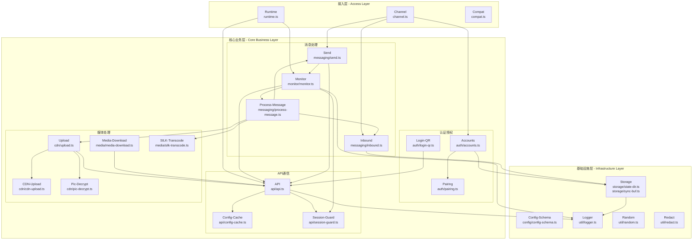
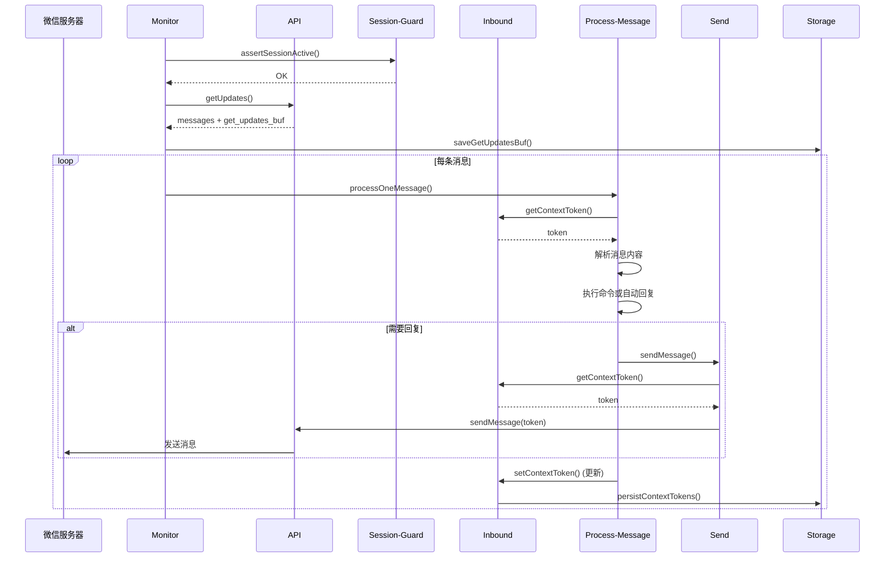

本页面系统性地阐述 openclaw-weixin-plugin 的核心模块架构及其职责边界，帮助开发者理解插件内部各组件的协作机制。该插件采用分层架构设计，各模块职责清晰、低耦合，通过明确的接口进行交互。在阅读本页之前，建议先了解[插件架构总览](5-cha-jian-jia-gou-zong-lan)以建立整体认知。

## 架构分层概览

插件采用三层架构设计：**接入层**、**核心业务层**和**基础设施层**。接入层负责与 OpenClaw 框架的集成，核心业务层实现微信通信的所有业务逻辑，基础设施层提供通用的工具和服务支持。这种分层设计确保了模块间的关注点分离，便于维护和扩展。

Sources: [index.ts](index.ts#L1-L25), [channel.ts](src/channel.ts#L1-L100)

## 接入层模块

接入层负责插件与 OpenClaw 主框架的集成，提供插件注册、运行时初始化和版本兼容性检查等基础能力。

### Runtime 模块

Runtime 模块是插件运行时的核心抽象，负责管理 OpenClaw 框架注入的 PluginRuntime 实例。该模块提供了全局运行时的设置、获取和异步等待机制，并支持从网关上下文中解析 channelRuntime，避免了插件注册阶段可能出现的竞态条件。runtime 模块是监控循环和其他需要访问 OpenClaw 基础设施组件的运行时依赖。

Sources: [runtime.ts](src/runtime.ts#L1-L71)

### Channel 模块

Channel 模块是插件的主入口，实现了 ChannelPlugin 接口。它集成了账号管理、消息发送、媒体上传等所有核心功能，对外提供统一的通道抽象。该模块负责处理账号路由逻辑，支持单账号和多账号场景下的智能账号选择，通过 contextToken 匹配来解析出站消息的目标账号。Channel 模块还负责处理登录流程的触发和等待，包括二维码登录状态的轮询和确认。

Sources: [channel.ts](src/channel.ts#L1-L100), [channel.ts](src/channel.ts#L100-L150)

### Compat 模块

Compat 模块提供版本兼容性检查，确保插件只能在支持的 OpenClaw 主机版本上运行。它采用 fail-fast 策略，在插件注册阶段就拒绝不兼容的主机版本，避免在运行时出现不可预测的行为。

Sources: [compat.ts](src/compat.ts), [index.ts](index.ts#L13-L14)

## 核心业务层 - 认证授权模块

认证授权模块负责微信账号的登录、存储、管理和配对授权，是整个插件的安全基础。

### Accounts 模块

Accounts 模块实现账号的全生命周期管理，包括账号注册、索引、加载、保存和删除。它维护一个持久化的账号索引文件（accounts.json），存储所有通过二维码登录注册的账号 ID。该模块支持账号 ID 的规范化处理（normalizeAccountId），并提供从配置文件中解析账号信息的能力。Accounts 模块还负责处理账号配置的加载和验证，确保每个账号都有有效的 baseUrl 和 routeTag 配置。

Sources: [accounts.ts](src/auth/accounts.ts#L1-L80), [accounts.ts](src/auth/accounts.ts#L80-L150)

### Login-QR 模块

Login-QR 模块实现二维码登录机制，提供启动登录、等待登录完成和检查登录状态的功能。它调用后端 API 获取登录二维码，并轮询查询登录状态，直到用户扫描确认或超时。该模块支持多种机器人类型（如 im-bot 和 im-wechat），并返回包含 token 和用户信息的登录结果。Login-QR 是账号创建流程的核心组件。

Sources: [login-qr.ts](src/auth/login-qr.ts), [channel.ts](src/channel.ts#L30-L50)

### Pairing 模块

Pairing 模块实现配对授权和白名单机制，负责解析和验证框架允许的来源路径。它支持白名单配置，确保只有被授权的来源可以与插件进行交互，增强系统的安全性。该模块读取配置中的 allowFrom 列表，并提供路径匹配功能。

Sources: [pairing.ts](src/auth/pairing.ts)

## 核心业务层 - API 通信模块

API 通信模块负责与微信服务器进行 HTTP 通信，处理长轮询、消息发送、配置获取等核心网络交互。

### API 模块

API 模块是网络通信的核心实现，提供了 getUpdates、sendMessage、getUploadUrl、getConfig、sendTyping 等 API 调用的封装。它构建标准的请求头（包括 iLink-App-Id 和 iLink-App-ClientVersion），处理请求签名和响应解析。该模块支持长轮询（默认 35 秒超时）和普通 API 请求（默认 15 秒超时）的不同超时策略，并实现了完善的错误处理和日志记录机制。

Sources: [api.ts](src/api/api.ts#L1-L80), [api.ts](src/api/api.ts#L80-L150)

### Config-Cache 模块

Config-Cache 模块提供配置缓存管理，为每个用户缓存 getConfig 返回的 typingTicket 等配置信息。它采用 24 小时随机刷新策略，避免同时刷新导致的服务器压力，并在失败时实现指数退避重试（最大延迟 1 小时）。这种设计既保证了配置的及时性，又避免了对后端 API 的频繁调用。Config-Cache 是会话保持的重要组成部分。

Sources: [config-cache.ts](src/api/config-cache.ts#L1-L80)

### Session-Guard 模块

Session-Guard 模块实现会话状态管理和过期处理。当检测到会话过期错误码（-14）时，它会暂停该账号的所有入站和出站 API 调用一小时，避免在会话无效时浪费网络资源。该模块维护每个账号的暂停状态，提供查询剩余暂停时间的能力，并在每次 API 调用前检查会话是否活跃。Session-Guard 是监控循环和消息发送流程的关键守卫者。

Sources: [session-guard.ts](src/api/session-guard.ts#L1-L59), [monitor.ts](src/monitor/monitor.ts#L12-L15)

## 核心业务层 - 消息处理模块

消息处理模块是插件的核心，负责消息的接收、处理、路由和发送。

### Monitor 模块

Monitor 模块实现长轮询监控循环，是插件的心跳机制。它持续调用 getUpdates API 获取新消息，处理响应并更新同步缓冲区（get_updates_buf）。监控循环支持断点续传，通过持久化的 sync buffer 确保服务重启后不会丢失消息。Monitor 模块集成了会话守护、配置缓存和消息处理分发，实现了完善的错误处理和指数退避重试策略（最大连续失败 3 次后等待 30 秒）。

Sources: [monitor.ts](src/monitor/monitor.ts#L1-L80), [monitor.ts](src/monitor/monitor.ts#L80-L150)

### Inbound 模块

Inbound 模块处理入站消息的上下文令牌管理。微信要求每个入站消息携带 contextToken，且出站消息必须回显该 token 以保持会话连续性。Inbound 模块维护内存中的 contextToken 映射表，并通过磁盘持久化（每个账号一个 context-tokens.json 文件）确保令牌在服务重启后可恢复。该模块提供令牌的设置、获取、恢复和清理功能，是消息上下文保持的核心组件。

Sources: [inbound.ts](src/messaging/inbound.ts#L1-L80), [inbound.ts](src/messaging/inbound.ts#L80-L150)

### Process-Message 模块

Process-Message 模块是消息处理的核心调度器，负责将原始微信消息转换为 OpenClaw 标准格式并触发配置中的回复逻辑。它解析消息类型（文本、图片、语音、文件等），提取消息内容，并调用配置的命令处理器或自动回复。该模块集成调试模式、Markdown 过滤、斜杠命令支持和错误通知等功能，提供了完整的消息处理流水线。

Sources: [process-message.ts](src/messaging/process-message.ts)

### Send 模块

Send 模块实现消息发送功能，支持文本消息和 Markdown 格式消息。它构建标准的 sendMessage 请求，包含 client_id、消息类型、消息状态和消息项列表。该模块提供 StreamingMarkdownFilter 用于实时过滤 Markdown 文本，避免发送不兼容的格式。Send 模块是所有出站消息的统一入口，被 monitor 的自动回复和 cron 定时任务调用。

Sources: [send.ts](src/messaging/send.ts#L1-L80), [send.ts](src/messaging/send.ts#L80-L150)

## 核心业务层 - 媒体处理模块

媒体处理模块负责图片、语音、文件等媒体内容的上传、下载、加密和解密。

### CDN-Upload 模块

CDN-Upload 模块实现 CDN 文件上传，使用 AES-128-ECB 加密算法加密文件内容后上传到微信 CDN。它支持两种上传方式：通过 upload_full_url 完整 URL 或通过 uploadParam 和 filekey 构建上传 URL。该模块实现重试机制（最多 3 次），服务器错误（5xx）自动重试，客户端错误（4xx）立即中止。上传成功后返回下载参数（x-encrypted-param），用于构建媒体消息。

Sources: [cdn-upload.ts](src/cdn/cdn-upload.ts#L1-L80)

### Upload 模块

Upload 模块提供高级上传接口，统一处理本地文件、远程 URL 和 Buffer 的上传流程。它自动识别媒体类型，调用 CDN-Upload 执行加密上传，并通过 API 获取预签名 URL。该模块支持下载远程图片到临时目录，并在上传完成后清理临时文件。Upload 是 send-media 组件的核心依赖。

Sources: [upload.ts](src/cdn/upload.ts)

### Pic-Decrypt 模块

Pic-Decrypt 模块实现图片解密功能，处理从微信 CDN 下载的加密图片。微信图片使用自定义加密算法，该模块负责将加密数据解密为可显示的图片格式。解密后的图片可以保存到本地或提供给上层应用处理。

Sources: [pic-decrypt.ts](src/cdn/pic-decrypt.ts)

### Media-Download 模块

Media-Download 模块提供媒体文件下载功能，支持从微信 CDN 下载图片、语音、文件等媒体内容。它处理 URL 构建、请求发送和响应保存，并支持断点续传和进度显示。下载的加密媒体会调用对应的解密模块处理。

Sources: [media-download.ts](src/media/media-download.ts)

### SILK-Transcode 模块

SILK-Transcode 模块实现 SILK 语音格式转码，将微信的 SILK 格式语音转换为标准 WAV 格式。它使用 silk-wasm 库进行解码，生成 24kHz 采样率的 PCM 数据并封装为 WAV 容器。如果转码失败（如 silk-wasm 不可用），模块会优雅地降级返回原始 SILK 文件。该模块使得微信语音可以在更多平台上播放和处理。

Sources: [silk-transcode.ts](src/media/silk-transcode.ts#L1-L75)

## 基础设施层模块

基础设施层提供通用的工具和服务，支撑整个插件的运行。

### Storage 模块

Storage 模块负责状态目录解析和同步缓冲区持久化。State-Dir 模块解析 OpenClaw 状态目录路径（默认 ~/.openclaw，支持环境变量覆盖），Sync-Buf 模块管理 get_updates_buf 的持久化存储，提供加载、保存和兼容性处理（支持从旧版路径迁移）。这些持久化机制确保插件重启后能恢复之前的同步状态，避免消息丢失或重复处理。

Sources: [state-dir.ts](src/storage/state-dir.ts#L1-L12), [sync-buf.ts](src/storage/sync-buf.ts#L1-L80)

### Config-Schema 模块

Config-Schema 模块使用 Zod 定义插件的配置结构，包括账号配置、baseUrl、cdnBaseUrl、routeTag 等字段。该 Schema 用于配置验证和 IDE 自动补全，确保用户提供的配置符合插件要求。它定义了单账号和多账号两种配置模式，支持每个账号覆盖默认配置。

Sources: [config-schema.ts](src/config/config-schema.ts#L1-L23)

### Logger 模块

Logger 模块提供结构化日志系统，所有模块共享同一个日志文件（openclaw-YYYY-MM-DD.log）。它支持 TRACE、DEBUG、INFO、WARN、ERROR、FATAL 六个日志级别，默认 INFO 级别（可通过环境变量 OPENCLAW_LOG_LEVEL 调整）。Logger 提供带账号前缀的子日志器（withAccount），便于按账号追踪日志。日志采用 JSON Lines 格式，包含时间戳、级别、子系统、主机名等结构化字段。

Sources: [logger.ts](src/util/logger.ts#L1-L80), [logger.ts](src/util/logger.ts#L80-L146)

### Random 和 Redact 模块

Random 模块提供随机 ID 生成功能，用于生成 client_id 和其他需要唯一标识的场景。Redact 模块提供敏感数据脱敏功能，自动隐藏日志中的 token、密钥等敏感信息，确保日志安全。这两个模块是基础设施层的重要安全组件。

Sources: [random.ts](src/util/random.ts), [redact.ts](src/util/redact.ts)

## 模块交互流程

下面以一条消息的完整处理流程为例，展示各模块之间的协作关系：

Sources: [monitor.ts](src/monitor/monitor.ts#L50-L100), [process-message.ts](src/messaging/process-message.ts)

## 核心模块职责总结

下表总结了所有核心模块的主要职责和关键依赖：

| 模块名称 | 主要职责 | 核心依赖 | 输出结果 |
|---------|---------|---------|---------|
| **runtime.ts** | 管理插件运行时和 channelRuntime 解析 | OpenClaw PluginRuntime | 可用的 channelRuntime 实例 |
| **channel.ts** | 插件主入口，集成所有功能模块 | auth, messaging, cdn | ChannelPlugin 实现 |
| **auth/accounts.ts** | 账号注册、索引、加载和保存 | storage/state-dir | 账号列表和配置 |
| **auth/login-qr.ts** | 二维码登录流程管理 | api | 登录结果和 token |
| **api/api.ts** | HTTP 通信和 API 调用封装 | logger | API 响应数据 |
| **api/config-cache.ts** | 配置缓存和自动刷新 | api | 缓存的配置信息 |
| **api/session-guard.ts** | 会话状态管理和过期处理 | logger | 会话活跃状态 |
| **monitor/monitor.ts** | 长轮询监控循环 | api, session-guard, storage | 持续的消息获取和处理 |
| **messaging/inbound.ts** | contextToken 管理和持久化 | storage | 消息上下文令牌 |
| **messaging/send.ts** | 消息发送构建 | api | sendMessage 请求 |
| **messaging/process-message.ts** | 消息解析和回复调度 | inbound, send, logger | 配置回复的触发 |
| **cdn/cdn-upload.ts** | CDN 文件加密上传 | aes-ecb, logger | 下载参数 |
| **cdn/upload.ts** | 高级上传接口 | cdn-upload, pic-decrypt, api | 媒体上传结果 |
| **media/silk-transcode.ts** | SILK 语音转 WAV | silk-wasm | WAV 格式音频 |
| **storage/state-dir.ts** | 状态目录路径解析 | - | 状态目录路径 |
| **storage/sync-buf.ts** | 同步缓冲区持久化 | state-dir | get_updates_buf 文件 |
| **config/config-schema.ts** | 配置 Schema 定义 | zod | Zod Schema 对象 |
| **util/logger.ts** | 结构化日志系统 | fs, path | 日志写入能力 |

Sources: [index.ts](index.ts), [channel.ts](src/channel.ts), [runtime.ts](src/runtime.ts)

## 设计原则

插件的核心模块设计遵循以下原则，确保系统的可维护性和可扩展性：

**单一职责原则**：每个模块只负责一个明确的业务领域，如 auth 模块专注认证，api 模块专注网络通信。这种设计使得模块职责清晰，便于理解和修改。

**依赖倒置原则**：高层模块依赖抽象接口而非具体实现，如 Monitor 模块依赖 API 接口而非直接调用 fetch。这使得底层实现可以独立演化而不影响高层逻辑。

**持久化与内存分离**：需要持久化的数据（如账号索引、同步缓冲区、contextToken）采用内存 + 磁盘双层存储，内存提供快速访问，磁盘保证数据安全。

**容错与降级**：关键路径都实现了完善的错误处理和降级策略，如 CDN 上传的重试机制、SILK 转码的降级处理、配置缓存的指数退避，确保系统在异常情况下仍能保持基本功能。

**安全防护**：敏感信息（token、密钥）通过 redact 模块自动脱敏，会话过期通过 session-guard 模块及时暂停，配对授权通过白名单机制严格控制，构建了多层次的安全防护体系。

Sources: [session-guard.ts](src/api/session-guard.ts#L1-L59), [redact.ts](src/util/redact.ts)

## 下一步学习路径

理解核心模块职责后，建议按照以下顺序深入学习具体实现细节：

1. **认证流程**：阅读[二维码登录机制](7-er-wei-ma-deng-lu-ji-zhi)了解账号创建和 token 获取流程
2. **API 通信**：学习[长轮询 getUpdates 实现](10-chang-lun-xun-getupdates-shi-xian)和[消息发送 sendMessage API](11-xiao-xi-fa-song-sendmessage-api)掌握网络通信细节
3. **媒体处理**：研究[CDN 上传与 AES-128-ECB 加密](14-cdn-shang-chuan-yu-aes-128-ecb-jia-mi)和[SILK 语音格式转码](16-silk-yu-yin-ge-shi-zhuan-ma)理解媒体文件处理流程
4. **消息处理**：深入[入站消息路由与处理](18-ru-zhan-xiao-xi-lu-you-yu-chu-li)和[Markdown 文本过滤](19-markdown-wen-ben-guo-lv)掌握消息处理流水线
5. **存储机制**：了解[状态目录解析](23-zhuang-tai-mu-lu-jie-xi)和[同步游标持久化](24-tong-bu-you-biao-chi-jiu-hua)理解数据持久化方案

通过系统性地学习这些模块，你将全面掌握 openclaw-weixin-plugin 的内部工作原理，为后续的功能扩展和问题排查奠定坚实基础。