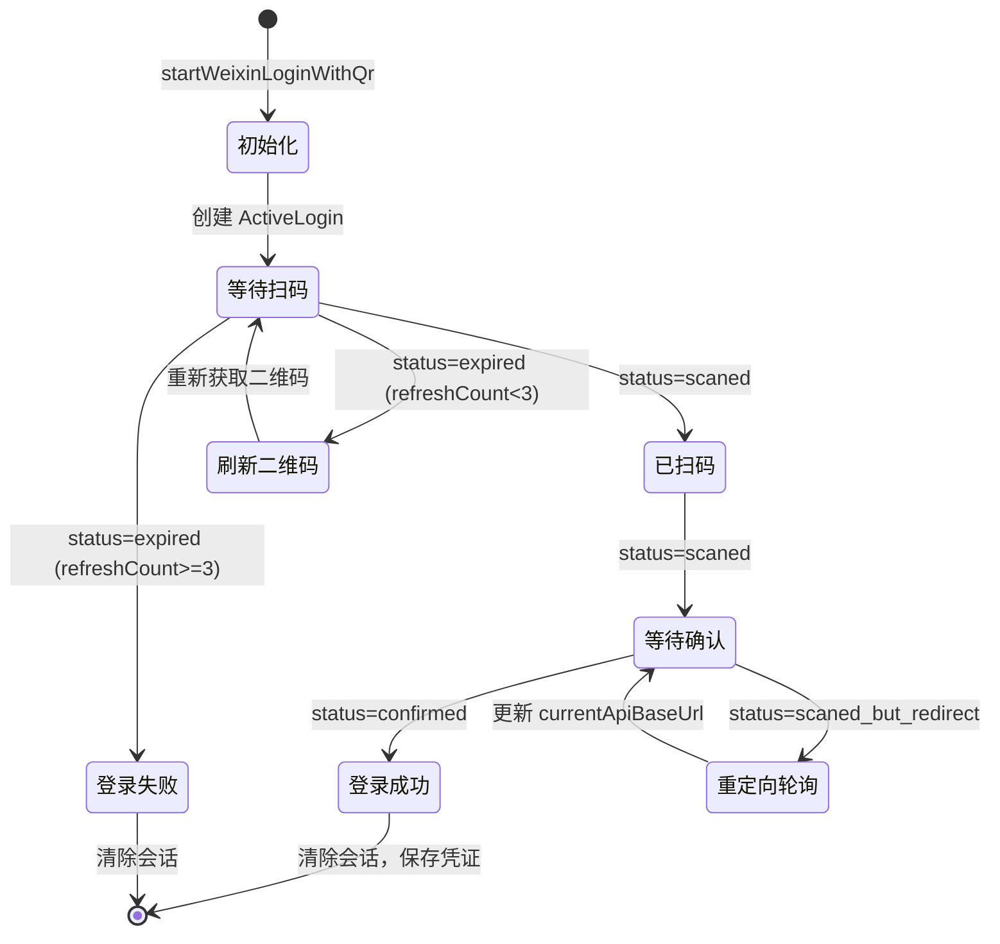

二维码登录是 OpenClaw Weixin 插件实现微信机器人认证的核心机制，通过扫码授权的方式安全地获取 bot token 和相关凭证，为后续的消息收发提供身份验证基础。该机制采用**服务端生成二维码 + 客户端轮询状态**的异步设计模式，确保登录流程的可靠性和用户体验的流畅性。

Sources: [src/auth/login-qr.ts](src/auth/login-qr.ts#L1-L50)

## 架构概览

二维码登录机制由多个协同工作的模块构成，核心职责包括二维码生成、状态轮询、会话管理和凭证持久化。整个架构遵循**关注点分离**原则，将网络通信、状态管理和存储逻辑解耦到不同的模块中。

```mermaid
graph TB
    subgraph "插件入口层"
        A[channel.ts] --> B[startWeixinLoginWithQr]
        A --> C[waitForWeixinLogin]
        A --> D[loginWithQrStart]
        A --> E[loginWithQrWait]
    end
    
    subgraph "认证核心层"
        B --> F[fetchQRCode]
        C --> G[pollQRStatus]
        H[activeLogins Map] --> B
        H --> C
    end
    
    subgraph "存储管理层"
        C --> I[saveWeixinAccount]
        C --> J[registerWeixinAccountId]
        C --> K[registerUserInFrameworkStore]
        J --> L[accounts.json]
        I --> M[accounts/{id}.json]
        K --> N[allowFrom.json]
    end
    
    subgraph "API通信层"
        F --> O[ilink.weixin.qq.com]
        G --> O
    end
    
    style A fill:#e1f5ff
    style O fill:#ffe1e1
    style L fill:#e1ffe1
    style M fill:#e1ffe1
    style N fill:#e1ffe1
```

**核心模块职责**：

| 模块 | 职责 | 关键文件 |
|------|------|----------|
| 二维码管理 | 生成二维码、管理会话状态 | `login-qr.ts` |
| 状态轮询 | 长轮询监听扫码确认事件 | `login-qr.ts` |
| 账号存储 | 持久化 token、baseUrl、userId | `accounts.ts` |
| 授权管理 | 维护用户白名单（allowFrom） | `pairing.ts` |
| 集成接口 | 暴露给网关的登录入口 | `channel.ts` |

Sources: [src/auth/login-qr.ts](src/auth/login-qr.ts#L1-L50), [src/auth/accounts.ts](src/auth/accounts.ts#L1-L50), [src/auth/pairing.ts](src/auth/pairing.ts#L1-L50)

## 登录流程详解

二维码登录采用**三阶段异步流程**：启动登录生成二维码、轮询等待用户操作、保存凭证完成认证。整个流程通过 sessionKey 关联各个阶段，确保同一登录会话的上下文一致性。

```mermaid
sequenceDiagram
    participant CLI as 命令行工具
    participant Channel as channel.ts
    participant LoginQR as login-qr.ts
    participant Server as 微信服务器
    participant Storage as 存储层
    
    CLI->>Channel: auth.login(accountId)
    Channel->>LoginQR: startWeixinLoginWithQr()
    LoginQR->>Server: GET /ilink/bot/get_bot_qrcode
    Server-->>LoginQR: qrcode + qrcode_img_content
    LoginQR-->>Channel: 二维码 URL + sessionKey
    Channel-->>CLI: 展示二维码
    
    loop 轮询状态 (每1秒)
        Channel->>LoginQR: waitForWeixinLogin(sessionKey)
        LoginQR->>Server: GET /ilink/bot/get_qrcode_status
        Server-->>LoginQR: status (wait/scaned/confirmed)
        LoginQR-->>Channel: 当前状态
        
        alt status = scaned
            Channel-->>CLI: 提示"已扫码，继续操作"
        else status = expired
            LoginQR->>Server: 重新获取二维码
            Channel-->>CLI: 提示"二维码已过期，刷新"
        else status = confirmed
            Server-->>LoginQR: bot_token + ilink_bot_id + userId
            LoginQR-->>Channel: connected=true + 凭证
            break 轮询结束
        end
    end
    
    Channel->>Storage: saveWeixinAccount(token, baseUrl, userId)
    Channel->>Storage: registerWeixinAccountId(id)
    Channel->>Storage: registerUserInFrameworkStore(userId)
    Channel-->>CLI: ✅ 连接成功
```

### 阶段一：二维码生成

`startWeixinLoginWithQr` 函数负责启动登录流程。首先清理过期的登录会话，然后检查是否已有有效的二维码（非强制模式下可复用）。若需要新生成，则向固定 API 地址发起 GET 请求获取二维码数据。

Sources: [src/auth/login-qr.ts](src/auth/login-qr.ts#L97-L157)

**关键参数**：
- `sessionKey`: 登录会话标识，默认使用随机 UUID，支持 accountId 作为参数复用会话
- `botType`: 默认值为 "3"，标识 iLink 机器人类型
- `apiBaseUrl`: 固定为 `https://ilinkai.weixin.qq.com`（二维码生成专用域名）
- `force`: 强制刷新二维码标志，忽略已有会话

**API 请求**：
```
GET https://ilinkai.weixin.qq.com/ilink/bot/get_bot_qrcode?bot_type=3
```

**响应数据结构**：
```typescript
{
  qrcode: string;              // 二维码标识符
  qrcode_img_content: string;  // 二维码图片内容（data URL）
}
```

获取到二维码后，系统在内存中创建 `ActiveLogin` 对象并存储在 `activeLogins` Map 中，记录会话开始时间用于后续的过期检查。

Sources: [src/auth/login-qr.ts](src/auth/login-qr.ts#L40-L56), [src/auth/login-qr.ts](src/auth/login-qr.ts#L123-L143)

### 阶段二：状态轮询

`waitForWeixinLogin` 函数实现长轮询机制，持续查询二维码的扫码状态。轮询采用**客户端超时 + 状态驱动**的双层超时策略，确保在网络波动或用户未操作时能及时退出。

Sources: [src/auth/login-qr.ts](src/auth/login-qr.ts#L159-L327)

**轮询配置**：
- 轮询间隔：1 秒（每次请求后等待 1 秒）
- 客户端超时：35 秒（单个请求）
- 总体超时：480 秒（默认，可配置）
- 二维码刷新上限：3 次（过期后可自动刷新）

**API 请求**：
```
GET https://ilinkai.weixin.qq.com/ilink/bot/get_qrcode_status?qrcode=<qrcode_id>
```

**状态枚举与处理逻辑**：

| 状态值 | 含义 | 处理策略 |
|--------|------|----------|
| `wait` | 等待扫码 | 继续轮询，静默输出进度点 |
| `scaned` | 已扫码，等待确认 | 提示用户在微信继续操作 |
| `confirmed` | 已确认登录 | 提取凭证，保存账号，返回成功 |
| `expired` | 二维码已过期 | 刷新二维码（最多 3 次）或放弃 |
| `scaned_but_redirect` | 扫码后需重定向 | 更新轮询地址到新主机 |

**网络异常处理**：
轮询过程中遇到超时（客户端 AbortError）或网关错误（如 Cloudflare 524）时，系统不会立即失败，而是返回 `wait` 状态继续重试。这种**容错设计**确保了网络抖动不会导致登录流程中断。

Sources: [src/auth/login-qr.ts](src/auth/login-qr.ts#L71-L95)

### 阶段三：凭证保存

当状态为 `confirmed` 时，系统提取以下关键信息并持久化存储：

1. **bot_token**: 用于后续 API 请求的身份凭证
2. **ilink_bot_id**: 账号唯一标识（如 "hex@im.bot"）
3. **ilink_user_id**: 扫码用户的微信 ID
4. **baseurl**: 推荐的 API 基础地址（可能因 IDC 重定向而变化）

Sources: [src/auth/login-qr.ts](src/auth/login-qr.ts#L237-L248)

**存储操作**：
```typescript
// 规范化账号 ID（移除特殊字符，转换为文件系统安全格式）
const normalizedId = normalizeAccountId(waitResult.accountId);

// 保存账号凭证
saveWeixinAccount(normalizedId, {
  token: waitResult.botToken,
  baseUrl: waitResult.baseUrl,
  userId: waitResult.userId,
});

// 注册到账号索引
registerWeixinAccountId(normalizedId);

// 清理同 userId 的旧账号（防止重复绑定）
if (waitResult.userId) {
  clearStaleAccountsForUserId(normalizedId, waitResult.userId, clearContextTokensForAccount);
}
```

Sources: [src/channel.ts](src/channel.ts#L331-L349)

## 会话管理机制

系统使用内存中的 `activeLogins` Map 管理进行中的登录会话，确保并发登录请求之间的隔离性。会话对象包含完整的登录上下文信息，支持重定向地址更新和状态追踪。

Sources: [src/auth/login-qr.ts](src/auth/login-qr.ts#L14-L25)

### 会话对象结构

```typescript
type ActiveLogin = {
  sessionKey: string;          // 会话唯一标识
  id: string;                  // 内部 UUID
  qrcode: string;              // 二维码标识符
  qrcodeUrl: string;           // 二维码图片 URL
  startedAt: number;           // 开始时间戳
  botToken?: string;           // 确认后填充的 token
  status?: LoginStatus;        // 当前状态
  error?: string;              // 错误信息
  currentApiBaseUrl?: string;  // 当前轮询地址（可能被重定向更新）
};
```

Sources: [src/auth/login-qr.ts](src/auth/login-qr.ts#L14-L25)

### 会话生命周期



**TTL 管理**：
- 登录会话有效期为 5 分钟（`ACTIVE_LOGIN_TTL_MS = 5 * 60_000`）
- 每次启动新登录时调用 `purgeExpiredLogins` 清理过期会话，防止内存泄漏
- 轮询前检查会话新鲜度，过期则提示用户重新生成二维码

Sources: [src/auth/login-qr.ts](src/auth/login-qr.ts#L30-L38), [src/auth/login-qr.ts](src/auth/login-qr.ts#L107-L109)

### 重定向处理

当服务器返回 `scaned_but_redirect` 状态时，表明需要将轮询地址切换到新的 IDC 主机（如地域负载均衡）。系统提取 `redirect_host` 字段，更新 `currentApiBaseUrl`，后续轮询使用新地址继续查询状态。

Sources: [src/auth/login-qr.ts](src/auth/login-qr.ts#L214-L224)

## 存储机制详解

登录成功后的凭证存储采用**分层持久化**策略，将账号数据、索引信息和授权列表分别存储在不同文件中，便于独立管理和查询。

Sources: [src/auth/accounts.ts](src/auth/accounts.ts#L1-L200)

### 存储目录结构

```
$OPENCLAW_STATE_DIR/
├── openclaw.json                      # 主配置文件
└── openclaw-weixin/
    ├── accounts.json                  # 账号索引（已注册的 accountId 列表）
    └── accounts/
        └── {accountId}.json           # 单账号凭证文件
            ├── token: string
            ├── baseUrl: string
            ├── userId: string
            └── savedAt: string

$OPENCLAW_STATE_DIR/credentials/
└── openclaw-weixin-{accountId}-allowFrom.json   # 用户授权白名单
    ├── version: number
    └── allowFrom: string[]
```

Sources: [src/auth/accounts.ts](src/auth/accounts.ts#L52-L80), [src/auth/pairing.ts](src/auth/pairing.ts#L29-L36)

### 账号凭证文件

单账号数据文件采用 JSON 格式存储，包含完整登录信息：

```typescript
type WeixinAccountData = {
  token?: string;      // bot token（必填，用于 API 认证）
  savedAt?: string;    // 保存时间戳（ISO 8601）
  baseUrl?: string;    // API 基础地址（可选，默认 DEFAULT_BASE_URL）
  userId?: string;     // 微信用户 ID（可选，用于配对授权）
};
```

**文件权限**：凭证文件使用 `chmod 0o600` 设置为仅用户可读写，防止敏感信息泄露。

Sources: [src/auth/accounts.ts](src/auth/accounts.ts#L120-L155)

### 账号索引管理

`accounts.json` 存储所有已登录账号的 ID 列表，用于快速枚举和去重：

```typescript
// 注册新账号（去重）
export function registerWeixinAccountId(accountId: string): void {
  const existing = listIndexedWeixinAccountIds();
  if (!existing.includes(accountId)) {
    const updated = [...existing, accountId];
    fs.writeFileSync(resolveAccountIndexPath(), JSON.stringify(updated, null, 2), "utf-8");
  }
}

// 列出所有账号
export function listIndexedWeixinAccountIds(): string[] {
  const raw = fs.readFileSync(resolveAccountIndexPath(), "utf-8");
  return JSON.parse(raw);
}
```

Sources: [src/auth/accounts.ts](src/auth/accounts.ts#L70-L91)

### 旧账号清理机制

为防止同一用户重复绑定多个账号导致上下文混淆，登录成功后会执行清理操作：

```typescript
export function clearStaleAccountsForUserId(
  currentAccountId: string,
  userId: string,
  onClearContextTokens?: (accountId: string) => void,
): void {
  const allIds = listIndexedWeixinAccountIds();
  for (const id of allIds) {
    if (id === currentAccountId) continue;
    const data = loadWeixinAccount(id);
    if (data?.userId?.trim() === userId) {
      logger.info(`removing stale account=${id} (same userId=${userId})`);
      onClearContextTokens?.(id);  // 清理上下文令牌
      clearWeixinAccount(id);       // 删除账号文件
      unregisterWeixinAccountId(id); // 从索引移除
    }
  }
}
```

Sources: [src/auth/accounts.ts](src/auth/accounts.ts#L94-L115)

## 授权白名单机制

为支持多用户隔离和访问控制，系统使用框架级别的 allowFrom 机制记录授权用户的微信 ID。登录成功后，扫码用户的 `ilink_user_id` 会自动注册到白名单中，允许该用户向机器人发送消息。

Sources: [src/auth/pairing.ts](src/auth/pairing.ts#L1-L121)

### 白名单文件路径

路径遵循框架规范，确保与核心授权管道兼容：

```
<credentialsDir>/openclaw-weixin-{accountId}-allowFrom.json
```

其中 `credentialsDir` 解析顺序为：
1. 环境变量 `OPENCLAW_OAUTH_DIR`
2. `$OPENCLAW_STATE_DIR/credentials`
3. `~/.openclaw/credentials`

Sources: [src/auth/pairing.ts](src/auth/pairing.ts#L7-L21)

### 白名单读写操作

```typescript
// 读取白名单（容错处理）
export function readFrameworkAllowFromList(accountId: string): string[] {
  const filePath = resolveFrameworkAllowFromPath(accountId);
  if (!fs.existsSync(filePath)) return [];
  const parsed = JSON.parse(fs.readFileSync(filePath, "utf-8"));
  return parsed.allowFrom || [];
}

// 注册用户（使用文件锁避免竞态）
export async function registerUserInFrameworkStore(params: {
  accountId: string;
  userId: string;
}): Promise<{ changed: boolean }> {
  const filePath = resolveFrameworkAllowFromPath(params.accountId);
  return await withFileLock(filePath, LOCK_OPTIONS, async () => {
    const content = readFrameworkAllowFromList(params.accountId);
    if (!content.includes(params.userId)) {
      content.push(params.userId);
      fs.writeFileSync(filePath, JSON.stringify({ version: 1, allowFrom: content }, null, 2));
      return { changed: true };
    }
    return { changed: false };
  });
}
```

Sources: [src/auth/pairing.ts](src/auth/pairing.ts#L43-L121)

## 接口规范与扩展

插件通过 `ChannelPlugin.auth` 和 `ChannelPlugin.gateway` 接口暴露登录功能，支持命令行交互和 API 调用两种模式。

Sources: [src/channel.ts](src/channel.ts#L273-L460)

### 命令行登录接口

```typescript
auth: {
  login: async ({ cfg, accountId, verbose, runtime }) => {
    // 1. 解析账号配置
    const account = resolveWeixinAccount(cfg, accountId);
    
    // 2. 生成二维码
    const startResult = await startWeixinLoginWithQr({
      accountId: account.accountId,
      apiBaseUrl: account.baseUrl,
      botType: DEFAULT_ILINK_BOT_TYPE,
      verbose,
    });
    
    // 3. 展示二维码
    qrcodeterminal.default.generate(startResult.qrcodeUrl, { small: true });
    
    // 4. 轮询等待
    const waitResult = await waitForWeixinLogin({
      sessionKey: startResult.sessionKey,
      apiBaseUrl: account.baseUrl,
      timeoutMs: 480_000,
      verbose,
    });
    
    // 5. 保存凭证
    if (waitResult.connected) {
      saveWeixinAccount(normalizedId, {
        token: waitResult.botToken,
        baseUrl: waitResult.baseUrl,
        userId: waitResult.userId,
      });
      registerWeixinAccountId(normalizedId);
    }
  }
}
```

Sources: [src/channel.ts](src/channel.ts#L273-L356)

### 分步登录接口

为支持 Web UI 等非交互式场景，系统提供分步登录接口：

```typescript
gateway: {
  // 第一步：生成二维码，返回 sessionKey
  loginWithQrStart: async ({ accountId, force, timeoutMs, verbose }) => {
    const result = await startWeixinLoginWithQr({
      accountId: accountId ?? undefined,
      apiBaseUrl: loadWeixinAccount(accountId)?.baseUrl || DEFAULT_BASE_URL,
      botType: DEFAULT_ILINK_BOT_TYPE,
      force,
      timeoutMs,
      verbose,
    });
    return {
      qrDataUrl: result.qrcodeUrl,
      message: result.message,
      sessionKey: result.sessionKey,  // 客户端需保存此值
    };
  },
  
  // 第二步：使用 sessionKey 等待结果
  loginWithQrWait: async (params) => {
    const sessionKey = (params as { sessionKey?: string }).sessionKey;
    const result = await waitForWeixinLogin({
      sessionKey,
      apiBaseUrl: loadWeixinAccount(params.accountId)?.baseUrl || DEFAULT_BASE_URL,
      timeoutMs: params.timeoutMs,
    });
    return {
      connected: result.connected,
      message: result.message,
      accountId: result.accountId,
    };
  }
}
```

Sources: [src/channel.ts](src/channel.ts#L403-L460)

## 错误处理与容错机制

二维码登录机制设计了多层容错策略，确保在网络不稳定、服务异常或用户操作超时的情况下能够优雅降级或提供明确反馈。

Sources: [src/auth/login-qr.ts](src/auth/login-qr.ts#L159-L327)

### 网络异常处理

轮询过程中对不同的网络错误进行分级处理：

| 错误类型 | 处理策略 | 返回状态 |
|----------|----------|----------|
| 客户端超时（AbortError） | 视为等待状态，继续轮询 | `wait` |
| 网关超时（Cloudflare 524） | 记录警告，重试 | `wait` |
| 连接失败（ECONNREFUSED） | 终止登录，返回错误信息 | 抛出异常 |
| 解析错误（JSON parse fail） | 终止登录，返回错误信息 | 抛出异常 |

Sources: [src/auth/login-qr.ts](src/auth/login-qr.ts#L71-L95)

### 二维码过期重试

当二维码过期时，系统支持自动刷新（最多 3 次）：

```typescript
case "expired": {
  qrRefreshCount++;
  if (qrRefreshCount > MAX_QR_REFRESH_COUNT) {
    activeLogins.delete(opts.sessionKey);
    return {
      connected: false,
      message: "登录超时：二维码多次过期，请重新开始登录流程。",
    };
  }
  
  // 重新获取二维码
  const qrResponse = await fetchQRCode(FIXED_BASE_URL, botType);
  activeLogin.qrcode = qrResponse.qrcode;
  activeLogin.qrcodeUrl = qrResponse.qrcode_img_content;
  activeLogin.startedAt = Date.now();
  break;
}
```

Sources: [src/auth/login-qr.ts](src/auth/login-qr.ts#L178-L211)

### 凭证保存失败处理

如果凭证保存失败（如磁盘权限问题），系统会记录错误但不影响登录状态，避免因存储问题导致登录流程卡住：

```typescript
try {
  saveWeixinAccount(normalizedId, {
    token: waitResult.botToken,
    baseUrl: waitResult.baseUrl,
    userId: waitResult.userId,
  });
  registerWeixinAccountId(normalizedId);
  if (waitResult.userId) {
    clearStaleAccountsForUserId(normalizedId, waitResult.userId, clearContextTokensForAccount);
  }
  triggerWeixinChannelReload();
  log(`✅ 与微信连接成功！`);
} catch (err) {
  logger.error(`auth.login: failed to save account data err=${String(err)}`);
  log(`⚠️  保存账号数据失败: ${String(err)}`);
  // 不抛出异常，允许用户手动处理
}
```

Sources: [src/channel.ts](src/channel.ts#L331-L356)

## 后续学习路径

理解二维码登录机制后，建议按以下顺序深入学习相关模块：

- **[账号存储与管理](8-zhang-hao-cun-chu-yu-guan-li)**：深入了解账号凭证的持久化策略和文件结构
- **[配对授权与白名单机制](9-pei-dui-shou-quan-yu-bai-ming-dan-ji-zhi)**：学习多用户隔离和访问控制的完整实现
- **[长轮询 getUpdates 实现](10-chang-lun-xun-getupdates-shi-xian)**：了解登录后如何使用 token 进行消息轮询
- **[会话状态管理与过期处理](13-hui-hua-zhuang-tai-guan-li-yu-guo-qi-chu-li)**：掌握消息上下文和同步游标的管理机制