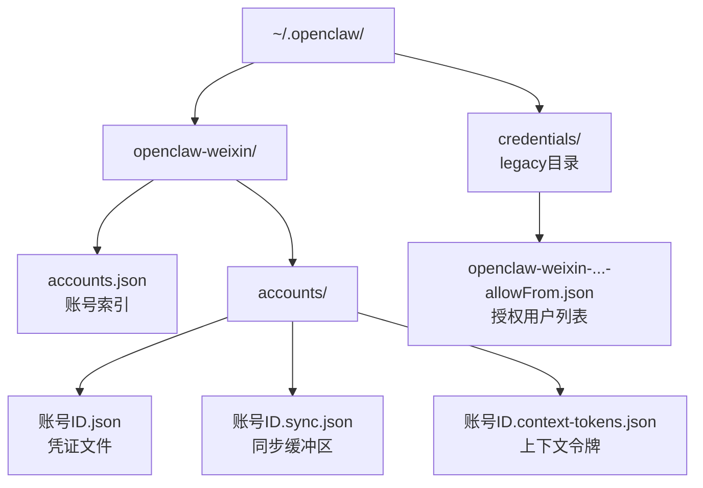
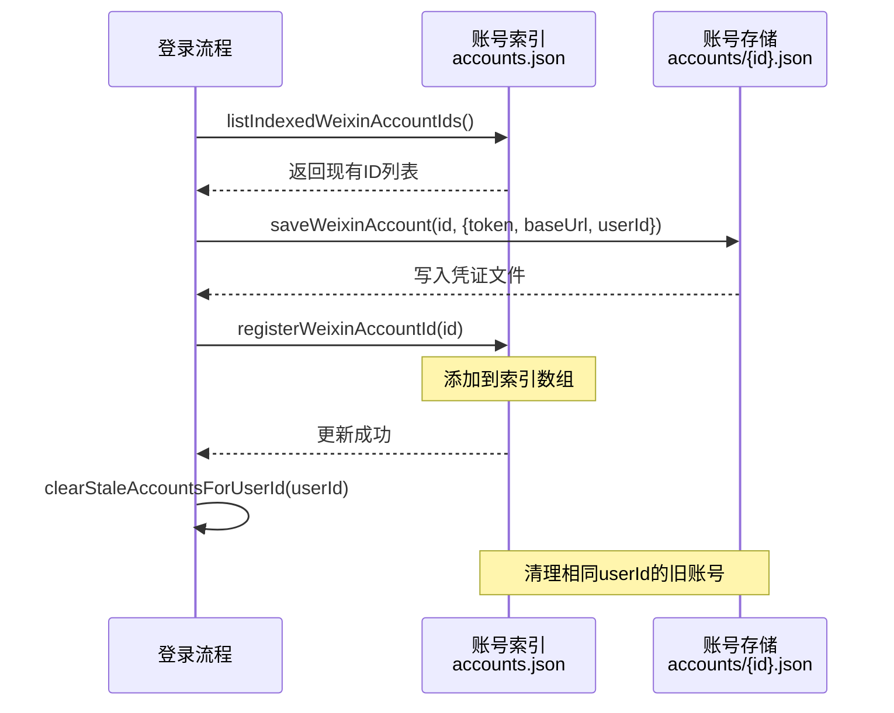
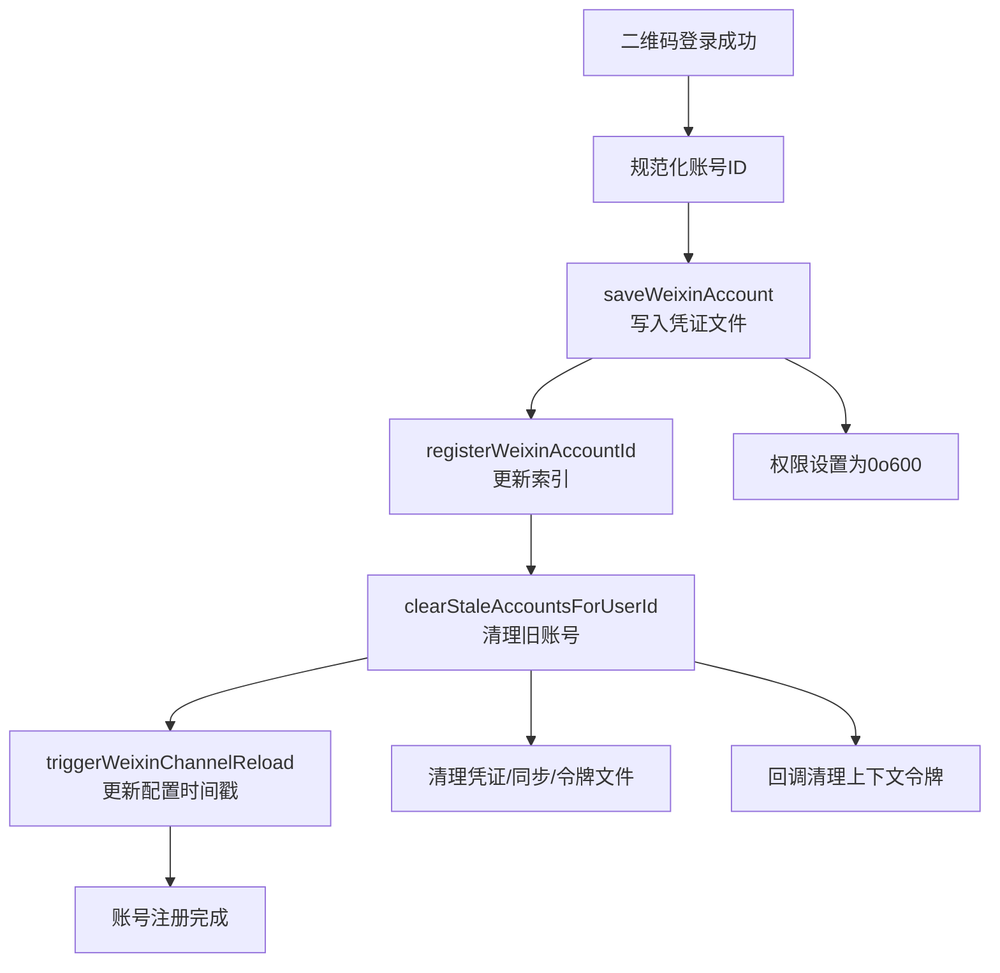

本页详细介绍 openclaw-weixin 插件的账号存储与管理架构。该系统支持多账号隔离存储、持久化认证凭证，并提供了完善的向后兼容机制。账号数据存储在用户主目录下的状态目录中，每个账号拥有独立的凭证文件、同步缓冲区和上下文令牌，确保数据隔离性和安全性。

## 存储目录结构

账号存储系统采用分层目录结构，所有持久化数据位于 `~/.openclaw/` 状态目录下。微信插件的专用子目录为 `openclaw-weixin/`，账号相关文件进一步组织在 `accounts/` 子目录中。这种设计实现了与其他 OpenClaw 组件的隔离，同时支持多个微信账号的并行管理。

Sources: [state-dir.ts](src/storage/state-dir.ts#L5-L11), [accounts.ts](src/auth/accounts.ts#L40-L46)

### 目录布局详解

状态目录解析遵循以下优先级：环境变量 `OPENCLAW_STATE_DIR` 优先，其次检查 `CLAWDBOT_STATE_DIR`，最后使用默认路径 `~/.openclaw/`。微信插件的状态目录为 `~/.openclaw/openclaw-weixin/`，账号索引文件 `accounts.json` 位于此目录下，而每个账号的独立文件存储在 `accounts/` 子目录中。

Sources: [state-dir.ts](src/storage/state-dir.ts#L5-L11), [accounts.ts](src/auth/accounts.ts#L40-L46), [accounts.ts](src/auth/accounts.ts#L122-L128)



### 账号文件类型说明

每个账号关联三种核心文件：`{accountId}.json` 存储认证凭证（token、baseUrl、userId）和保存时间戳；`{accountId}.sync.json` 持久化长轮询的 get_updates_buf；`{accountId}.context-tokens.json` 保存会话上下文令牌。所有凭证文件在写入时设置权限为 `0o600`，确保只有所有者可读写，保护敏感认证信息不被其他用户访问。

Sources: [accounts.ts](src/auth/accounts.ts#L113-L120), [accounts.ts](src/auth/accounts.ts#L205-L211), [sync-buf.ts](src/storage/sync-buf.ts#L32-L34)

## 账号索引管理

账号索引文件 `accounts.json` 维护已通过二维码登录注册的所有账号 ID 列表。这是一个持久化的有序数组，记录了系统中的活跃账号。索引文件在每次成功二维码登录后更新，支持增删操作，并提供了完整的错误容错机制。

Sources: [accounts.ts](src/auth/accounts.ts#L48-L60)

### 账号索引操作

`listIndexedWeixinAccountIds()` 函数读取并解析索引文件，返回有效的账号 ID 字符串数组。函数对文件不存在、解析失败、非数组内容等情况提供健壮的处理，始终返回数组类型。`registerWeixinAccountId()` 将新账号 ID 添加到索引中，避免重复注册；`unregisterWeixinAccountId()` 从索引中移除指定账号。这些操作均使用原子性的文件读写，确保数据一致性。

Sources: [accounts.ts](src/auth/accounts.ts#L48-L81)



### 陈旧账号清理机制

当同一微信用户（相同 userId）通过新二维码登录时，`clearStaleAccountsForUserId()` 函数会清理所有关联该 userId 的旧账号。这防止了同一用户的多个账号实例导致上下文令牌匹配歧义。清理过程包括删除账号的所有关联文件（凭证、同步缓冲区、上下文令牌），从索引中移除，并通过回调清理对应的上下文令牌。

Sources: [accounts.ts](src/auth/accounts.ts#L90-L107), [accounts.ts](src/auth/accounts.ts#L221-L240)

## 账号凭证存储

每个账号的凭证存储在独立的 JSON 文件中，文件名为规范化后的账号 ID。`WeixinAccountData` 类型定义了凭证文件的结构，包含 token、baseUrl、保存时间戳和关联的微信用户 ID。这些数据在二维码登录成功后持久化，支持断线重连和多账号并行运行。

Sources: [accounts.ts](src/auth/accounts.ts#L113-L120)

### 凭证数据模型

凭证文件使用 JSON 格式存储，`token` 字段保存从微信服务器获取的认证令牌，`baseUrl` 记录 API 基础 URL（支持 IDC 重定向后的动态地址），`userId` 关联扫描二维码的微信用户 ID（用于白名单管理和陈旧账号清理），`savedAt` 记录凭证最后保存的 ISO 8601 时间戳。`baseUrl` 和 `userId` 可选，未提供时会回退到默认值或不存储。

Sources: [accounts.ts](src/auth/accounts.ts#L183-L211)

| 字段 | 类型 | 必填 | 说明 |
|------|------|------|------|
| token | string | 否 | 微信认证令牌 |
| baseUrl | string | 否 | API 基础 URL |
| userId | string | 否 | 关联的微信用户 ID |
| savedAt | string | 否 | ISO 8601 格式的保存时间戳 |

### 凭证读写操作

`loadWeixinAccount()` 函数实现三级回退加载机制：首先尝试读取规范化的账号 ID 文件；若不存在且 ID 包含已知后缀（如 `-im-bot`），尝试推导并读取旧版原始 ID 文件（如 `@im.bot`）；最后回退到旧版单账号凭证文件 `credentials/openclaw-weixin/credentials.json`。这种设计确保了从旧版本升级的无缝兼容。`saveWeixinAccount()` 合并现有数据和新更新，写入文件并设置安全权限。

Sources: [accounts.ts](src/auth/accounts.ts#L145-L175), [accounts.ts](src/auth/accounts.ts#L183-L211)

## 账号 ID 规范化与兼容性

账号 ID 的规范化处理是向后兼容机制的核心。微信返回的原始 ID 如 `b0f5860fdecb@im.bot` 包含特殊字符 `@`，不适合用作文件名。系统使用 `normalizeAccountId()` 函数将其转换为文件系统安全的格式（如 `b0f5860fdecb-im-bot`）。反向推导函数 `deriveRawAccountId()` 则在读取旧版数据时将规范化 ID 还原为原始格式，确保数据迁移无感知。

Sources: [accounts.ts](src/auth/accounts.ts#L26-L34), [channel.ts](src/auth/login-qr.ts#L330-L336)

### 规范化转换规则

已知微信账号类型包括企业机器人（`@im.bot`）和个人微信（`@im.wechat`）。规范化时将 `@` 替换为 `-`，将 `.` 保留，生成可直接用作文件名的字符串。反向推导检查后缀 `-im-bot` 和 `-im-wechat`，将其还原为 `@im.bot` 和 `@im.wechat`。这种模式匹配确保了仅对已知类型进行转换，避免误处理其他 ID 格式。

Sources: [accounts.ts](src/auth/accounts.ts#L26-L34)

```mermaid
graph LR
    A[原始账号ID<br/>b0f5860fdecb@im.bot] --> B[规范化<br/>normalizeAccountId]
    B --> C[文件系统安全ID<br/>b0f5860fdecb-im-bot]
    C --> D[文件存储<br/>accounts/b0f5860fdecb-im-bot.json]
    D --> E[读取文件<br/>loadWeixinAccount]
    E --> F[反向推导<br/>deriveRawAccountId]
    F --> G[原始ID还原<br/>b0f5860fdecb@im.bot]
```

### 遗留数据迁移

早期版本使用单账号凭证文件 `credentials/openclaw-weixin/credentials.json` 存储认证令牌。`loadLegacyToken()` 函数读取该文件中的 `token` 字段，为现有安装提供平滑升级路径。同样，同步缓冲区也支持从旧版单账号路径 `~/.openclaw/agents/default/sessions/.openclaw-weixin-sync/default.json` 迁移数据。这些回退机制在新版本中仍然激活，确保用户升级后无需手动迁移数据。

Sources: [accounts.ts](src/auth/accounts.ts#L133-L143), [sync-buf.ts](src/storage/sync-buf.ts#L21-L30)

## 账号解析与配置合并

账号解析逻辑将存储的凭证与配置文件合并，生成运行时账号对象。`resolveWeixinAccount()` 函数接收全局配置和账号 ID，优先使用账号级别的配置（`accounts.{id}`），其次使用频道级别的默认配置（`channels.openclaw-weixin`）。合并后的 `ResolvedWeixinAccount` 对象包含账号 ID、baseUrl、cdnBaseUrl、token、启用状态、配置状态和显示名称。

Sources: [accounts.ts](src/auth/accounts.ts#L355-L380), [config-schema.ts](src/config/config-schema.ts#L9-L22)

### 配置优先级

配置读取遵循明确的优先级规则：`token` 仅从凭证文件读取，不在配置中存储；`baseUrl` 优先使用凭证文件中的值，其次使用配置中的 `baseUrl`，最后回退到 `DEFAULT_BASE_URL`；`cdnBaseUrl` 从配置读取，默认为 `CDN_BASE_URL`；`enabled` 从配置读取，默认为 `true`；`name` 从配置读取，用于显示标签。这种设计实现了敏感数据（token）与配置的分离。

Sources: [accounts.ts](src/auth/accounts.ts#L367-L379)

| 配置项 | 来源 | 默认值 |
|--------|------|--------|
| token | 账号凭证文件 | undefined |
| baseUrl | 账号凭证 → 配置 → 默认值 | https://ilinkai.weixin.qq.com |
| cdnBaseUrl | 配置 | https://novac2c.cdn.weixin.qq.com/c2c |
| enabled | 配置 | true |
| name | 配置 | undefined |

### 账号列表与状态

`listWeixinAccountIds()` 返回索引中的所有账号 ID，用于枚举已注册账号。`isConfigured` 属性通过检查 `token` 是否存在判断账号是否已完成登录配置。这种设计允许用户预先在配置文件中定义账号结构，然后通过登录流程填充凭证，实现了配置与认证的分离。

Sources: [accounts.ts](src/auth/accounts.ts#L350-L352), [channel.ts](src/channel.ts#L182-L189)

## 登录后的账号注册流程

二维码登录成功后触发账号注册流程，这是账号生命周期管理的关键环节。登录流程获取 `bot_token`、`ilink_bot_id`、`baseurl` 和 `ilink_user_id` 后，首先规范化账号 ID，然后保存凭证到文件，将账号 ID 注册到索引，清理相同 userId 的旧账号，最后触发网关配置重载。

Sources: [channel.ts](src/auth/login-qr.ts#L326-L340), [channel.ts](src/auth/login-qr.ts#L278-L303)

### 注册流程详解

注册流程从 `waitForWeixinLogin()` 返回成功状态开始，包含四个原子操作：`saveWeixinAccount()` 写入凭证文件，`registerWeixinAccountId()` 更新索引，`clearStaleAccountsForUserId()` 清理旧账号，`triggerWeixinChannelReload()` 更新配置文件的时间戳字段。这些操作按顺序执行，确保数据一致性。如果任一操作失败，记录错误日志但继续后续流程，最大程度保证注册成功。

Sources: [channel.ts](src/auth/login-qr.ts#L326-L340), [accounts.ts](src/auth/accounts.ts#L297-L318)



## 安全性与权限管理

账号存储系统实现了多层安全防护机制。凭证文件权限设置为 `0o600`（仅所有者可读写），防止系统其他用户读取敏感令牌。`userId` 字段与白名单机制配合，实现基于微信用户 ID 的访问控制。陈旧账号清理确保同一用户的多个实例不会导致权限混乱，上下文令牌的独立存储和清理进一步隔离了会话状态。

Sources: [accounts.ts](src/auth/accounts.ts#L205-L211), [accounts.ts](src/auth/accounts.ts#L90-L107)

### 文件权限保护

所有账号相关文件在创建时自动设置 `0o600` 权限，确保只有文件所有者可以读写。凭证文件包含敏感的认证令牌，必须严格限制访问。权限设置使用 `fs.chmodSync()` 实现，捕获并忽略错误以确保最佳 effort 保护。在 Unix 系统上，这防止了通过共享目录读取其他用户的账号凭证。

Sources: [accounts.ts](src/auth/accounts.ts#L207-L211)

### 访问控制与隔离

基于 `userId` 的白名单机制允许用户指定哪些微信用户 ID 可以控制机器人。配对授权机制将扫描二维码的 `ilink_user_id` 添加到允许列表，实现细粒度的访问控制。多账号隔离确保每个账号的上下文令牌、同步缓冲区和白名单独立存储，避免跨账号的权限泄露。

Sources: [accounts.ts](src/auth/accounts.ts#L337-L338)

## 同步缓冲区持久化

长轮询的 `get_updates_buf` 需要持久化以防止进程重启导致消息丢失。同步缓冲区存储在 `{accountId}.sync.json` 文件中，路径与账号凭证文件相同。`SyncBufData` 类型定义了数据结构，包含 `get_updates_buf` 字段。加载和保存操作支持与账号凭证相同的规范化兼容机制，确保从旧版本平滑升级。

Sources: [sync-buf.ts](src/storage/sync-buf.ts#L16-L18), [sync-buf.ts](src/storage/sync-buf.ts#L56-L72)

### 缓冲区读取策略

`loadGetUpdatesBuf()` 实现三级回退读取：首先读取规范化 ID 的路径；若失败且 ID 包含已知后缀，尝试推导旧版原始 ID 路径；最后回退到旧版单账号路径。这种设计确保了历史数据的兼容性，用户升级后无需手动迁移同步缓冲区。`saveGetUpdatesBuf()` 则将当前缓冲区写入文件，使用原子操作防止数据损坏。

Sources: [sync-buf.ts](src/storage/sync-buf.ts#L56-L81)

## 账号清理与注销

账号注销需要删除所有关联文件并更新索引。`clearWeixinAccount()` 函数删除 `{accountId}.json` 凭证文件、`{accountId}.sync.json` 同步缓冲区、`{accountId}.context-tokens.json` 上下文令牌，以及授权用户列表文件。删除操作捕获并忽略错误，确保部分文件已不存在时仍能完成清理。调用此函数后，通常需要调用 `unregisterWeixinAccountId()` 从索引中移除账号 ID。

Sources: [accounts.ts](src/auth/accounts.ts#L221-L240), [accounts.ts](src/auth/accounts.ts#L75-L81)

## 配置 Schema 定义

账号配置使用 Zod Schema 定义，确保类型安全和数据验证。`WeixinAccountSchema` 定义了账号级别的配置项，`WeixinConfigSchema` 扩展了该 schema，添加了 `accounts` 对象支持多账号配置，以及 `channelConfigUpdatedAt` 字段用于触发网关重载。token 不在配置中定义，仅存储在凭证文件中，实现了配置与凭证的分离。

Sources: [config-schema.ts](src/config/config-schema.ts#L9-L22)

### 配置字段说明

配置 Schema 支持以下字段：`name` 为账号显示名称；`enabled` 控制账号启用状态（默认 true）；`baseUrl` 指定 API 基础 URL（默认使用常量）；`cdnBaseUrl` 指定 CDN 基础 URL（默认使用常量）；`routeTag` 为可选的路由标签。多账号配置通过 `accounts` 对象实现，键为账号 ID，值为账号级别配置。`channelConfigUpdatedAt` 字段在每次成功登录后更新，通知网关重载配置。

Sources: [config-schema.ts](src/config/config-schema.ts#L9-L22)

## 总结

账号存储与管理架构实现了多账号隔离、持久化凭证、向后兼容和安全性保障。通过分层目录结构、原子文件操作、规范化 ID 转换和三级回退加载机制，系统支持从旧版本平滑升级，同时为多账号并行运行提供完整支持。凭证与配置的分离设计确保了敏感数据的安全隔离，权限管理和陈旧账号清理机制则提供了细粒度的访问控制。

下一步建议阅读[配对授权与白名单机制](9-pei-dui-shou-quan-yu-bai-ming-dan-ji-zhi)了解基于 userId 的访问控制实现，或[长轮询 getUpdates 实现](10-chang-lun-xun-getupdates-shi-xian)了解同步缓冲区的使用场景。