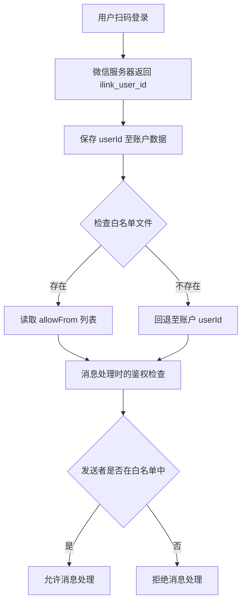

配对授权与白名单机制是微信插件控制用户访问权限的核心安全架构。该机制基于二维码登录流程，通过建立允许交互的用户 ID 列表（白名单），确保只有经过授权的用户能够与机器人进行私信交互。

## 核心架构概述

配对授权机制采用框架级白名单存储与权限验证相结合的设计，在二维码登录时捕获扫描用户的身份，并在后续消息处理中通过框架提供的授权检查器验证发送者权限。该机制支持两种授权模式：通过显式白名单配置，或者基于登录用户的回退兼容模式。



Sources: [src/auth/login-qr.ts](src/auth/login-qr.ts#L40-L45), [src/auth/pairing.ts](src/auth/pairing.ts#L47-L58), [src/messaging/process-message.ts](src/messaging/process-message.ts#L163-L195)

## 二维码登录与用户身份捕获

二维码登录流程是配对授权的起点。当用户扫描二维码并确认登录后，微信服务器会返回 `ilink_bot_id`（机器人账号 ID）和 `ilink_user_id`（扫描用户的 ID）。这两个字段构成了配对机制的基础数据源。

登录成功后，系统将 `ilink_user_id` 保存到账户数据文件中，该文件位于 `<stateDir>/openclaw-weixin/accounts/<accountId>.json`。`userId` 字段记录了最后一次完成二维码登录的微信用户身份。

```typescript
// 账户数据结构
type WeixinAccountData = {
  token?: string;
  savedAt?: string;
  baseUrl?: string;
  userId?: string;  // 扫码用户的 ID
};
```

Sources: [src/auth/login-qr.ts](src/auth/login-qr.ts#L40-L45), [src/auth/accounts.ts](src/auth/accounts.ts#L30-L38), [src/channel.ts](src/channel.ts#L315-L325)

## 白名单存储机制

框架级别的白名单存储采用 JSON 文件格式，路径遵循统一的约定模式。每个账号对应一个独立的白名单文件，文件路径为 `<credentialsDir>/openclaw-weixin-<accountId>-allowFrom.json`。

**路径解析逻辑**：

1. 优先使用环境变量 `OPENCLAW_OAUTH_DIR`（如果设置）
2. 回退至 `<stateDir>/credentials` 目录
3. 账户 ID 和通道标识符经过安全清理（替换特殊字符、移除相对路径片段）以避免文件系统安全问题

**白名单文件格式**：

```json
{
  "version": 1,
  "allowFrom": ["user_id_1", "user_id_2", ...]
}
```

Sources: [src/auth/pairing.ts](src/auth/pairing.ts#L9-L42)

**读取白名单列表**：

`readFrameworkAllowFromList()` 函数负责从磁盘读取并解析白名单文件。该函数采用容错设计：当文件不存在、读取失败或解析错误时，返回空数组而不是抛出异常。这种设计确保了系统在白名单文件损坏或缺失时仍能继续运行。

```typescript
export function readFrameworkAllowFromList(accountId: string): string[] {
  const filePath = resolveFrameworkAllowFromPath(accountId);
  try {
    if (!fs.existsSync(filePath)) return [];
    const raw = fs.readFileSync(filePath, "utf-8");
    const parsed = JSON.parse(raw) as AllowFromFileContent;
    if (Array.isArray(parsed.allowFrom)) {
      return parsed.allowFrom.filter((id): id is string => typeof id === "string" && id.trim() !== "");
    }
  } catch {
    // best-effort: 静默失败，返回空数组
  }
  return [];
}
```

Sources: [src/auth/pairing.ts](src/auth/pairing.ts#L47-L63)

## 用户注册与白名单更新

`registerUserInFrameworkStore()` 函数提供了将用户 ID 注册到白名单文件的能力。该函数设计用于并发安全场景，采用了文件锁机制防止竞态条件。

**注册流程特性**：

- **原子性操作**：使用 `withFileLock()` 确保读写操作的原子性
- **幂等性保证**：如果用户 ID 已存在于列表中，函数返回 `changed: false` 而不重复添加
- **文件自动创建**：如果目标文件不存在，函数会创建文件并初始化为空的 allowFrom 数组
- **锁配置**：重试 3 次，重试间隔采用指数退避（factor=2，最小 100ms，最大 2000ms），锁超时时间为 10 秒

```typescript
export async function registerUserInFrameworkStore(params: {
  accountId: string;
  userId: string;
}): Promise<{ changed: boolean }> {
  const { accountId, userId } = params;
  const trimmedUserId = userId.trim();
  if (!trimmedUserId) return { changed: false };

  const filePath = resolveFrameworkAllowFromPath(accountId);

  // 确保文件存在
  if (!fs.existsSync(filePath)) {
    const initial: AllowFromFileContent = { version: 1, allowFrom: [] };
    fs.writeFileSync(filePath, JSON.stringify(initial, null, 2), "utf-8");
  }

  return await withFileLock(filePath, LOCK_OPTIONS, async () => {
    let content: AllowFromFileContent = { version: 1, allowFrom: [] };
    try {
      const raw = fs.readFileSync(filePath, "utf-8");
      const parsed = JSON.parse(raw) as AllowFromFileContent;
      if (Array.isArray(parsed.allowFrom)) {
        content = parsed;
      }
    } catch {
      // 如果读取/解析失败，从空开始
    }

    if (content.allowFrom.includes(trimmedUserId)) {
      return { changed: false };
    }

    content.allowFrom.push(trimmedUserId);
    fs.writeFileSync(filePath, JSON.stringify(content, null, 2), "utf-8");
    return { changed: true };
  });
}
```

Sources: [src/auth/pairing.ts](src/auth/pairing.ts#L72-L121)

**实现状态说明**：当前代码中 `registerUserInFrameworkStore()` 函数已实现但在二维码登录流程中未被调用。这意味着白名单文件的自动更新机制尚未激活，当前系统依赖回退兼容模式进行鉴权。

## 消息处理时的鉴权检查

消息进入处理管道后，系统通过框架提供的 `resolveSenderCommandAuthorizationWithRuntime()` 函数执行鉴权检查。该函数是 OpenClaw 插件 SDK 提供的核心授权解析器，支持多种授权策略。

**鉴权配置参数**：

```typescript
const { senderAllowedForCommands, commandAuthorized } =
  await resolveSenderCommandAuthorizationWithRuntime({
    cfg: deps.config,
    rawBody,
    isGroup: false,
    dmPolicy: "pairing",  // 配对模式
    configuredAllowFrom: [],  // 配置文件中的白名单（当前未使用）
    configuredGroupAllowFrom: [],
    senderId,
    isSenderAllowed: (id: string, list: string[]) => list.length === 0 || list.includes(id),
    // 白名单读取器：先尝试框架 allowFrom，回退至账户 userId
    readAllowFromStore: async () => {
      const fromStore = readFrameworkAllowFromList(deps.accountId);
      if (fromStore.length > 0) return fromStore;
      const uid = loadWeixinAccount(deps.accountId)?.userId?.trim();
      return uid ? [uid] : [];
    },
    runtime: deps.channelRuntime.commands,
  });
```

Sources: [src/messaging/process-message.ts](src/messaging/process-message.ts#L163-L195)

**鉴权决策流程**：

1. **读取白名单**：调用 `readAllowFromStore()` 获取授权用户列表
2. **白名单优先**：如果框架白名单文件存在且非空，使用该列表
3. **回退机制**：如果白名单文件为空或不存在，回退至账户数据中存储的 `userId`（即扫码登录的用户）
4. **权限检查**：通过 `isSenderAllowed` 函数判断发送者 ID 是否在授权列表中
5. **策略应用**：基于 `dmPolicy: "pairing"` 和 `senderAllowedForCommands` 结果决定是否允许消息处理

**授权结果处理**：

```typescript
const directDmOutcome = resolveDirectDmAuthorizationOutcome({
  isGroup: false,
  dmPolicy: "pairing",
  senderAllowedForCommands,
});

if (directDmOutcome === "disabled" || directDmOutcome === "unauthorized") {
  logger.info(
    `authorization: dropping message from=${senderId} outcome=${directDmOutcome}`,
  );
  return;  // 拒绝处理该消息
}
```

Sources: [src/messaging/process-message.ts](src/messaging/process-message.ts#L197-L210)

## 授权策略对比

插件支持两种不同的私信授权策略，通过 `dmPolicy` 参数进行配置：

| 策略名称 | 配置值 | 行为描述 | 使用场景 |
|---------|--------|---------|---------|
| 配对模式 | `"pairing"` | 仅允许白名单中的用户与机器人交互，默认白名单为扫码登录的用户 | 提供严格的访问控制，适用于个人或小型团队使用 |
| 开放模式 | `"open"` | 允许任何用户与机器人交互（当前未使用） | 公开服务场景，需要额外的速率限制和过滤机制 |

Sources: [src/messaging/process-message.ts](src/messaging/process-message.ts#L175), [src/messaging/process-message.ts](src/messaging/process-message.ts#L192)

## 文件路径与存储位置

配对授权机制涉及的多个文件存储路径遵循 OpenClaw 框架的目录约定：

| 文件类型 | 路径模板 | 说明 |
|---------|---------|------|
| 账户数据 | `<stateDir>/openclaw-weixin/accounts/<accountId>.json` | 存储机器人 token、userId 等核心信息 |
| 白名单文件 | `<credDir>/openclaw-weixin-<accountId>-allowFrom.json` | 存储授权用户 ID 列表 |
| 账户索引 | `<stateDir>/openclaw-weixin/accounts.json` | 注册账户 ID 列表 |
| 上下文令牌 | `<stateDir>/openclaw-weixin/accounts/<accountId>.context-tokens.json` | 每个会话的 contextToken 缓存 |

**目录解析优先级**：

- **凭证目录**（`<credDir>`）：
  1. 环境变量 `OPENCLAW_OAUTH_DIR`
  2. 环境变量 `OPENCLAW_STATE_DIR` + `/credentials`
  3. `~/.openclaw/credentials`
  
- **状态目录**（`<stateDir>`）：
  1. 环境变量 `OPENCLAW_STATE_DIR`
  2. `~/.openclaw`

Sources: [src/auth/pairing.ts](src/auth/pairing.ts#L9-L20), [src/storage/state-dir.ts](src/storage/state-dir.ts), [src/auth/accounts.ts](src/auth/accounts.ts#L36-L52)

## 当前实现状态与限制

基于代码分析，配对授权与白名单机制的当前实现状态如下：

**已实现功能**：

- ✅ 二维码登录时捕获 `ilink_user_id` 并保存至账户数据
- ✅ 框架白名单文件路径解析与读取逻辑
- ✅ 并发安全的用户注册函数（带文件锁）
- ✅ 消息处理时的授权检查与白名单回退机制
- ✅ 多账号隔离的存储设计

**未完成功能**：

- ❌ 二维码登录成功后未调用 `registerUserInFrameworkStore()` 自动更新白名单
- ❌ 缺少手动管理白名单的斜杠命令（如 `/add-user`, `/remove-user`）
- ❌ 缺少查看当前白名单状态的管理命令

**当前行为**：

由于 `registerUserInFrameworkStore()` 未被调用，系统完全依赖回退兼容模式工作。在这种模式下：
- 只有最后一次完成二维码登录的用户能够与机器人交互
- 如果白名单文件手动创建并填充用户 ID，系统将优先使用该文件中的列表
- 账户 `userId` 的更新在每次登录成功后自动执行（通过 `saveWeixinAccount()`）

Sources: [src/auth/login-qr.ts](src/auth/login-qr.ts#L300-L312), [src/channel.ts](src/channel.ts#L315-L330)

## 后续阅读建议

要深入了解配对授权机制的相关组件，建议按以下顺序阅读：

1. [二维码登录机制](7-er-wei-ma-deng-lu-ji-zhi) — 了解完整的登录流程和用户身份捕获过程
2. [账号存储与管理](8-zhang-hao-cun-chu-yu-guan-li) — 掌握账户数据的持久化结构和存储策略
3. [入站消息路由与处理](18-ru-zhan-xiao-xi-lu-you-yu-chu-li) — 理解消息从接收到 AI 处理的完整管道
4. [斜杠命令支持](20-xie-gang-ming-ling-zhi-chi) — 学习如何扩展斜杠命令以支持白名单管理
5. [API 协议类型定义](31-api-xie-yi-lei-xing-ding-yi) — 查阅完整的协议类型定义和字段说明